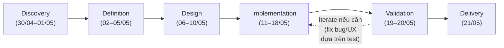

# Business Requirements Document (BRD)

## MathSnap — AI-Powered Math Tutor

| Thông tin               | Chi tiết                                  |
| ----------------------- | ----------------------------------------- |
| **Dự án**               | MathSnap                                  |
| **Phiên bản**           | 2.0.0                                     |
| **Ngày cập nhật**       | 10/05/2026                                |
| **Tác giả**             | Thanh Thinh Nguyen                        |
| **Môn học**             | Thiết kế Giao diện Người dùng (UI Design) |
| **Thời gian thực hiện** | 3 tuần (30/04/2026 – 21/05/2026)          |
| **Trạng thái**          | Approved                                  |

> **Phạm vi tài liệu:** BRD này trả lời cho câu hỏi **"WHY"** — mô tả vấn đề nghiệp vụ, mục tiêu kinh doanh, phạm vi và yêu cầu ở mức **WHAT** (năng lực hệ thống cần có), không đi vào chi tiết triển khai.

---

## Mục lục (Table of Contents)

1. [Executive Summary — Tóm tắt điều hành](#1-executive-summary--tóm-tắt-điều-hành)
2. [Business Objectives — Mục tiêu kinh doanh](#2-business-objectives--mục-tiêu-kinh-doanh)
3. [Problem Statement — Vấn đề hiện tại cần giải quyết](#3-problem-statement--vấn-đề-hiện-tại-cần-giải-quyết)
4. [Scope — Phạm vi dự án](#4-scope--phạm-vi-dự-án)
5. [Stakeholders — Các bên liên quan](#5-stakeholders--các-bên-liên-quan)
6. [Business Requirements — Yêu cầu nghiệp vụ](#6-business-requirements--yêu-cầu-nghiệp-vụ)
7. [Constraints & Assumptions — Ràng buộc & giả định](#7-constraints--assumptions--ràng-buộc--giả-định)
8. [Risks — Rủi ro kinh doanh](#8-risks--rủi-ro-kinh-doanh)
9. [ROI / Cost-Benefit — Phân tích lợi ích đầu tư](#9-roi--cost-benefit--phân-tích-lợi-ích-đầu-tư)
10. [Timeline — Mốc thời gian kỳ vọng](#10-timeline--mốc-thời-gian-kỳ-vọng)
11. [Appendix — Phụ lục](#11-appendix--phụ-lục)

---

## 1. Executive Summary — Tóm tắt điều hành

**MathSnap** là đồ án thiết kế sản phẩm EdTech — một ứng dụng web gia sư toán học trực quan, cho phép học sinh và sinh viên **chụp ảnh** bài toán thay vì phải gõ công thức LaTeX phức tạp. Hệ thống sử dụng **OCR** để nhận diện công thức và **LLM** để sinh lời giải **từng bước** theo phong cách sư phạm.

**Triết lý cốt lõi:** _"Gia sư, không phải máy trả lời"_ — MathSnap không đưa đáp án ngay. Lời giải được chia thành các **block tư duy** mà người dùng chủ động mở từng bước để kích thích quá trình Active Learning.

**Giá trị kinh doanh:** Dự án là một case study đồ án môn học UI Design, đồng thời là tài sản portfolio có khả năng mở rộng thương mại trong tương lai. Mục đích chính của bản BRD này là **thống nhất hiểu biết giữa các bên liên quan** về vấn đề cần giải quyết, phạm vi và tiêu chí thành công trước khi bước vào giai đoạn thiết kế và phát triển chi tiết.

**Nền tảng:** Web-based, thiết kế **mobile-first** để tối ưu hoá trải nghiệm chụp ảnh từ điện thoại.

**Phạm vi:** Dự án không dừng ở Hi-fi prototype Figma mà triển khai đến mức **MVP production-ready** — web app deploy public, tích hợp OCR + LLM thật, có error handling, rate limit và persist dữ liệu. Bộ deliverable cuối kỳ gồm bốn hạng mục: BRD, PRD, Hi-fi Prototype và Working Web App.

---

## 2. Business Objectives — Mục tiêu kinh doanh

Các mục tiêu dưới đây là **kim chỉ nam cho toàn bộ quyết định sản phẩm và thiết kế** của dự án. Mọi tính năng trong Scope và mọi yêu cầu nghiệp vụ trong Section 6 phải liên kết được ngược về ít nhất một mục tiêu ở đây.

### 2.1 Mục tiêu chiến lược

| ID       | Mục tiêu                                                  | Mô tả                                                                                                                                                                      | Chỉ số Đo lường (KPI)                                                                                                                                                                                                                                                              |
| -------- | --------------------------------------------------------- | -------------------------------------------------------------------------------------------------------------------------------------------------------------------------- | ---------------------------------------------------------------------------------------------------------------------------------------------------------------------------------------------------------------------------------------------------------------------------------- |
| **BO-1** | Giải quyết rào cản nhập liệu toán học                     | Cho phép người học đưa bài toán vào hệ thống mà không cần gõ công thức bằng bàn phím                                                                                       | Prototype end-to-end hoạt động: chụp ảnh → ra lời giải, không cần gõ LaTeX                                                                                                                                                                                                         |
| **BO-2** | Thúc đẩy học tập chủ động (Active Learning)               | Thiết kế sản phẩm theo hướng người học phải tương tác với lời giải, không được hiển thị đáp án ngay                                                                        | ≥ 70% phiên sử dụng có user mở ít nhất 3 bước giải trước khi xem đáp án cuối                                                                                                                                                                                                       |
| **BO-3** | Chứng minh năng lực thiết kế UX trên mobile               | Đạt trải nghiệm mobile chất lượng cao như tiêu chuẩn ngành                                                                                                                 | Lighthouse Mobile Usability Score ≥ 90                                                                                                                                                                                                                                             |
| **BO-4** | Tạo nền tảng portfolio có giá trị                         | Tài liệu và output đủ chuẩn để dùng làm case study chuyên nghiệp                                                                                                           | Có đủ 4 deliverable: BRD + PRD + Hi-fi Prototype clickable + Working Web App deployed                                                                                                                                                                                              |
| **BO-5** | Hiện thực hoá thiết kế thành web app MVP production-ready | Không dừng ở Hi-fi prototype Figma, mà triển khai thành web app thật: frontend + backend tích hợp OCR + LLM, deploy public, xử lý lỗi, rate limit, persist dữ liệu lịch sử | Web app deploy được public URL, mở được trên mobile + desktop; luồng cốt lõi BR-1 → BR-5 hoạt động end-to-end với OCR + LLM tích hợp thật (không mock); có persist lịch sử bài giải và rate limit chống lạm dụng; Lighthouse ≥ 80 cho Performance + Accessibility + Best Practices |

### 2.2 Liên kết Mục tiêu ↔ Vấn đề

| Mục tiêu | Vấn đề                                                                                                                                  |
| -------- | --------------------------------------------------------------------------------------------------------------------------------------- |
| BO-1     | P-1: Rào cản nhập liệu công thức                                                                                                        |
| BO-2     | P-3: Đáp án tức thì làm giảm tư duy                                                                                                     |
| BO-3     | P-2: Thiết bị chính của người học là điện thoại                                                                                         |
| BO-4     | — (mục tiêu phát triển cá nhân/nhóm)                                                                                                    |
| BO-5     | P-1, P-2: chỉ web app chạy thật mới chứng minh được rào cản nhập liệu thực sự được giảm và mobile UX hoạt động trong môi trường thực tế |

---

## 3. Problem Statement — Vấn đề hiện tại cần giải quyết

### 3.1 Bối cảnh

Thị trường công cụ học toán hiện tại (Photomath, Symbolab, ChatGPT, Mathway...) tập trung vào việc **cung cấp đáp án**, không vào việc **hướng dẫn tư duy**. Đồng thời, các công cụ nhập liệu văn bản như Google Search hay chatbot không phù hợp với bản chất trực quan của ngôn ngữ toán học. Đối tượng học sinh — sinh viên Việt Nam, vốn phụ thuộc vào điện thoại di động để học tập ngoài giờ, đang thiếu một công cụ kết hợp được cả hai yếu tố: **dễ nhập liệu** và **hỗ trợ tư duy**.

### 3.2 Các vấn đề cụ thể

| ID      | Vấn đề                         | Mô tả                                                                                                                                    | Ảnh hưởng                                                                               |
| ------- | ------------------------------ | ---------------------------------------------------------------------------------------------------------------------------------------- | --------------------------------------------------------------------------------------- |
| **P-1** | Rào cản nhập liệu công thức    | Công thức toán (tích phân, ma trận, phân số phức tạp) rất khó gõ bằng bàn phím. Hình học/đồ thị gần như không thể mô tả bằng văn bản     | Người học bỏ cuộc trước khi tìm được hướng dẫn, hoặc mất nhiều thời gian chỉ để nhập đề |
| **P-2** | Thiết bị chính là điện thoại   | Học sinh/sinh viên học ở nhà, thư viện, nơi chủ yếu chỉ có điện thoại. Công cụ hiện tại chưa tối ưu cho thao tác chụp và đọc trên mobile | Trải nghiệm rời rạc, tỷ lệ quay lại thấp                                                |
| **P-3** | Đáp án tức thì làm giảm tư duy | Photomath/Symbolab hiển thị đáp án ngay, tạo thói quen "copy đáp án" thay vì hiểu cách giải                                              | Điểm số có thể cao nhưng kiến thức nền yếu; giảm động lực tự học                        |
| **P-4** | Thiếu ngữ cảnh tiếng Việt      | Đa số công cụ ưu tiên tiếng Anh, phần giải thích không bám sát thuật ngữ/cách diễn đạt mà giáo viên và đề thi Việt Nam đang dùng         | Học sinh khó chuyển kiến thức tự học sang bài thi thực tế                               |

### 3.3 Cơ hội

Kết hợp **OCR toán học** (giải quyết P-1, P-2) với **LLM có định hướng sư phạm và hỗ trợ tiếng Việt** (giải quyết P-3, P-4), tạo ra một giải pháp toàn diện mà chưa có sản phẩm nào trên thị trường đáp ứng tốt đồng thời cả 4 vấn đề trên.

---

## 4. Scope — Phạm vi dự án

Scope được định nghĩa ở cấp **năng lực hệ thống (capability)**, không ở cấp tính năng chi tiết. Phân rã tính năng chi tiết (màn hình, tương tác, state, validation...) sẽ được làm rõ trong tài liệu PRD.

### 4.1 Trong phạm vi (In Scope)

| STT | Năng lực                                                      | Mô tả ngắn                                                                                                       |
| --- | ------------------------------------------------------------- | ---------------------------------------------------------------------------------------------------------------- |
| 1   | **Nhập liệu đa hình thức**                                    | Chụp ảnh từ camera, upload từ thư viện, hoặc nhập LaTeX thủ công                                                 |
| 2   | **Nhận diện công thức từ ảnh (OCR)**                          | Chuyển ảnh bài toán thành công thức LaTeX có thể render                                                          |
| 3   | **Xác nhận & chỉnh sửa công thức**                            | Người dùng có thể xem trước và sửa công thức trước khi giải                                                      |
| 4   | **Sinh lời giải từng bước**                                   | LLM trả về lời giải có cấu trúc, chia nhiều bước rõ ràng                                                         |
| 5   | **Trình bày lời giải theo nguyên tắc Progressive Disclosure** | Ẩn các bước tiếp theo mặc định, người dùng chủ động mở từng bước                                                 |
| 6   | **Lưu lịch sử & đánh dấu (bookmark)**                         | Xem lại bài cũ, lưu bài khó để ôn                                                                                |
| 7   | **Song ngữ Việt – Anh**                                       | Giao diện và nội dung lời giải                                                                                   |
| 8   | **Tối ưu mobile-first, responsive**                           | Hoạt động tốt trên mobile → tablet → desktop                                                                     |
| 9   | **Triển khai web app production-ready**                       | Backend tích hợp OCR + LLM thật, deploy public URL, có error handling, rate limit, persist lịch sử trên database |

### 4.2 Ngoài phạm vi (Out of Scope)

| STT | Không bao gồm                                    | Lý do                                                                           |
| --- | ------------------------------------------------ | ------------------------------------------------------------------------------- |
| 1   | Đăng ký / Đăng nhập (Authentication)             | Giảm phức tạp cho prototype; có thể bổ sung ở phiên bản sau                     |
| 2   | Dashboard dành cho giáo viên hoặc phụ huynh      | Không thuộc đối tượng người dùng chính của MVP                                  |
| 3   | Gamification (điểm, streak, ranking)             | Không đủ thời gian trong 3 tuần                                                 |
| 4   | Monetization (trả phí, quảng cáo)                | Không phải mục tiêu của đồ án                                                   |
| 5   | Offline mode                                     | Phụ thuộc API trực tuyến (OCR, LLM); kỹ thuật phức tạp                          |
| 6   | Hình học / đồ thị trực quan                      | OCR hiện không nhận diện hình vẽ tay; chỉ hỗ trợ công thức ký hiệu              |
| 7   | Brand Identity chi tiết (logo, brand guidelines) | Theo yêu cầu stakeholder (giảng viên) — trọng tâm là UI/UX, không phải branding |
| 8   | Đa nền tảng native (iOS/Android app)             | MVP là web-based; native app thuộc giai đoạn sau                                |

---

## 5. Stakeholders — Các bên liên quan

### 5.1 Sơ đồ Stakeholders

| Vai trò                         | Danh tính                                                | Quyền quyết định                                                       | Mức độ liên quan                                            |
| ------------------------------- | -------------------------------------------------------- | ---------------------------------------------------------------------- | ----------------------------------------------------------- |
| **Project Sponsor / Evaluator** | Giảng viên môn Thiết kế Giao diện Người dùng             | Phê duyệt BRD, đánh giá và nghiệm thu sản phẩm cuối                    | **Cao** — quyết định thành công học thuật của dự án         |
| **Project Owner / Designer**    | Nhóm phụ trách đề tài (tác giả đồ án)                    | Quyết định mọi vấn đề thiết kế & phát triển trong phạm vi đồ án        | **Rất cao** — chịu trách nhiệm toàn bộ delivery             |
| **End Users — Primary**         | Học sinh cấp 3 đang ôn thi THPT Quốc gia                 | Không có quyền quyết định chính thức, nhưng là đối tượng phục vụ chính | **Cao** — cần được phỏng vấn, usability test và phản hồi    |
| **End Users — Secondary**       | Sinh viên năm 1-2 đại học (Giải tích, Đại số Tuyến tính) | Không có quyền quyết định chính thức                                   | **Trung bình** — persona thứ hai, xác nhận khả năng mở rộng |

### 5.2 Ma trận RACI (cấp tài liệu BRD/PRD)

| Hoạt động                                 | Giảng viên |  Tác giả  | End Users |
| ----------------------------------------- | :--------: | :-------: | :-------: |
| Phê duyệt BRD                             |   **A**    |     R     |     —     |
| Soạn thảo BRD / PRD                       |     C      | **R / A** |     —     |
| User research (phỏng vấn, usability test) |     I      |   **R**   |   **C**   |
| Phê duyệt thiết kế (Hi-fi)                |   **A**    |     R     |     C     |
| Nghiệm thu sản phẩm cuối                  |   **A**    |     R     |     I     |

_R = Responsible, A = Accountable, C = Consulted, I = Informed_

### 5.3 Giao tiếp với Stakeholders

| Stakeholder | Kênh giao tiếp                               | Tần suất                                       |
| ----------- | -------------------------------------------- | ---------------------------------------------- |
| Giảng viên  | Buổi review trực tiếp / email                | Đầu tuần 1, cuối tuần 1, cuối tuần 2           |
| End Users   | Phỏng vấn trực tiếp / usability test session | 2 đợt: tuần 1 (discovery), tuần 2 (validation) |

---

## 6. Business Requirements — Yêu cầu nghiệp vụ

Mỗi yêu cầu được gán độ ưu tiên theo mô hình **MoSCoW** (Must / Should / Could / Won't) và liên kết ngược về Business Objective mà nó phục vụ.

### 6.1 Yêu cầu nghiệp vụ cốt lõi

| ID        | Yêu cầu Nghiệp vụ                                                   | Mô tả                                                                                                                                                        | Ưu tiên |      Liên kết      |
| --------- | ------------------------------------------------------------------- | ------------------------------------------------------------------------------------------------------------------------------------------------------------ | :-----: | :----------------: |
| **BR-1**  | Cho phép người dùng đưa đề toán vào hệ thống mà không cần gõ LaTeX  | Hỗ trợ ít nhất một phương thức nhập trực quan (chụp ảnh hoặc upload ảnh). Người dùng không bị buộc phải biết LaTeX để sử dụng sản phẩm                       |  Must   |        BO-1        |
| **BR-2**  | Nhận diện công thức toán từ ảnh và chuyển thành dạng chỉnh sửa được | Hệ thống phải chuyển ảnh bài toán thành biểu diễn số (LaTeX hoặc tương đương) mà người dùng có thể xem trước, xác nhận hoặc chỉnh sửa                        |  Must   |        BO-1        |
| **BR-3**  | Cho phép người dùng xác nhận và sửa công thức trước khi giải        | Giảm rủi ro tốn tài nguyên LLM xử lý công thức sai; tôn trọng quyền kiểm soát của người dùng                                                                 |  Must   |        BO-1        |
| **BR-4**  | Sinh lời giải có cấu trúc từng bước với định hướng sư phạm          | Lời giải không phải văn bản tự do; phải phân tách thành các bước logic độc lập, có tiêu đề và giải thích, kết thúc bằng đáp án rõ ràng                       |  Must   |        BO-2        |
| **BR-5**  | Trình bày lời giải theo nguyên tắc Progressive Disclosure           | Không hiển thị toàn bộ lời giải cùng lúc; người dùng chủ động mở từng bước. Đáp án cuối được phân biệt rõ ràng về mặt thị giác                               |  Must   |        BO-2        |
| **BR-6**  | Lưu lịch sử các bài đã giải                                         | Người dùng có thể quay lại xem các bài đã giải trước đó trên cùng thiết bị                                                                                   | Should  |        BO-4        |
| **BR-7**  | Cho phép đánh dấu (bookmark) bài quan trọng                         | Người dùng có thể lưu riêng những bài khó để ôn tập                                                                                                          | Should  |        BO-4        |
| **BR-8**  | Hỗ trợ song ngữ Việt – Anh                                          | Cả giao diện lẫn nội dung lời giải đều có thể chuyển đổi giữa hai ngôn ngữ                                                                                   | Should  |        BO-4        |
| **BR-9**  | Trải nghiệm tối ưu trên thiết bị di động                            | Sản phẩm phải hoạt động mượt và trực quan trên màn hình từ 320px trở lên, với các thao tác phù hợp với mobile                                                |  Must   |        BO-3        |
| **BR-10** | Đảm bảo quyền riêng tư dữ liệu người dùng                           | Không lưu trữ ảnh gốc sau khi xử lý OCR. Chỉ lưu kết quả LaTeX và lời giải                                                                                   |  Must   | (Nguyên tắc chung) |
| **BR-11** | Xử lý lỗi minh bạch cho người dùng                                  | Khi OCR hoặc LLM thất bại, hệ thống phải thông báo rõ và đề xuất phương án (thử lại, nhập thủ công...) thay vì để màn hình trắng hoặc crash                  |  Must   |        BO-3        |
| **BR-12** | Đáp ứng chuẩn tiếp cận cơ bản (Accessibility)                       | Đáp ứng WCAG 2.1 AA ở mức tối thiểu cho contrast, font size, touch target                                                                                    | Should  |        BO-3        |
| **BR-13** | Triển khai web app trên hạ tầng public                              | Web app phải deploy được trên dịch vụ hosting công khai (Vercel / Netlify / Railway / tương đương) với public URL truy cập được, không yêu cầu cài đặt local |  Must   |        BO-5        |
| **BR-14** | Giới hạn tần suất gọi API (Rate Limiting)                           | Áp dụng giới hạn số request OCR/LLM trên mỗi thiết bị/IP trong khung thời gian, kèm thông báo rõ ràng cho người dùng khi đạt giới hạn                        |  Must   |     BO-5, C-5      |
| **BR-15** | Persist dữ liệu lịch sử trên backend                                | Lịch sử bài giải và bookmark được lưu trên database backend (gắn theo device fingerprint hoặc session anonymous), không chỉ trong localStorage               |  Must   |  BO-5, BR-6, BR-7  |

### 6.2 Tiêu chí thành công ở cấp độ BRD

Dự án được coi là **thành công về mặt nghiệp vụ** khi:

- Toàn bộ yêu cầu **Must** (BR-1 đến BR-5, BR-9, BR-10, BR-11, BR-13, BR-14, BR-15) được đáp ứng trong sản phẩm demo cuối kỳ.
- Usability test với ít nhất 3 người dùng cuối xác nhận được luồng cốt lõi (chụp ảnh → nhận lời giải → mở bước) hoạt động mà không cần hướng dẫn.
- BRD và PRD được giảng viên phê duyệt trước khi bước vào giai đoạn Hi-fi Design.

_(Acceptance Criteria cấp kỹ thuật chi tiết — ví dụ "Touch target ≥ 44×44px", "FCP < 1.5s", "render đúng 10 mẫu công thức" — được định nghĩa trong PRD.)_

---

## 7. Constraints & Assumptions — Ràng buộc & giả định

### 7.1 Giả định (Assumptions)

Các phát biểu dưới đây được coi là **đúng** tại thời điểm lập kế hoạch. Nếu một giả định bị phá vỡ, cần quay lại review scope và kế hoạch.

| ID      | Giả định                                                                                                          | Nếu sai thì sao?                                                                  |
| ------- | ----------------------------------------------------------------------------------------------------------------- | --------------------------------------------------------------------------------- |
| **A-1** | Người dùng mục tiêu có smartphone với camera độ phân giải ≥ 5MP                                                   | Phải bổ sung hướng dẫn chụp/hỗ trợ ảnh chất lượng thấp                            |
| **A-2** | Người dùng có kết nối internet ổn định (4G/Wi-Fi)                                                                 | Cần cân nhắc offline mode / chế độ giảm tải                                       |
| **A-3** | Có sẵn dịch vụ OCR thương mại hoặc open-source đủ tốt cho công thức toán phổ thông và đại học năm đầu             | Phải cắt giảm phạm vi công thức hỗ trợ hoặc chuyển sang nhập thủ công là mặc định |
| **A-4** | LLM công khai (OpenAI, Anthropic, Google...) có thể sinh lời giải từng bước có cấu trúc khi được prompt đúng cách | Phải đầu tư prompt engineering sâu hơn hoặc cân nhắc fine-tune                    |
| **A-5** | Người dùng chấp nhận việc dữ liệu lịch sử/bookmark gắn với thiết bị, không đồng bộ đa thiết bị                    | Cần triển khai hệ thống đăng nhập sớm hơn kế hoạch                                |

### 7.2 Ràng buộc (Constraints)

| ID      | Ràng buộc                                                                                | Ảnh hưởng đến quyết định                                                                                                         |
| ------- | ---------------------------------------------------------------------------------------- | -------------------------------------------------------------------------------------------------------------------------------- |
| **C-1** | **Thời gian:** 3 tuần                                                                    | Ưu tiên tuyệt đối cho năng lực cốt lõi (BR-1 đến BR-5); tính năng phụ có thể chỉ dừng ở wireframe                                |
| **C-2** | **Nguồn lực:** cá nhân tác giả đảm nhận toàn bộ design + tài liệu + development + DevOps | Không có song song nhiều stream công việc; thời lượng dồn hết vào sequence tuần tự; rủi ro kỹ năng chéo (design-code-deploy) cao |
| **C-3** | **Không có hệ thống đăng nhập**                                                          | Dữ liệu gắn thiết bị; không đồng bộ đa thiết bị; cần truyền thông rõ cho người dùng                                              |
| **C-4** | **Phụ thuộc dịch vụ bên thứ ba (OCR, LLM)**                                              | Chất lượng sản phẩm bị ràng buộc bởi API provider; cần có phương án fallback                                                     |
| **C-5** | **Ngân sách API ở mức đồ án**                                                            | Không thể gọi LLM vô hạn; cần giới hạn số lượng request để tránh chi phí vượt kiểm soát                                          |
| **C-6** | **WebRTC / Camera API có thể không hỗ trợ trên một số trình duyệt cũ hoặc webview**      | Phải có phương án upload ảnh thay thế                                                                                            |

---

## 8. Risks — Rủi ro kinh doanh

| ID       | Rủi ro                                                                                                          |  Khả năng  |  Tác động  | Giảm thiểu                                                                                                                                                                                |
| -------- | --------------------------------------------------------------------------------------------------------------- | :--------: | :--------: | ----------------------------------------------------------------------------------------------------------------------------------------------------------------------------------------- |
| **R-1**  | OCR nhận diện sai công thức phức tạp (tích phân nhiều lớp, ma trận lớn)                                         |    Cao     | Trung bình | BR-3 đã bao phủ: cho phép người dùng sửa LaTeX trước khi giải                                                                                                                             |
| **R-2**  | LLM trả lời sai hoặc lời giải không logic                                                                       | Trung bình |    Cao     | Hiển thị disclaimer rõ ràng; khuyến khích người dùng kiểm chứng với giáo viên/tài liệu gốc                                                                                                |
| **R-3**  | Chi phí API vượt ngân sách đồ án                                                                                | Trung bình | Trung bình | Giới hạn số request/ngày trên mỗi thiết bị; có cảnh báo và fallback khi vượt hạn mức                                                                                                      |
| **R-4**  | Ảnh chụp mờ, thiếu sáng, góc nghiêng làm OCR sai hàng loạt                                                      |    Cao     | Trung bình | Hướng dẫn chụp trực quan (tooltip); cho phép bật flash; hỗ trợ crop/xoay                                                                                                                  |
| **R-5**  | Người dùng mất dữ liệu khi đổi thiết bị hoặc xoá browser data                                                   |    Thấp    |    Thấp    | Truyền thông rõ ràng trong onboarding; cân nhắc đăng nhập ở phiên bản sau                                                                                                                 |
| **R-6**  | Không đủ thời gian hoàn thành toàn bộ scope trong 3 tuần                                                        | Trung bình |    Cao     | Áp dụng MoSCoW nghiêm ngặt; cắt Could/Should nếu cần để bảo vệ Must                                                                                                                       |
| **R-7**  | Usability test phát hiện nguyên tắc Progressive Disclosure gây khó chịu (người dùng chỉ muốn xem đáp án ngay)   |    Thấp    |    Cao     | Test sớm trong tuần 1 với wireframe; sẵn sàng điều chỉnh mức độ "ép buộc" mở bước                                                                                                         |
| **R-8**  | Người dùng upload ảnh không phải toán (bất kỳ ảnh nào) gây tốn tài nguyên LLM và có thể vi phạm policy provider | Trung bình | Trung bình | Giới hạn số request/thiết bị; tích hợp bước kiểm tra "có phải bài toán không" trước khi gọi LLM (thuộc PRD)                                                                               |
| **R-9**  | Không kịp implement web app production-ready trong Phase 2.5 (8 ngày)                                           |    Cao     |    Cao     | Chuẩn bị starter template (Next.js + Tailwind + shadcn/ui) song song Phase 2; account hosting và API provider sẵn sàng trước 11/05; ưu tiên BR-1 → BR-5, cắt BR-6/7/8 nếu trượt sau 13/05 |
| **R-10** | Chi phí backend infra (database, hosting, API) vượt ngân sách đồ án                                             | Trung bình | Trung bình | Dùng tier free của hosting (Vercel, Supabase, Railway); rate limit chặt theo BR-14; fallback sang SQLite + serverless nếu cloud DB hết quota; setup billing alert hằng ngày               |
| **R-11** | API key OCR/LLM bị lộ trên frontend hoặc bị abuse                                                               |    Cao     |    Cao     | Tuyệt đối không gọi API từ frontend; mọi request đi qua backend proxy; rotate key định kỳ; monitor billing alert; whitelist domain ở provider khi có thể                                  |

---

## 9. ROI / Cost-Benefit — Phân tích lợi ích đầu tư

> **Framing:** MathSnap là đồ án học thuật 3 tuần, không có mục tiêu thương mại hoá trong giai đoạn này. ROI được đánh giá thuần theo **learning outcomes** — năng lực, kiến thức, tài sản portfolio mà dự án sinh ra cho tác giả.

### 9.1 Chi phí đầu tư (Cost)

| Hạng mục                     | Ước lượng                                                         | Ghi chú                                                                         |
| ---------------------------- | ----------------------------------------------------------------- | ------------------------------------------------------------------------------- |
| Thời gian cá nhân            | ~120 giờ (3 tuần × ~6h/ngày × 7 ngày/tuần)                        | Bao gồm research, design, implementation, deploy, viết tài liệu, usability test |
| Chi phí API (OCR + LLM)      | Mức thử nghiệm nhỏ, dự kiến trong gói free tier / ngân sách đồ án | Giới hạn bởi C-5                                                                |
| Công cụ design (Figma, v.v.) | 0 — dùng gói Free / Education                                     | —                                                                               |
| Usability test participants  | 0 — sử dụng mạng lưới bạn bè/học sinh                             | —                                                                               |

### 9.2 Lợi ích mong đợi (Benefits)

Chia theo 4 nhóm learning outcomes:

**A. Năng lực Thiết kế & UX**

- Thực hành **mobile-first design** đầy đủ chu trình từ research đến prototype.
- Áp dụng **các nguyên lý UX học thuật** vào sản phẩm thực tế: Progressive Disclosure, Scaffolding (giáo dục), Cognitive Load Theory, One Concept Per Screen.
- Xây dựng **design system ở mức component** (button, accordion, card, bottom nav...) có tính nhất quán.
- Đáp ứng **chuẩn tiếp cận WCAG 2.1 AA** ở mức tối thiểu — một kỹ năng ngày càng quan trọng với nhà tuyển dụng.

**B. Năng lực Sản phẩm (Product Thinking)**

- Thực hành viết **tài liệu sản phẩm chuyên nghiệp**: BRD, PRD tách bạch — rất hiếm trong đồ án sinh viên.
- Thực hành **scope management** với MoSCoW và In/Out of Scope rõ ràng.
- Phân tích **vấn đề – cơ hội – giải pháp** có cấu trúc, không chỉ "làm theo ý tưởng".

**C. Năng lực Nghiên cứu Người dùng**

- Xây dựng **persona** dựa trên quan sát thực tế thay vì ước đoán.
- Thực hiện **usability test** ít nhất 1 vòng với người dùng thật.
- Rèn kỹ năng **phỏng vấn, tổng hợp insight, mapping journey**.

**D. Tài sản Portfolio & Đóng góp Học thuật**

- Bộ tài liệu **BRD + PRD + Hi-fi Prototype clickable** đạt chuẩn case study dùng được cho phỏng vấn xin việc.
- Áp dụng lý thuyết **Scaffolding và Progressive Disclosure** vào bài toán EdTech — có thể phát triển thành bài viết, blog, hoặc nền tảng cho đồ án tốt nghiệp.
- Case study minh chứng **khả năng thiết kế sản phẩm AI-powered (OCR + LLM)** — kỹ năng đang được thị trường đặc biệt quan tâm năm 2026.

**E. Năng lực Design-to-Code & Full-stack**

- Thực hành chuyển đổi **Hi-fi design thành code thực tế**: dịch component Figma sang React, giữ pixel-perfect và tương tác.
- Build **full-stack web app**: frontend (Next.js + Tailwind), backend (API routes), database, tích hợp third-party API (OCR + LLM).
- Thực hành **DevOps cơ bản**: deploy CI/CD, environment config, secrets management, rate limiting, billing monitoring.
- Áp dụng **Production engineering principles**: error handling end-to-end, fallback patterns, observability, cost control.

### 9.3 Đánh giá tổng quát

Chi phí chủ yếu là thời gian cá nhân trong 3 tuần. Lợi ích là một danh mục kỹ năng và tài sản portfolio mở rộng đáng kể, đồng thời thoả mãn yêu cầu nghiệm thu môn học. Dự án có **tỷ lệ chi phí – lợi ích đặc biệt tốt** trong bối cảnh học thuật, đặc biệt vì:

1. Toàn bộ output có thể tái sử dụng (tài liệu làm portfolio, kiến thức áp dụng cho đồ án tốt nghiệp/phỏng vấn).
2. Chủ đề sản phẩm (AI + EdTech) phù hợp với xu hướng tuyển dụng hiện tại.
3. Quy trình chuẩn (BRD → PRD → Design → Test) rèn được tư duy làm việc chuyên nghiệp ngay từ đồ án.

---

## 10. Timeline — Mốc thời gian kỳ vọng

> **Lưu ý:** Timeline này là **kế hoạch ở cấp BRD** — mô tả các giai đoạn lớn và milestone nghiệm thu. Sprint plan chi tiết theo ngày / task-level sẽ được mở rộng trong PRD hoặc Project Plan riêng.

### 10.1 Giai đoạn tổng quát

| Giai đoạn                     | Khoảng thời gian       | Mục tiêu chính                                                  | Deliverable                        |
| ----------------------------- | ---------------------- | --------------------------------------------------------------- | ---------------------------------- |
| **Phase 0: Discovery**        | 30/04 – 01/05 (3 ngày) | Hiểu vấn đề, xác nhận nhu cầu với người dùng                    | BRD phê duyệt, User research notes |
| **Phase 1: Definition**       | 02/05 – 05/05 (4 ngày) | Xác định chi tiết tính năng, IA, luồng người dùng               | PRD, Low-fi wireframe              |
| **Phase 2: Design**           | 06/05 – 10/05 (5 ngày) | Hi-fi mockup, design system, prototype clickable                | Hi-fi Figma file, Prototype link   |
| **Phase 2.5: Implementation** | 11/05 – 18/05 (8 ngày) | Code frontend + backend, tích hợp OCR + LLM, deploy public      | Working web app + public URL       |
| **Phase 3: Validation**       | 19/05 – 20/05 (2 ngày) | Usability test với người dùng thật trên web app, lặp điều chỉnh | Test report, Revised web app       |
| **Phase 4: Delivery**         | 21/05 (1 ngày)         | Hoàn thiện tài liệu, nộp bài, trình bày                         | Final deliverables                 |

### 10.2 Milestone quan trọng

| Milestone                                | Ngày  | Tiêu chí hoàn thành                                                                                        |
| ---------------------------------------- | ----- | ---------------------------------------------------------------------------------------------------------- |
| **M1 — BRD Approved**                    | 01/05 | Giảng viên phê duyệt BRD                                                                                   |
| **M2 — PRD & Wireframe Approved**        | 05/05 | Xong low-fi wireframe và PRD đủ chi tiết để bắt tay Hi-fi                                                  |
| **M3 — Hi-fi Prototype Ready for Build** | 10/05 | Hi-fi prototype clickable, đủ chi tiết để bắt tay implementation                                           |
| **M4 — Web App Deployed**                | 18/05 | Web app deploy được public URL, luồng cốt lõi BR-1 → BR-5 hoạt động end-to-end với OCR + LLM tích hợp thật |
| **M5 — Validation Complete**             | 20/05 | Có báo cáo test trên web app thật, các issue P0/P1 đã xử lý                                                |
| **M6 — Final Delivery**                  | 21/05 | Nộp BRD + PRD + Hi-fi + Working Web App; sẵn sàng trình bày                                                |

### 10.3 Phụ thuộc giữa các giai đoạn

### 10.4 Buffer & cảnh báo

- Không có buffer riêng trong 3 tuần → bất kỳ milestone nào trượt đều ảnh hưởng đến ngày nộp cuối.
- **Phase 2.5 (Implementation, 8 ngày)** là phase rủi ro cao nhất — build production-ready web app với backend + tích hợp OCR/LLM trong 8 ngày một mình rất chặt. Cần chuẩn bị starter template (Next.js + Tailwind + component library) và account API provider sẵn từ Phase 2.
- Cảnh báo sớm: nếu sau 3 ngày đầu của Phase 2.5 (đến hết 13/05) chưa có frontend chạy được hoặc backend chưa connect được tới OCR/LLM API, cần xem xét cắt **Should/Could** (BR-6, BR-7, BR-8) trong Section 6 để bảo vệ **Must**.

---

## 11. Appendix — Phụ lục

### 11.1 Thuật ngữ

| Thuật ngữ                  | Giải thích                                                            |
| -------------------------- | --------------------------------------------------------------------- |
| **BRD**                    | Business Requirements Document — Tài liệu yêu cầu nghiệp vụ           |
| **PRD**                    | Product Requirements Document — Tài liệu yêu cầu sản phẩm             |
| **OCR**                    | Optical Character Recognition — Nhận diện ký tự quang học             |
| **LaTeX**                  | Hệ thống sắp chữ dùng để viết công thức toán học                      |
| **LLM**                    | Large Language Model — Mô hình ngôn ngữ lớn (AI)                      |
| **MoSCoW**                 | Mô hình ưu tiên: Must / Should / Could / Won't                        |
| **Progressive Disclosure** | Nguyên lý UX: chỉ hiển thị thông tin cần thiết tại thời điểm đó       |
| **Scaffolding**            | Lý thuyết giáo dục: hỗ trợ học sinh từng bước để tự đạt được mục tiêu |
| **RACI**                   | Ma trận vai trò: Responsible / Accountable / Consulted / Informed     |

### 11.2 Lịch sử sửa đổi

| Phiên bản | Ngày       | Nội dung                                                                                                                                                                                                                                                                                                                                                                                               |
| --------- | ---------- | ------------------------------------------------------------------------------------------------------------------------------------------------------------------------------------------------------------------------------------------------------------------------------------------------------------------------------------------------------------------------------------------------------ |
| **1.0.0** | 30/04/2026 | Khởi tạo tài liệu BRD: Executive Summary, Business Objectives, Problem Statement, Scope, Stakeholders, Business Requirements, Constraints & Assumptions, Risks, ROI / Cost-Benefit, Timeline                                                                                                                                                                                                           |
| **2.0.0** | 10/05/2026 | Mở rộng scope từ Hi-fi Prototype sang MVP production-ready. Thêm BO-5 (web app chạy được), BR-13/14/15 (deploy / rate limit / persist — tất cả Must), R-9/10/11 (implementation / infra cost / API key abuse), benefit nhóm E (Design-to-Code & Full-stack). Kéo dài timeline 2 → 3 tuần (deadline 14/05 → 21/05) với Phase 2.5 Implementation 11/05 – 18/05. Cập nhật C-1, C-2, KPI BO-4, Section 6.2 |

### 11.3 Tài liệu tham chiếu

| Tài liệu                       | Mục đích                                                                                                                            | Trạng thái         |
| ------------------------------ | ----------------------------------------------------------------------------------------------------------------------------------- | ------------------ |
| **Product Requirements (PRD)** | Chi tiết tính năng, màn hình, luồng người dùng, tiêu chí chấp nhận kỹ thuật                                                         | Chờ phê duyệt      |
| **User Research Notes**        | Kết quả phỏng vấn người dùng                                                                                                        | Đang thực hiện     |
| **System Design**              | Kiến trúc hệ thống, API contracts, mô hình dữ liệu, luồng dữ liệu, caching strategy, error handling, edge cases, trade-off analysis | PRD / Design phase |

---

> **Ghi chú:** Tài liệu BRD là nguồn sự thật về **động cơ và phạm vi** của dự án. Mọi đề xuất thêm/bớt tính năng, thay đổi scope trong các giai đoạn sau đều phải được đối chiếu ngược về tài liệu này.
