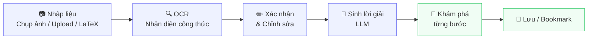
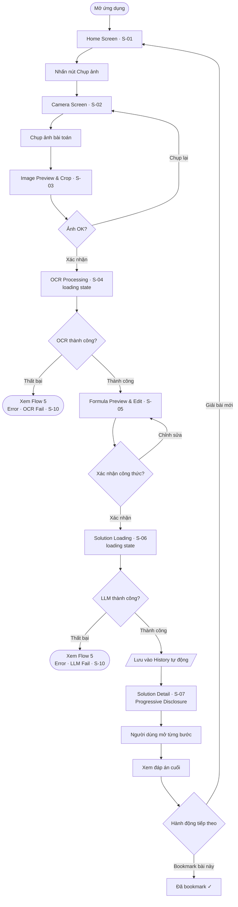
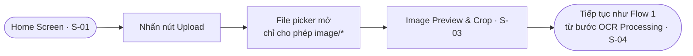
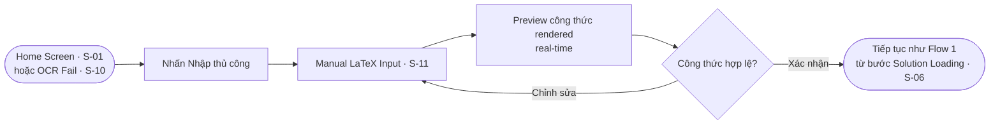
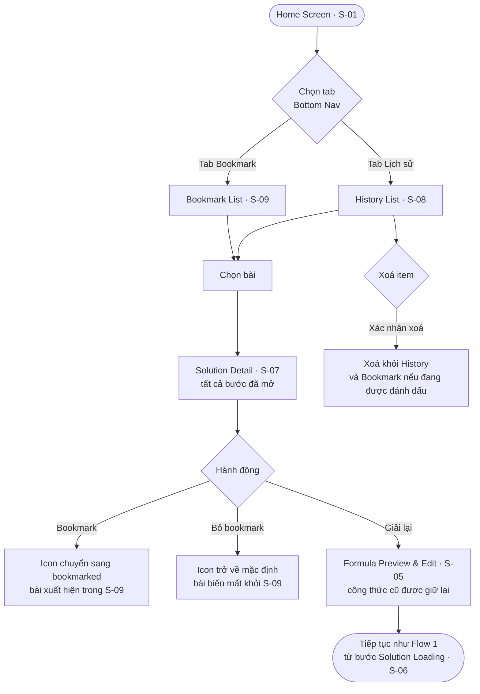
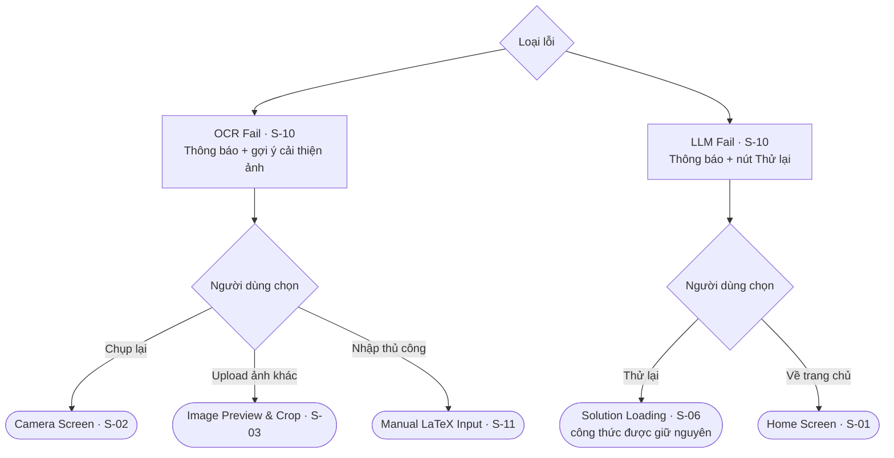
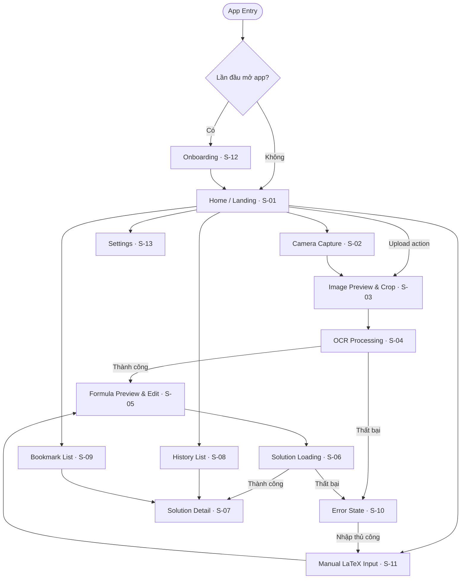
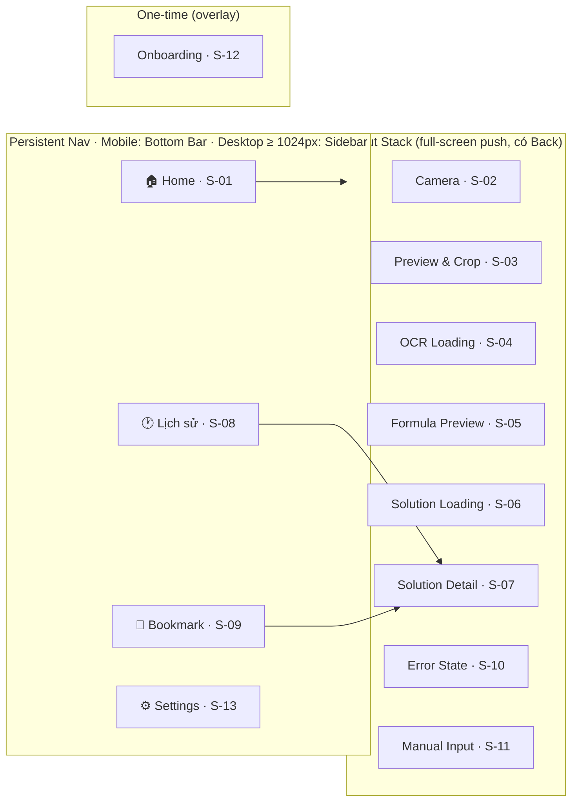
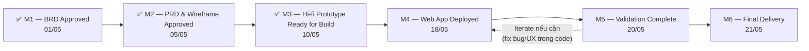

# Product Requirements Document (PRD)

## MathSnap — AI-Powered Math Tutor

| Thông tin               | Chi tiết                                                                                                   |
| ----------------------- | ---------------------------------------------------------------------------------------------------------- |
| **Dự án**               | MathSnap                                                                                                   |
| **Phiên bản**           | 2.0.0                                                                                                      |
| **Ngày cập nhật**       | 10/05/2026                                                                                                 |
| **Tác giả**             | Thanh Thinh Nguyen                                                                                         |
| **Môn học**             | Thiết kế Giao diện Người dùng (UI Design)                                                                  |
| **Thời gian thực hiện** | 3 tuần (30/04/2026 – 21/05/2026)                                                                           |
| **Trạng thái**          | Approved                                                                                                   |
| **Tham chiếu**          | BRD v2.0.0 (Approved) · User Research Notes · System Design                                                |
| **Đối tượng**           | Tác giả đồ án (designer/PM), lập trình viên (developers), giảng viên đánh giá, Hi-fi Design, System Design |

> **Phạm vi tài liệu:** PRD này trả lời cho câu hỏi **"WHAT"** và **"HOW (at product level)"** — mô tả hành vi sản phẩm, yêu cầu tính năng, luồng người dùng và tiêu chí chấp nhận. PRD kế thừa mọi phát biểu về vấn đề, mục tiêu kinh doanh, ràng buộc và rủi ro từ BRD. Khi có xung đột: **BRD là nguồn tin cậy cho mục tiêu & phạm vi; PRD là nguồn tin cậy cho hành vi sản phẩm.** Tài liệu tiếp theo — **SYSTEM_DESIGN** — sẽ trả lời HOW ở cấp hệ thống (kiến trúc, API contracts, mô hình dữ liệu).

---

## Mục lục

1. [Product Overview — Tổng quan sản phẩm](#1-product-overview)
2. [Goals & Non-Goals — Mục tiêu & Ngoài phạm vi](#2-goals--non-goals)
3. [User Personas — Chân dung người dùng](#3-user-personas)
4. [User Stories & Flows — Câu chuyện & Luồng người dùng](#4-user-stories--flows)
5. [Information Architecture — Kiến trúc thông tin](#5-information-architecture)
6. [Requirements — Yêu cầu sản phẩm](#6-requirements)
7. [Design Principles — Nguyên lý thiết kế](#7-design-principles)
8. [Definition of Done — Tiêu chí hoàn thành](#8-definition-of-done)
9. [Success Metrics — Chỉ số thành công](#9-success-metrics)
10. [Timeline — Mốc thời gian](#10-timeline)
11. [Open Questions — Câu hỏi còn mở](#11-open-questions)
12. [Appendix — Phụ lục](#12-appendix)

---

## 1. Product Overview — Tổng quan sản phẩm

> **Mục tiêu section:** Cung cấp bức tranh tổng quan về sản phẩm — đủ để người đọc mới hiểu MathSnap là gì, phục vụ ai, và tại sao tồn tại, mà không cần đọc lại BRD. Không lặp lại chi tiết số liệu hay phân tích từ BRD.

### 1.1 Tóm tắt sản phẩm

MathSnap là ứng dụng web gia sư toán học AI, thiết kế mobile-first dành cho học sinh THPT và sinh viên đại học năm đầu tại Việt Nam. Thay vì gõ công thức LaTeX phức tạp, người dùng chỉ cần **chụp ảnh bài toán** — hệ thống dùng OCR để nhận diện công thức và LLM để sinh **lời giải từng bước có cấu trúc** theo phong cách sư phạm. Điểm khác biệt cốt lõi so với các công cụ hiện có: MathSnap không đưa đáp án ngay mà dẫn dắt người dùng **chủ động khám phá từng bước tư duy**, kích thích Active Learning thay vì tạo thói quen sao chép đáp án.

### 1.2 Triết lý cốt lõi

**"Gia sư, không phải máy trả lời"** — triết lý này chi phối mọi quyết định thiết kế của MathSnap. Lời giải được tổ chức thành các block tư duy độc lập mà người dùng phải chủ động mở từng bước, thay vì hiển thị toàn bộ ngay lập tức.

Cơ chế này dựa trên hai nền tảng lý luận:

- **Scaffolding** (Vygotsky): hỗ trợ người học vừa đủ để tiến lên mà không làm thay — mỗi bước gợi mở hướng tư duy, không đưa đáp án trước khi người học sẵn sàng.
- **Active Learning**: người học ghi nhớ sâu hơn khi phải chủ động xử lý thông tin, so với tiếp nhận thụ động. Việc tự quyết định "mở bước tiếp theo" tạo ra khoảnh khắc nhận thức có giá trị.

Progressive Disclosure trong MathSnap không chỉ là một UX pattern — đây là cơ chế học tập cốt lõi của sản phẩm và không thể thỏa hiệp.

### 1.3 Vị thế cạnh tranh

Thị trường công cụ học toán hiện tại tập trung vào việc **cung cấp đáp án nhanh** — chưa có sản phẩm nào kết hợp được cả bốn yếu tố: nhập liệu bằng ảnh, lời giải sư phạm có cấu trúc, cơ chế ẩn đáp án chủ động, và tối ưu cho người dùng Việt Nam trên mobile.

| Tiêu chí                                     | MathSnap | Photomath |   Symbolab    |     ChatGPT     |
| -------------------------------------------- | :------: | :-------: | :-----------: | :-------------: |
| Nhập liệu bằng ảnh                           |    ✅    |    ✅     | ✅ (giới hạn) |       ✅        |
| Lời giải từng bước có cấu trúc cố định       |    ✅    |    ✅     |      ✅       | ⚠️ (tuỳ prompt) |
| Ẩn đáp án — người dùng chủ động mở từng bước |    ✅    |    ❌     |      ❌       |       ❌        |
| Hỗ trợ tiếng Việt trong lời giải             |    ✅    |    ❌     |      ❌       |       ✅        |
| Tối ưu mobile-first                          |    ✅    |    ✅     | ⚠️ (partial)  |  ❌ (generic)   |

_Ghi chú: ⚠️ = hỗ trợ một phần hoặc không nhất quán._

### 1.4 Luồng sản phẩm tổng quát

Sơ đồ dưới đây thể hiện luồng sử dụng chính (happy path). Các nhánh thay thế (upload ảnh, nhập LaTeX thủ công) và luồng lỗi (OCR fail, LLM fail) được mở rộng chi tiết tại Section 4.

Hai giai đoạn cuối — **Khám phá từng bước** và **Lưu / Bookmark** — được tô màu khác để nhấn mạnh đây là phần tạo ra giá trị học tập cốt lõi của sản phẩm, phân biệt MathSnap với các công cụ tính toán thông thường.

---

## 2. Goals & Non-Goals — Mục tiêu & Ngoài phạm vi

> **Mục tiêu section:** Phát biểu lại Business Objectives từ BRD ở cấp độ sản phẩm — outcome-based, có metric cụ thể. Non-Goals phải có lý do rõ ràng để ngăn scope creep trong suốt quá trình thiết kế.

### 2.1 Goals (cấp Product)

| ID      | Goal                                                                                          | Metric thành công                                                                                                                                                                                                               | Liên kết BRD |
| ------- | --------------------------------------------------------------------------------------------- | ------------------------------------------------------------------------------------------------------------------------------------------------------------------------------------------------------------------------------- | ------------ |
| **G-1** | Loại bỏ rào cản nhập liệu — người dùng đưa được bài toán vào hệ thống mà không cần biết LaTeX | Prototype end-to-end hoạt động: chụp ảnh → ra lời giải                                                                                                                                                                          | BO-1         |
| **G-2** | Thúc đẩy Active Learning — người dùng chủ động tương tác với lời giải trước khi xem đáp án    | ≥ 70% phiên có user mở ≥ 3 bước trước khi xem đáp án cuối                                                                                                                                                                       | BO-2         |
| **G-3** | Trải nghiệm mobile đạt chuẩn ngành                                                            | Lighthouse Mobile Usability Score ≥ 90                                                                                                                                                                                          | BO-3         |
| **G-4** | Hoàn thiện bộ deliverable portfolio đạt chuẩn case study                                      | Có đủ: BRD (approved) + PRD (approved) + Hi-fi Prototype clickable + Working Web App deployed                                                                                                                                   | BO-4         |
| **G-5** | Triển khai sản phẩm thành web app MVP production-ready                                        | Web app deploy public URL; luồng cốt lõi BR-1 → BR-5 chạy end-to-end với OCR + LLM tích hợp thật (không mock); persist lịch sử trên backend; rate limit hoạt động; Lighthouse Performance + Accessibility + Best Practices ≥ 80 | BO-5         |

### 2.2 Non-Goals (cấp Product)

| STT | Không thực hiện                          | Lý do                                                                                                                                                                  |
| --- | ---------------------------------------- | ---------------------------------------------------------------------------------------------------------------------------------------------------------------------- |
| 1   | Authentication / tài khoản người dùng    | Định danh thiết bị qua `deviceId` UUID (xem FR-11) là đủ cho MVP; chấp nhận tradeoff không đồng bộ đa thiết bị, mất data khi clear browser (C-3, A-5, BR-15 trong BRD) |
| 2   | Hỗ trợ hình học và đồ thị trực quan      | OCR hiện tại không nhận diện được hình vẽ tay; chỉ hỗ trợ ký hiệu toán học (BRD Out of Scope)                                                                          |
| 3   | Offline mode                             | Phụ thuộc hoàn toàn vào OCR API và LLM API trực tuyến (C-4 trong BRD)                                                                                                  |
| 4   | Dashboard dành cho giáo viên / phụ huynh | Ngoài đối tượng người dùng chính của MVP                                                                                                                               |
| 5   | Gamification, Monetization, Native app   | Không thuộc mục tiêu đồ án; có thể cân nhắc ở phiên bản thương mại sau                                                                                                 |

---

## 3. User Personas — Chân dung người dùng

> **Mục tiêu section:** Xây dựng 2 persona đủ độ sâu để làm căn cứ cho mọi quyết định UX trong tài liệu này. Persona 1 là đối tượng thiết kế chính; Persona 2 xác nhận khả năng mở rộng. Khi có xung đột giữa nhu cầu hai persona, ưu tiên Persona 1.

### 3.1 Persona 1 — Học sinh THPT (Primary)

> _Persona này là đối tượng thiết kế chính. Mọi quyết định UX ưu tiên phục vụ nhóm này trước._

| Thuộc tính         | Chi tiết                                                                                             |
| ------------------ | ---------------------------------------------------------------------------------------------------- |
| **Tên đại diện**   | Minh Khôi                                                                                            |
| **Độ tuổi**        | 17 tuổi, học sinh lớp 12                                                                             |
| **Địa lý**         | Thành phố tỉnh lẻ (ví dụ: Đà Nẵng, Cần Thơ)                                                          |
| **Thiết bị chính** | Điện thoại Android tầm trung, màn hình ~6.5 inch, kết nối 4G                                         |
| **Thiết bị phụ**   | Laptop gia đình dùng chung, chỉ dùng khi cần in/nộp bài                                              |
| **Bối cảnh học**   | Tự học ôn thi THPT Quốc gia vào buổi tối và cuối tuần; chủ yếu học một mình tại nhà hoặc quán cà phê |

**Mục tiêu & động lực**

Khôi đang trong giai đoạn nước rút ôn thi THPT Quốc gia. Toán là môn thi bắt buộc và quyết định phần lớn tổng điểm xét tuyển đại học. Mục tiêu cụ thể của Khôi không phải là "hiểu toán" theo nghĩa học thuật — mà là **giải được dạng bài đó vào ngày thi**. Khôi cần hiểu đủ để tự làm lại bài tương tự, không phải chỉ nhớ đáp án.

**Điểm đau với công cụ hiện tại**

- Gặp bài toán khó trong đề cương hoặc sách bài tập, muốn tra cứu ngay nhưng **không biết gõ công thức** (tích phân, giới hạn, lượng giác) vào ô tìm kiếm hay ChatGPT — gõ thủ công vừa lâu vừa dễ sai.
- Dùng Photomath được nhưng nó **cho đáp án ngay** — Khôi nhìn vào, thấy đáp án, đóng app, và 10 phút sau không nhớ mình đã hiểu gì.
- Lời giải trên YouTube hoặc blog tiếng Anh: mất thời gian tìm, ngôn ngữ khác với cách thầy cô giảng trên lớp, khó áp dụng vào bài thi Việt Nam.

**Mental model & kỳ vọng với MathSnap**

Khôi kỳ vọng MathSnap hoạt động giống như **nhắn tin hỏi bạn học giỏi**: chụp ảnh đề bài → bạn không đưa đáp án ngay mà hỏi ngược "em nghĩ bước đầu tiên là gì?" → dẫn dắt từng bước cho đến khi tự làm được. Khôi không cần giao diện phức tạp — cần ứng dụng **mở nhanh, chụp được ngay, đọc được trên điện thoại** mà không phải zoom hay cuộn ngang.

**Hành vi sử dụng điển hình**

Buổi tối, đang làm bài tập, gặp bài không biết bắt đầu từ đâu. Khôi mở MathSnap, chụp ảnh đề bài trong đề cương (chữ in, ánh đèn bàn), xem lời giải theo từng bước, đọc bước đầu tiên → thử tự làm tiếp → mở bước 2 nếu bị kẹt. Cuối buổi bookmark lại những bài dạng lạ để xem lại trước khi thi.

> _"Mình biết cách làm các dạng quen rồi, nhưng gặp bài lạ là mình không biết bắt đầu từ đâu. Mà hỏi ChatGPT thì nó giải luôn, nhìn vào xong là quên ngay."_

---

### 3.2 Persona 2 — Sinh viên Đại học năm 1–2 (Secondary)

> _Persona này xác nhận khả năng mở rộng của sản phẩm lên cấp đại học. Khi nhu cầu của persona này xung đột với Persona 1, ưu tiên Persona 1._

| Thuộc tính         | Chi tiết                                                                                            |
| ------------------ | --------------------------------------------------------------------------------------------------- |
| **Tên đại diện**   | Thanh Vy                                                                                            |
| **Độ tuổi**        | 20 tuổi, sinh viên năm 2 ngành Kỹ thuật                                                             |
| **Địa lý**         | TP. Hồ Chí Minh (sinh viên ngoại tỉnh)                                                              |
| **Thiết bị chính** | Điện thoại iPhone tầm trung + laptop cá nhân                                                        |
| **Thiết bị phụ**   | Máy tính bàn tại thư viện trường                                                                    |
| **Bối cảnh học**   | Học Giải tích và Đại số Tuyến tính; hay gặp bài tập về nhà và đề thi giữa kỳ với công thức phức tạp |

**Mục tiêu & động lực**

Vy học kỹ thuật và phải vượt qua các môn Toán đại cương trong hai học kỳ đầu. Khác với Khôi, Vy không ôn thi theo dạng đề — Vy cần **hiểu bản chất** để áp dụng vào các môn chuyên ngành sau này. Mục tiêu là hiểu được lý do tại sao từng bước được thực hiện, không chỉ biết làm theo công thức.

**Điểm đau với công cụ hiện tại**

- Công thức ở cấp đại học (tích phân bội, khai triển ma trận, chuỗi hội tụ) **quá phức tạp để gõ** vào bất kỳ công cụ nào mà không mất nhiều thời gian.
- Symbolab và Wolfram Alpha giải được nhưng **lời giải bằng tiếng Anh** — thuật ngữ khác hoàn toàn với cách giảng viên Việt Nam diễn đạt trong slide và đề thi, gây khó khăn khi muốn trình bày lại.
- ChatGPT đôi khi cho lời giải **sai hoặc thiếu bước** mà không có cảnh báo, Vy phải tự kiểm tra lại — mất niềm tin dần.

**Mental model & kỳ vọng với MathSnap**

Vy kỳ vọng MathSnap như một **trợ giảng giải thích bằng tiếng Việt**: không chỉ làm tính mà còn giải thích "bước này áp dụng định lý nào", "tại sao không dùng cách kia". Vy sẵn sàng đọc lời giải dài hơn, miễn là **thuật ngữ quen thuộc** và có thể bookmark để xem lại trước kỳ thi.

**Hành vi sử dụng điển hình**

Ngồi tại thư viện, mở tài liệu bài tập giảng viên phát. Gặp bài chứng minh hoặc tính tích phân nhiều lớp — chụp ảnh đề bài bằng điện thoại, đọc lời giải trên phone. Vy thường mở hết tất cả các bước liên tiếp (không dừng lại lâu ở từng bước) nhưng quan tâm đặc biệt đến **phần giải thích lý do** của mỗi bước. Hay bookmark các bài chứa kỹ thuật mới để ôn lại.

> _"Symbolab giải được nhưng mình không hiểu tại sao nó làm vậy. Giảng viên mình hay nói 'áp dụng định lý Fubini' nhưng Symbolab không giải thích gì cả."_

---

## 4. User Stories & Flows — Câu chuyện & Luồng người dùng

> **Mục tiêu section:** Định nghĩa đầy đủ các tình huống sử dụng sản phẩm từ góc nhìn người dùng (User Stories) và thể hiện chúng dưới dạng luồng trực quan (Mermaid flowchart). Section này là căn cứ để xác định scope màn hình ở Section 6 và acceptance criteria ở Section 7.

### 4.1 User Stories

#### Nhóm A — Nhập liệu bài toán

| ID        | User Story                                                                                                                                                                                          | Persona        | Liên kết FR |
| --------- | --------------------------------------------------------------------------------------------------------------------------------------------------------------------------------------------------- | -------------- | ----------- |
| **US-A1** | As a **học sinh đang ôn thi**, I want to **chụp ảnh bài toán trực tiếp trong ứng dụng** so that **tôi không cần gõ công thức phức tạp bằng bàn phím**.                                              | Khôi (Primary) | FR-1a       |
| **US-A2** | As a **người dùng đã có ảnh chụp sẵn**, I want to **upload ảnh từ thư viện thiết bị** so that **tôi có thể dùng screenshot hoặc ảnh đã chụp trước mà không cần mở camera lại**.                     | Khôi, Vy       | FR-1b       |
| **US-A3** | As a **người dùng biết LaTeX hoặc muốn nhập chính xác**, I want to **gõ công thức thủ công** so that **tôi có thể bỏ qua OCR khi công thức đơn giản hoặc ảnh quá mờ để quét**.                      | Vy (Secondary) | FR-1c       |
| **US-A4** | As a **người dùng có ảnh chứa nhiều nội dung ngoài bài toán**, I want to **cắt và xoay ảnh trước khi gửi** so that **tôi có thể khoanh vùng đúng phần cần giải và cải thiện độ chính xác của OCR**. | Khôi, Vy       | FR-1d       |

#### Nhóm B — Xem & xác nhận công thức sau OCR

| ID        | User Story                                                                                                                                                                                                                           | Persona  | Liên kết FR |
| --------- | ------------------------------------------------------------------------------------------------------------------------------------------------------------------------------------------------------------------------------------ | -------- | ----------- |
| **US-B1** | As a **người dùng vừa chụp ảnh**, I want to **xem kết quả OCR dưới dạng công thức toán học được render trước khi yêu cầu lời giải** so that **tôi có thể xác nhận kết quả đúng và tránh lãng phí một lần gọi API vì công thức sai**. | Khôi, Vy | FR-3        |
| **US-B2** | As a **người dùng có công thức bị OCR nhận sai một phần**, I want to **chỉnh sửa trực tiếp raw LaTeX** so that **tôi có thể sửa lỗi nhỏ mà không cần chụp lại ảnh từ đầu**.                                                          | Vy       | FR-3        |
| **US-B3** | As a **người dùng có ảnh cho ra kết quả OCR sai hoàn toàn**, I want to **quay lại chụp lại ảnh** so that **tôi không bị buộc phải tự gõ lại toàn bộ công thức phức tạp từ đầu**.                                                     | Khôi     | FR-1a, FR-3 |

#### Nhóm C — Khám phá lời giải từng bước

| ID        | User Story                                                                                                                                                                                                               | Persona  | Liên kết FR |
| --------- | ------------------------------------------------------------------------------------------------------------------------------------------------------------------------------------------------------------------------ | -------- | ----------- |
| **US-C1** | As a **học sinh muốn hiểu bài**, I want **lời giải bị ẩn mặc định và được hiển thị từng bước một** so that **tôi được khuyến khích tự suy nghĩ từng giai đoạn trước khi xem bước tiếp theo**.                            | Khôi, Vy | FR-5        |
| **US-C2** | As a **người dùng đang đọc một bước giải**, I want **mỗi bước có tiêu đề và giải thích bằng ngôn ngữ tự nhiên — không chỉ là phép tính** so that **tôi hiểu được lý do đằng sau mỗi thao tác, không chỉ biết cách làm**. | Vy       | FR-4        |
| **US-C3** | As a **người dùng**, I want **đáp án cuối được phân biệt rõ về mặt thị giác so với các bước trung gian** so that **tôi dễ dàng nhận ra khi nào đã đến kết quả và không nhầm lẫn với bước tính toán**.                    | Khôi, Vy | FR-4, FR-5  |
| **US-C4** | As a **người dùng đang ôn tập lại — không phải học lần đầu**, I want **tuỳ chọn hiện tất cả các bước cùng lúc** so that **tôi có thể đọc nhanh toàn bộ lời giải mà không phải bấm mở từng bước một**.                    | Vy       | FR-5        |

#### Nhóm D — Lưu lịch sử & Bookmark

| ID        | User Story                                                                                                                                                                                         | Persona  | Liên kết FR |
| --------- | -------------------------------------------------------------------------------------------------------------------------------------------------------------------------------------------------- | -------- | ----------- |
| **US-D1** | As a **người dùng**, I want **các bài đã giải được tự động lưu vào lịch sử** so that **tôi có thể xem lại sau mà không cần chụp ảnh và chạy OCR lại từ đầu**.                                      | Khôi, Vy | FR-6        |
| **US-D2** | As a **học sinh đang ôn thi**, I want to **đánh dấu (bookmark) những bài khó hoặc dạng quan trọng** so that **tôi có thể tìm lại nhanh trong buổi ôn tập mà không phải cuộn qua toàn bộ lịch sử**. | Khôi     | FR-7        |
| **US-D3** | As a **người dùng**, I want to **truy cập lịch sử và bookmark từ thanh điều hướng chính** so that **tôi có thể chuyển đổi giữa giải bài mới và xem lại bài cũ một cách liền mạch**.                | Khôi, Vy | FR-6, FR-7  |

#### Nhóm E — Xử lý lỗi & Fallback

| ID        | User Story                                                                                                                                                                                                        | Persona  | Liên kết FR |
| --------- | ----------------------------------------------------------------------------------------------------------------------------------------------------------------------------------------------------------------- | -------- | ----------- |
| **US-E1** | As a **người dùng có ảnh chụp mờ hoặc thiếu sáng**, I want to **thấy thông báo lỗi rõ ràng kèm gợi ý cụ thể để cải thiện** so that **tôi biết chính xác cần làm gì tiếp theo — không chỉ biết là có lỗi xảy ra**. | Khôi     | FR-2, NFR-5 |
| **US-E2** | As a **người dùng bị lỗi OCR**, I want to **được đề xuất ngay tuỳ chọn nhập thủ công** so that **tôi luôn có lối đi tiếp bất kể chất lượng ảnh như thế nào**.                                                     | Khôi, Vy | FR-1c       |
| **US-E3** | As a **người dùng bị lỗi sinh lời giải**, I want to **thấy thông báo lỗi rõ ràng và nút thử lại** so that **tôi có thể thử lại mà không mất công thức đã xác nhận và không phải bắt đầu lại từ đầu**.             | Khôi, Vy | FR-4        |

---

### 4.2 User Flows

#### Flow 1 — Happy Path: Chụp ảnh (Primary Flow)

Luồng cốt lõi phục vụ US-A1, US-B1, US-C1, US-C3. History được lưu tự động ngay khi lời giải thành công — không phụ thuộc vào hành động tiếp theo của người dùng. Các nhánh lỗi OCR/LLM được mô tả chi tiết hơn tại Flow 5.

---

#### Flow 2 — Luồng thay thế: Upload ảnh từ thư viện

Phục vụ US-A2. Người dùng đã có ảnh chụp sẵn hoặc screenshot đề bài. Hội tụ về Image Preview & Crop (S-03) rồi tiếp tục như Flow 1.

---

#### Flow 3 — Luồng thay thế: Nhập LaTeX thủ công

Phục vụ US-A3, US-E2. Bỏ qua hoàn toàn S-02, S-03, S-04. Điểm vào có thể từ Home Screen hoặc được chuyển hướng từ OCR Fail.

---

#### Flow 4 — Xem lịch sử & Bookmark

Phục vụ US-D1, US-D2, US-D3. Solution Detail ở trạng thái "đã giải" — tất cả bước hiển thị đầy đủ, không reset về locked. Hành động "Giải lại" giữ lại công thức cũ tại S-05.

---

#### Flow 5 — Luồng lỗi: OCR Fail & LLM Fail

Phục vụ US-E1, US-E2, US-E3. Hai loại lỗi có tập hành động khác nhau — OCR Fail cung cấp 3 lối thoát, LLM Fail giữ lại công thức đã xác nhận và cho phép thử lại mà không mất dữ liệu.

---

## 5. Information Architecture — Kiến trúc thông tin

> **Mục tiêu section:** Liệt kê toàn bộ màn hình của sản phẩm, cấu trúc phân cấp và luồng điều hướng. Section này là nền tảng để bắt đầu wireframe và hi-fi design. Mọi screen phải có ít nhất một user flow tương ứng ở Section 5.

### 5.1 Sơ đồ màn hình (Screen Hierarchy)

### 5.2 Navigation Structure

Persistent nav gồm 4 tab: **Home**, **Lịch sử**, **Bookmark**, **Settings**. Tab hiện tại được highlight; chuyển tab không reset trạng thái của tab kia.

Trên **mobile**: Bottom Navigation Bar cố định ở cuối màn hình. Trên **desktop (≥ 1024px)**: các tab chuyển sang Sidebar cố định bên trái.

Các màn hình trong luồng nhập liệu (S-02 đến S-07, S-10, S-11) được trình bày dạng **full-screen push** — có nút Back ở góc trên trái để quay về màn hình trước. S-12 Onboarding là **overlay** xuất hiện một lần duy nhất.

**Back navigation theo màn hình:**

| Màn hình                    | Nhấn Back → về                               |
| --------------------------- | -------------------------------------------- |
| S-02 Camera Capture         | S-01 Home                                    |
| S-03 Image Preview & Crop   | S-02 Camera hoặc S-01 (nếu vào từ Upload)    |
| S-04 OCR Processing         | Không có Back — đang xử lý; huỷ bằng nút X   |
| S-05 Formula Preview & Edit | S-03 Image Preview (hoặc S-11 nếu từ manual) |
| S-06 Solution Loading       | Không có Back — đang xử lý; huỷ bằng nút X   |
| S-07 Solution Detail        | S-01 Home                                    |
| S-10 Error State            | Màn hình trước đó                            |
| S-11 Manual LaTeX Input     | S-01 Home hoặc S-10                          |

### 5.3 Danh sách Screens

| ID       | Tên màn hình           | Screen Type          | Mô tả ngắn                                                                      | User Flow liên quan |
| -------- | ---------------------- | -------------------- | ------------------------------------------------------------------------------- | ------------------- |
| **S-01** | Home / Landing         | Full-page (tab root) | Điểm vào chính; 3 CTA nhập liệu; Bottom Nav                                     | Flow 1, 2, 3, 4     |
| **S-02** | Camera Capture         | Full-screen push     | Viewfinder; khung hướng dẫn căn chỉnh; nút chụp                                 | Flow 1              |
| **S-03** | Image Preview & Crop   | Full-screen push     | Xem ảnh vừa chụp/upload; crop & xoay; xác nhận gửi OCR                          | Flow 1, 2           |
| **S-04** | OCR Processing         | Full-screen push     | Loading state khi gọi OCR API; skeleton/spinner; nút huỷ (X)                    | Flow 1, 2           |
| **S-05** | Formula Preview & Edit | Full-screen push     | LaTeX rendered; ô chỉnh sửa raw LaTeX; preview real-time                        | Flow 1, 3, 4        |
| **S-06** | Solution Loading       | Full-screen push     | Loading state khi gọi LLM API; skeleton/spinner; nút huỷ (X)                    | Flow 1, 3, 4        |
| **S-07** | Solution Detail        | Full-screen push     | Lời giải Progressive Disclosure; mở từng bước; đáp án cuối; bookmark            | Flow 1, 4           |
| **S-08** | History List           | Full-page (tab root) | Danh sách bài đã giải; sắp xếp mới nhất trên đầu; swipe xoá                     | Flow 4              |
| **S-09** | Bookmark List          | Full-page (tab root) | Danh sách bài đã đánh dấu; sắp xếp mới bookmark trên đầu                        | Flow 4              |
| **S-10** | Error State            | Full-screen push     | Hai biến thể: OCR Fail (3 lối thoát) / LLM Fail (2 lối thoát)                   | Flow 5              |
| **S-11** | Manual LaTeX Input     | Full-screen push     | Nhập LaTeX thủ công; preview rendered real-time                                 | Flow 3, Flow 5      |
| **S-12** | Onboarding             | Overlay (one-time)   | Giới thiệu nhanh lần đầu mở app; tùy chọn — xem OQ-3                            | —                   |
| **S-13** | Settings               | Full-page (tab root) | Cài đặt ngôn ngữ (FR-8); thông tin phiên bản ứng dụng                           | —                   |
| **S-14** | Problem Selector       | Full-screen push     | Hiển thị danh sách bài toán OCR phát hiện; người dùng chọn bài muốn giải (OQ-4) | Flow 1, 2           |

---

## 6. Requirements — Yêu cầu sản phẩm

> **Mục tiêu section:** Đây là nguồn sự thật về hành vi sản phẩm. Mỗi Functional Requirement có Acceptance Criteria cụ thể và edge cases. Non-Functional Requirements có ngưỡng đo lường được. Mọi FR phải liên kết ngược về ít nhất một Business Requirement trong BRD.

### 6.1 Functional Requirements

Ưu tiên theo mô hình **MoSCoW**: P0 = Must / P1 = Should / P2 = Could

---

#### FR-1: Nhập liệu đa hình thức

**Liên kết BRD:** BR-1, BR-9 | **Ưu tiên:** P0

| Sub-feature                   | Mô tả                                                         | Ưu tiên |
| ----------------------------- | ------------------------------------------------------------- | ------- |
| FR-1a: Chụp ảnh từ camera     | Kích hoạt camera thiết bị; hướng dẫn góc chụp; nút chụp       | P0      |
| FR-1b: Upload từ thư viện     | Cho phép chọn ảnh từ bộ nhớ thiết bị                          | P0      |
| FR-1c: Nhập LaTeX thủ công    | Fallback khi OCR thất bại hoặc người dùng muốn nhập trực tiếp | P0      |
| FR-1d: Hỗ trợ crop & xoay ảnh | Cho phép chỉnh ảnh trước khi gửi OCR                          | P1      |

##### FR-1a — Chụp ảnh từ camera

- **Trace:** BR-1 (nhập liệu bằng ảnh), BR-9 (mobile-first).
- **Mô tả:** Người dùng kích hoạt camera thiết bị trực tiếp từ S-01. Viewfinder hiển thị với khung hướng dẫn căn chỉnh bài toán. Khi không có quyền hoặc thiết bị không hỗ trợ, hệ thống ẩn tính năng và cung cấp fallback rõ ràng.
- **Acceptance Criteria:**
  - Given trình duyệt hỗ trợ Camera API và quyền camera đã được cấp, When người dùng nhấn "Chụp ảnh" trên S-01, Then S-02 mở với viewfinder trực tiếp và khung hướng dẫn căn chỉnh bài toán.
  - Given người dùng đang ở S-02, When nhấn nút chụp, Then hệ thống chuyển sang S-03 với ảnh vừa chụp hiển thị.
  - Given trình duyệt **không** hỗ trợ Camera API, When S-01 load, Then nút "Chụp ảnh" bị ẩn; chỉ hiển thị "Upload" và "Nhập thủ công" (xem NFR-5).
  - Given trình duyệt hỗ trợ Camera API nhưng người dùng **từ chối** quyền, When nhấn "Chụp ảnh", Then hiển thị hướng dẫn cấp quyền trong cài đặt trình duyệt và nút fallback sang Upload.

##### FR-1b — Upload từ thư viện

- **Trace:** BR-1 (nhập liệu bằng ảnh), BR-9 (mobile-first).
- **Mô tả:** Người dùng chọn ảnh từ bộ nhớ thiết bị thông qua file picker. Chỉ chấp nhận định dạng ảnh hợp lệ. Hủy picker không gây thay đổi trạng thái.
- **Acceptance Criteria:**
  - Given người dùng nhấn "Upload ảnh" trên S-01, When file picker mở, Then chỉ cho phép chọn file định dạng jpg, jpeg, png, webp.
  - Given người dùng đã chọn ảnh hợp lệ, When ảnh được tải lên thành công, Then hệ thống chuyển sang S-03 với ảnh đã chọn hiển thị.
  - Given người dùng mở file picker, When đóng picker mà không chọn file, Then hệ thống giữ nguyên S-01, không có thay đổi trạng thái.
  - Given người dùng chọn file không phải định dạng ảnh hợp lệ, When file được submit, Then hiển thị thông báo lỗi inline: "Định dạng không hỗ trợ. Vui lòng chọn ảnh (jpg, png, webp)."

##### FR-1c — Nhập LaTeX thủ công

- **Trace:** BR-1 (nhập liệu đa hình thức), BR-3 (xác nhận công thức trước khi giải).
- **Mô tả:** Người dùng nhập trực tiếp cú pháp LaTeX vào ô văn bản. Preview render real-time giúp kiểm tra công thức trước khi xác nhận. Đây là fallback chính khi OCR thất bại (S-10) hoặc khi người dùng chủ động chọn từ S-01.
- **Acceptance Criteria:**
  - Given người dùng nhấn "Nhập thủ công" từ S-01 hoặc chọn lối thoát "Nhập thủ công" từ S-10, When S-11 mở, Then ô nhập liệu ở trạng thái rỗng và bàn phím được kích hoạt tự động.
  - Given người dùng đang nhập trên S-11, When có bất kỳ ký tự nào trong ô nhập, Then vùng preview bên dưới render công thức real-time theo cú pháp LaTeX.
  - Given ô nhập liệu không rỗng và LaTeX hợp lệ về cú pháp, When người dùng nhấn "Xác nhận", Then hệ thống chuyển sang S-05 với nội dung LaTeX vừa nhập.
  - Given ô nhập liệu **rỗng**, When người dùng nhấn "Xác nhận", Then nút bị vô hiệu hóa (disabled); không thể submit.

##### FR-1d — Crop & xoay ảnh

- **Trace:** BR-1 (chất lượng đầu vào ảnh hưởng độ chính xác OCR), BR-9 (trải nghiệm mobile-first).
- **Mô tả:** Tại S-03, người dùng có thể chọn vùng crop và xoay ảnh trước khi gửi OCR. Nếu không thao tác, toàn bộ ảnh gốc được gửi mặc định. Tính năng này giúp loại bỏ nhiễu (chữ viết ngoài bài toán, nền phức tạp) trước khi xử lý.
- **Acceptance Criteria:**
  - Given người dùng đang ở S-03, When ảnh hiển thị, Then người dùng có thể kéo vùng crop để chọn phần ảnh chứa bài toán.
  - Given người dùng đã điều chỉnh vùng crop, When nhấn "Xác nhận", Then chỉ vùng đã chọn được gửi đến OCR; phần ngoài vùng crop bị loại bỏ.
  - Given người dùng nhấn nút xoay trên S-03, When mỗi lần nhấn, Then ảnh xoay 90° theo chiều kim đồng hồ; có thể nhấn nhiều lần liên tiếp.
  - Given người dùng không thực hiện crop hay xoay, When nhấn "Xác nhận" ngay, Then toàn bộ ảnh gốc được gửi đến OCR (crop mặc định = toàn ảnh).

---

#### FR-2: OCR — Nhận diện công thức từ ảnh

**Liên kết BRD:** BR-2, BR-9 | **Ưu tiên:** P0

- **Trace:** BR-2 (nhận diện công thức từ ảnh), BR-9 (mobile-first), R-11 (API key abuse).
- **Mô tả:** Hệ thống gửi ảnh đã xác nhận từ S-03 đến OCR API và hiển thị trạng thái xử lý tại S-04. Phạm vi hỗ trợ: số học cơ bản, đại số, lượng giác, giải tích (đạo hàm, tích phân đơn), ma trận cơ bản. Không hỗ trợ hình vẽ tay, đồ thị, hình học không gian (xem Non-Goals).
- **Kiến trúc:** Frontend không gọi trực tiếp OCR provider. Toàn bộ request đi qua **backend proxy** — backend xác thực `deviceId`, kiểm tra rate limit (FR-10), rồi mới forward đến OCR provider. API key OCR tuyệt đối không xuất hiện trong frontend bundle hoặc network request từ browser (xem **NFR-7**, **R-11** trong BRD).
- **Acceptance Criteria:**
  - Given ảnh đã được xác nhận tại S-03, When S-04 OCR Processing load, Then spinner/skeleton hiển thị và nút huỷ (X) khả dụng.
  - Given OCR API xử lý thành công trong ≤ 10s, When kết quả trả về, Then hệ thống chuyển sang S-05 Formula Preview & Edit với LaTeX đã render.
  - Given OCR API chưa trả kết quả, When thời gian xử lý vượt quá 10s (xem NFR-1), Then hệ thống chuyển sang S-10 OCR Fail với tùy chọn thử lại / nhập thủ công.
  - Given người dùng đang ở S-04, When nhấn nút X, Then request bị huỷ và hệ thống quay về S-01.
  - Given ảnh mờ, góc nghiêng hoặc nội dung không phải công thức toán học, When OCR trả về kết quả không nhận diện được, Then hệ thống chuyển sang S-10 OCR Fail.
  - Given OCR nhận diện được một phần công thức (partial result), When độ tin cậy không đủ để coi là thất bại hoàn toàn, Then hệ thống chuyển sang S-05 với LaTeX partial đã render; người dùng chỉnh sửa phần còn thiếu (xem OQ-6).
  - Given ảnh chứa nhiều bài toán, When OCR phát hiện nhiều công thức riêng biệt, Then hệ thống chuyển sang S-14 Problem Selector để người dùng chọn bài muốn giải (xem OQ-4).

---

#### FR-3: Xác nhận & Chỉnh sửa công thức

**Liên kết BRD:** BR-3 | **Ưu tiên:** P0

- **Trace:** BR-3 (người dùng xác nhận công thức trước khi giải).
- **Mô tả:** S-05 là màn hình trung gian giữa OCR và LLM — người dùng xem lại công thức đã nhận diện, chỉnh sửa nếu cần, rồi xác nhận gửi. Có hai entry point: từ S-04 (OCR thành công) và từ S-11 (nhập thủ công).
- **Acceptance Criteria:**
  - Given S-05 mở từ S-04 hoặc S-11, When màn hình load, Then công thức LaTeX được render dạng đã định dạng và raw LaTeX hiển thị trong ô chỉnh sửa bên dưới.
  - Given người dùng đang chỉnh raw LaTeX trên S-05, When nội dung ô thay đổi, Then vùng preview render lại ngay lập tức theo cú pháp mới.
  - Given ô LaTeX không rỗng và cú pháp hợp lệ, When người dùng nhấn "Xác nhận", Then hệ thống chuyển sang S-06 Solution Loading.
  - Given ô LaTeX chứa cú pháp không hợp lệ, When người dùng nhấn "Xác nhận", Then hiển thị thông báo lỗi inline bên dưới ô; không thể submit.
  - Given người dùng đang ở S-05, When nhấn Back, Then quay về S-03 nếu vào từ OCR, hoặc S-11 nếu vào từ nhập thủ công (xem bảng back navigation 5.2).

---

#### FR-4: Sinh lời giải từng bước

**Liên kết BRD:** BR-4 | **Ưu tiên:** P0

- **Trace:** BR-4 (sinh lời giải từng bước có cấu trúc), R-11 (API key abuse).
- **Mô tả:** Hệ thống gửi LaTeX đã xác nhận từ S-05 đến LLM và hiển thị trạng thái chờ tại S-06. Lời giải trả về có cấu trúc: mỗi bước gồm tiêu đề + nội dung giải thích + công thức (nếu có); bước cuối là đáp án, được đánh dấu thị giác khác biệt. Ngôn ngữ theo cài đặt người dùng, mặc định Tiếng Việt (xem FR-8).
- **Kiến trúc:** Frontend không gọi trực tiếp LLM provider. Toàn bộ request đi qua **backend proxy** — backend xác thực `deviceId`, kiểm tra rate limit (FR-10), rồi mới forward đến LLM provider. API key LLM tuyệt đối không xuất hiện trong frontend bundle hoặc network request từ browser (xem **NFR-7**, **R-11** trong BRD).
- **Acceptance Criteria:**
  - Given LaTeX đã xác nhận từ S-05, When S-06 Solution Loading load, Then spinner/skeleton hiển thị và nút huỷ (X) khả dụng.
  - Given LLM xử lý thành công trong ≤ 15s, When kết quả trả về, Then hệ thống chuyển sang S-07 với lời giải có cấu trúc; mỗi bước gồm tiêu đề, nội dung giải thích và công thức (nếu có); bước cuối (đáp án) được đánh dấu thị giác khác biệt.
  - Given LLM chưa trả kết quả, When thời gian xử lý vượt quá 15s (xem NFR-1), Then hệ thống chuyển sang S-10 LLM Fail với tùy chọn thử lại; LaTeX được giữ nguyên.
  - Given LLM trả về định dạng không đúng cấu trúc, When hệ thống không thể parse kết quả, Then chuyển sang S-10 LLM Fail; không crash.

---

#### FR-5: Progressive Disclosure

**Liên kết BRD:** BR-5 | **Ưu tiên:** P0

- **Trace:** BR-5 (Progressive Disclosure — dẫn dắt tư duy từng bước).
- **Mô tả:** S-07 là màn hình cốt lõi thể hiện triết lý sản phẩm. Lời giải không hiển thị toàn bộ ngay — người dùng chủ động mở từng bước. Đáp án chỉ xuất hiện sau khi tất cả bước trước đã được mở. Khi xem lại từ History hoặc Bookmark, trạng thái không bị reset. (Xem R-7 BRD về mức độ "ép buộc" — cần usability test để xác nhận.)
- **Acceptance Criteria:**
  - Given S-07 mở từ luồng giải mới (S-06), When màn hình load, Then chỉ bước 1 hiển thị; các bước còn lại ở trạng thái locked; đáp án ẩn.
  - Given người dùng đang ở S-07 với bước hiện tại đã mở, When nhấn "Xem bước tiếp theo", Then bước kế tiếp mở ra; các bước trước giữ nguyên trạng thái đã mở.
  - Given tất cả các bước đã được mở, When người dùng nhấn "Xem đáp án", Then đáp án hiển thị với đánh dấu thị giác khác biệt so với các bước thông thường.
  - Given S-07 hiển thị lời giải, When ở bất kỳ trạng thái nào, Then có sự phân biệt thị giác rõ ràng giữa 3 trạng thái: đã mở / locked / đáp án.
  - Given người dùng muốn bỏ qua cơ chế từng bước, When nhấn nút "Xem tất cả" (ít nổi bật), Then tất cả bước và đáp án hiển thị đầy đủ ngay lập tức (xem OQ-1).
  - Given người dùng mở S-07 từ History (S-08) hoặc Bookmark (S-09), When màn hình load, Then tất cả bước hiển thị đầy đủ; không reset về trạng thái locked.

---

#### FR-6: Lịch sử

**Liên kết BRD:** BR-6 | **Ưu tiên:** P1

- **Trace:** BR-6 (lưu lịch sử các bài đã giải), BR-10 (không lưu ảnh gốc), BR-15 (persist trên backend).
- **Mô tả:** Mỗi bài giải thành công được tự động lưu vào database backend thông qua cơ chế đặc tả tại **FR-11** (định danh bằng `deviceId` UUID v4 lưu trong localStorage frontend). Dữ liệu lưu gồm LaTeX, lời giải có cấu trúc và timestamp; ảnh gốc không được persist (BR-10). Người dùng có thể xem lại và xoá từng item.
- **Acceptance Criteria:**
  - Given LLM trả về lời giải thành công, When S-07 hiển thị, Then bài được tự động lưu vào database với LaTeX + lời giải có cấu trúc + timestamp; ảnh gốc không được lưu.
  - Given người dùng mở S-08, When danh sách load, Then các item sắp xếp theo thời gian giải gần nhất trên đầu.
  - Given người dùng nhấn vào một item trong S-08, When S-07 mở, Then toàn bộ bước lời giải hiển thị đầy đủ (không reset về locked).
  - Given người dùng thực hiện xoá một item trong S-08, When xác nhận xoá, Then item bị xoá khỏi History; nếu item đang được bookmark thì cũng bị xoá khỏi S-09.
  - Given History không có item nào, When S-08 load, Then hiển thị empty state với gợi ý giải bài đầu tiên.

---

#### FR-7: Bookmark

**Liên kết BRD:** BR-7 | **Ưu tiên:** P1

- **Trace:** BR-7 (đánh dấu bài để xem lại), BR-15 (persist trên backend).
- **Mô tả:** Người dùng đánh dấu hoặc bỏ đánh dấu bài giải trực tiếp từ S-07. Bookmark được persist trên backend cùng cấu trúc dữ liệu History (xem **FR-11**), thông qua một flag `isBookmarked` trên record — không tạo collection/table riêng. S-09 hiển thị danh sách riêng biệt với S-08 bằng cách filter records có `isBookmarked = true` của `deviceId` hiện tại.
- **Acceptance Criteria:**
  - Given người dùng đang ở S-07, When nhấn icon bookmark, Then bài được đánh dấu; icon chuyển sang trạng thái active; bài xuất hiện trong S-09.
  - Given bài đang ở trạng thái đã bookmark, When người dùng nhấn lại icon bookmark trên S-07, Then bỏ đánh dấu; icon trở về mặc định; bài biến mất khỏi S-09.
  - Given người dùng mở S-09, When danh sách load, Then các item sắp xếp theo thời gian bookmark gần nhất trên đầu.
  - Given Bookmark List không có item nào, When S-09 load, Then hiển thị empty state.

---

#### FR-8: Song ngữ Việt – Anh

**Liên kết BRD:** BR-8 | **Ưu tiên:** P1

- **Trace:** BR-8 (hỗ trợ song ngữ Việt – Anh).
- **Mô tả:** Ngôn ngữ ảnh hưởng đến hai lớp: UI (labels, messages, placeholders) và nội dung lời giải LLM trả về. Toggle được đặt tại S-13 Settings. Thay đổi ngôn ngữ không tái tạo lời giải cũ — chỉ áp dụng cho lần giải tiếp theo.
- **Acceptance Criteria:**
  - Given người dùng khởi động app lần đầu, When S-01 load, Then ngôn ngữ mặc định là Tiếng Việt.
  - Given người dùng toggle ngôn ngữ tại S-13, When thay đổi được lưu, Then toàn bộ UI labels, messages và placeholders đổi sang ngôn ngữ mới ngay lập tức.
  - Given ngôn ngữ đã được đổi sang Tiếng Anh, When người dùng thực hiện một lần giải mới, Then LLM trả về lời giải bằng Tiếng Anh.
  - Given người dùng đổi ngôn ngữ, When mở lại bài cũ trong History hoặc Bookmark, Then lời giải giữ nguyên ngôn ngữ tại thời điểm giải; không bị tái tạo.

---

#### FR-9: Deploy & Hosting

**Liên kết BRD:** BR-13 | **Ưu tiên:** P0

- **Trace:** BR-13 (triển khai web app trên hạ tầng public).
- **Mô tả:** Web app phải được deploy trên dịch vụ hosting công khai (Vercel / Netlify / Railway) với public URL truy cập được, không yêu cầu cài đặt local. URL này được dùng cho usability test (M5) và bàn giao cuối kỳ (M6). Không cần custom domain — subdomain của hosting provider là đủ.
- **Acceptance Criteria:**
  - Given web app đã được build và deploy, When người dùng truy cập public URL từ trình duyệt mobile (iOS Safari, Android Chrome) hoặc desktop (Chrome, Firefox, Edge), Then app load thành công với S-01 hiển thị đầy đủ.
  - Given người dùng truy cập public URL trên mobile 4G/Wi-Fi, When app load, Then FCP ≤ 1.5s (xem NFR-1).
  - Given có commit mới trên branch chính, When CI/CD pipeline chạy thành công, Then phiên bản mới được tự động deploy lên public URL trong vòng ≤ 5 phút.
  - Given build hoặc deploy thất bại, When CI/CD pipeline trả về lỗi, Then phiên bản production trước đó vẫn còn online (không bị thay bằng broken build).

---

#### FR-10: Rate Limiting

**Liên kết BRD:** BR-14, C-5 | **Ưu tiên:** P0

- **Trace:** BR-14 (giới hạn tần suất gọi API), C-5 (ngân sách API hạn chế), R-3 (chi phí vượt ngân sách), R-8 (lạm dụng upload không phải toán).
- **Mô tả:** Backend áp dụng giới hạn số request OCR và LLM trên mỗi thiết bị/IP trong khung thời gian. Khi đạt giới hạn, app hiển thị thông báo rõ ràng kèm thời điểm có thể thử lại. Giới hạn cụ thể xem NFR-4.
- **Acceptance Criteria:**
  - Given người dùng đã thực hiện < ngưỡng request/ngày, When gửi request OCR hoặc LLM, Then request được xử lý bình thường.
  - Given người dùng đã đạt ngưỡng request/ngày, When gửi thêm request, Then backend trả về HTTP 429; frontend hiển thị thông báo "Bạn đã đạt giới hạn lần dùng hôm nay. Vui lòng thử lại sau [thời gian reset]."
  - Given người dùng đạt rate limit, When màn hình lỗi hiển thị, Then có nút "Về trang chủ" và (nếu áp dụng) "Nhập thủ công" — không phải dead end.
  - Given backend nhận request bất thường (vd. 100 request trong 1 phút từ cùng IP), When phát hiện burst, Then áp dụng burst limit chặt hơn ngưỡng/ngày để chặn abuse (xem System Design).
  - Given người dùng truy cập từ thiết bị mới hoặc clear browser data, When deviceId mới được tạo, Then giới hạn reset về 0 (chấp nhận đây là edge case có thể abuse — sẽ siết lại ở phiên bản sau).

---

#### FR-11: Persist History on Backend

**Liên kết BRD:** BR-15, BR-6, BR-7 | **Ưu tiên:** P0

- **Trace:** BR-15 (persist trên backend), BR-6 (lưu lịch sử), BR-7 (bookmark), BR-10 (không lưu ảnh gốc).
- **Mô tả:** Lịch sử bài giải và bookmark được lưu trên database backend, định danh bằng `deviceId` (UUID anonymous, lưu trong localStorage frontend). Không yêu cầu authentication. Khi người dùng mở History/Bookmark, frontend gửi `deviceId` lên backend để lấy danh sách. Đây là replace cho phương án localStorage-only đã thảo luận trong OQ-2.
- **Acceptance Criteria:**
  - Given người dùng mở app lần đầu, When `localStorage` chưa có `deviceId`, Then frontend tạo UUID v4 mới, lưu vào `localStorage` với key `deviceId`.
  - Given LLM trả về lời giải thành công, When S-07 hiển thị, Then frontend POST đến backend với payload `{ deviceId, latex, solution, timestamp }` và backend lưu vào database.
  - Given người dùng mở S-08 (History) hoặc S-09 (Bookmark), When màn hình load, Then frontend GET danh sách từ backend kèm `deviceId`; backend chỉ trả về items thuộc `deviceId` đó.
  - Given backend không reachable hoặc trả lỗi, When frontend gọi API History/Bookmark, Then hiển thị empty state với message "Không tải được lịch sử. Kiểm tra kết nối và thử lại." kèm nút Retry.
  - Given người dùng xoá item trong History (S-08) hoặc bỏ bookmark (S-07), When xác nhận, Then backend xoá hoặc cập nhật record tương ứng.
  - Given ảnh gốc đã được gửi đến OCR API, When OCR trả kết quả, Then backend không lưu ảnh gốc vào database (BR-10).
  - Given người dùng đổi thiết bị hoặc clear localStorage, When `deviceId` mới được tạo, Then không thấy lịch sử cũ — đây là tradeoff đã chấp nhận (xem A-5 và onboarding messaging).

---

### 6.2 Non-Functional Requirements

#### NFR-1: Performance

| Chỉ số                            | Ngưỡng | Ghi chú                                           |
| --------------------------------- | ------ | ------------------------------------------------- |
| First Contentful Paint (FCP)      | ≤ 1.5s | Đo trên thiết bị mid-range, 4G                    |
| OCR API response timeout          | ≤ 10s  | Sau 10s hiển thị error state với tùy chọn thử lại |
| LLM API response timeout          | ≤ 15s  | Sau 15s hiển thị error state với tùy chọn thử lại |
| Lighthouse Mobile Usability Score | ≥ 90   | Xem G-3                                           |
| Lighthouse Performance Score      | ≥ 80   | Đo trên public URL production; xem G-5            |
| Lighthouse Best Practices Score   | ≥ 80   | Đo trên public URL production; xem G-5            |
| Lighthouse Accessibility Score    | ≥ 80   | Đo trên public URL production; xem G-5            |

#### NFR-2: Accessibility

| Tiêu chí            | Chuẩn       | Chi tiết                                          |
| ------------------- | ----------- | ------------------------------------------------- |
| Contrast ratio      | WCAG 2.1 AA | Tối thiểu 4.5:1 cho text thường; 3:1 cho text lớn |
| Touch target size   | WCAG 2.1 AA | Tối thiểu 44×44px cho tất cả interactive elements |
| Font size tối thiểu | —           | 16px cho body text; 14px cho secondary text       |
| Keyboard navigation | WCAG 2.1 AA | Hỗ trợ trên desktop                               |

#### NFR-3: Responsive Breakpoints

| Breakpoint       | Kích thước     | Ghi chú                                                       |
| ---------------- | -------------- | ------------------------------------------------------------- |
| Mobile (primary) | 320px – 767px  | Thiết kế mobile-first; tất cả tính năng phải hoạt động đầy đủ |
| Tablet           | 768px – 1023px | Layout có thể điều chỉnh; không cần tối ưu riêng              |
| Desktop          | ≥ 1024px       | Hỗ trợ; không phải trọng tâm                                  |

#### NFR-4: API & Quyền riêng tư

| Ràng buộc            | Mô tả                                                                                                                          | Liên kết BRD    |
| -------------------- | ------------------------------------------------------------------------------------------------------------------------------ | --------------- |
| Giới hạn OCR request | Tối đa **20 request/thiết bị/ngày** (reset 00:00 UTC); burst limit 5 request/phút                                              | C-5, R-3, BR-14 |
| Giới hạn LLM request | Tối đa **20 request/thiết bị/ngày** (reset 00:00 UTC); burst limit 5 request/phút                                              | C-5, R-3, BR-14 |
| Định danh thiết bị   | `deviceId` UUID v4 lưu trong localStorage frontend; backend dùng để key rate limit và persist History/Bookmark                 | BR-15, A-5      |
| Không lưu ảnh gốc    | Ảnh được xử lý OCR xong thì xóa, không persist trên backend hoặc file storage                                                  | BR-10           |
| Dữ liệu gắn thiết bị | Không đồng bộ đa thiết bị; thông báo rõ trong onboarding rằng History/Bookmark sẽ mất khi clear browser data hoặc đổi thiết bị | C-3, A-5, BR-15 |
| Persist trên backend | Lịch sử và bookmark lưu trên database backend (không phải localStorage); xem FR-11                                             | BR-15           |

#### NFR-5: Browser Compatibility & Camera API

| Tình huống                          | Xử lý                                                                 |
| ----------------------------------- | --------------------------------------------------------------------- |
| Trình duyệt hỗ trợ Camera API       | Sử dụng camera trực tiếp (FR-1a)                                      |
| Trình duyệt không hỗ trợ Camera API | Ẩn nút chụp ảnh; chỉ hiện nút upload và nhập thủ công (C-6 trong BRD) |
| Người dùng từ chối quyền camera     | Hiển thị hướng dẫn cấp quyền; fallback sang upload                    |

#### NFR-6: Deployment & Availability

| Tiêu chí                | Ngưỡng                       | Ghi chú                                                                                             |
| ----------------------- | ---------------------------- | --------------------------------------------------------------------------------------------------- |
| Public URL availability | 24/7 trong giai đoạn M4 → M6 | Stale build vẫn online nếu deploy mới fail (xem FR-9 AC)                                            |
| Cold start backend      | ≤ 3s cho request đầu tiên    | Áp dụng nếu dùng serverless tier free; cân nhắc warmup ping nếu vượt ngưỡng                         |
| Hosting tier            | Free tier của provider       | Vercel / Netlify / Railway / Supabase free; chuyển paid tier chỉ khi free quota không đủ (xem R-10) |
| Build time              | ≤ 5 phút từ commit → live    | Đảm bảo iteration nhanh trong Phase 2.5                                                             |

#### NFR-7: Security

| Tiêu chí                  | Yêu cầu                                                                                                           | Liên kết BRD    |
| ------------------------- | ----------------------------------------------------------------------------------------------------------------- | --------------- |
| API key OCR/LLM           | Tuyệt đối không xuất hiện trong frontend bundle hoặc network request từ browser; mọi request đi qua backend proxy | R-11            |
| Secrets management        | API key, database credentials lưu ở environment variables của hosting provider; không commit vào repo             | R-11            |
| Rotate API key            | Định kỳ ≥ 1 lần/2 tuần trong giai đoạn demo; rotate ngay nếu phát hiện leak                                       | R-11            |
| Billing alert             | Setup alert hàng ngày ở provider OCR/LLM khi vượt 50% / 80% / 100% ngân sách dự kiến                              | R-3, R-10       |
| Domain whitelist (nếu có) | Whitelist domain production tại provider OCR/LLM khi provider hỗ trợ (giảm rủi ro abuse nếu key leak)             | R-11            |
| HTTPS                     | Toàn bộ traffic qua HTTPS; HTTP redirect 301 → HTTPS                                                              | (best practice) |

---

## 7. Design Principles — Nguyên lý thiết kế

> **Mục tiêu section:** Các nguyên lý này là kim chỉ nam cho mọi quyết định thiết kế trong giai đoạn Hi-fi. Khi có nhiều phương án thiết kế, ưu tiên phương án phù hợp với nhiều nguyên lý hơn. Thứ tự liệt kê phản ánh mức độ ưu tiên.

### P-1: Progressive Disclosure — Không lộ thông tin trước khi người dùng sẵn sàng

Lời giải được chia thành các block tư duy. Người dùng chủ động mở từng bước. Đây là nguyên lý cốt lõi của sản phẩm và không thể thỏa hiệp.

### P-2: Scaffolding — Dẫn dắt từng bước, không bỏ lại người dùng một mình

Mỗi bước giải đi kèm giải thích "tại sao", không chỉ "làm gì". Thông báo lỗi luôn đề xuất hành động tiếp theo.

### P-3: Cognitive Load Reduction — Một khái niệm mỗi màn hình

Tránh hiển thị nhiều hành động cạnh tranh cùng lúc. Loading state cần được thiết kế để giảm cảm giác chờ đợi.

### P-4: Mobile-First — Thiết kế cho ngón tay cái trước, chuột sau

Tất cả interactive elements đều đạt 44×44px. Thao tác quan trọng nằm trong vùng tay cái có thể với tới dễ dàng (thumb zone).

### P-5: Transparent Fallback — Lỗi phải được giải thích và có lối thoát rõ ràng

Không có màn hình trắng. Không có dead end. Mọi trạng thái lỗi đều có thông báo ngắn gọn và ít nhất một hành động để tiếp tục.

### P-6: Production Resilience — Thiết kế cho môi trường thật

Sản phẩm chạy trên hạ tầng thật với latency biến thiên, rate limit, cold start backend, và lỗi mạng — UI phải tính đến những thực tế này. Khi gọi API có khả năng chậm (OCR ~10s, LLM ~15s, cold start ~3s), hiển thị loading state có dấu hiệu sự sống (progress, message "đang xử lý..."), không để màn hình im lặng. Khi đạt rate limit (FR-10), message rõ thời điểm reset thay vì chỉ báo "lỗi". Khi backend không reachable, phân biệt rõ giữa "mất kết nối", "server lỗi", và "rate limited" — mỗi loại có actionable feedback khác nhau.

---

## 8. Definition of Done — Tiêu chí hoàn thành

> **Phạm vi:** Tiêu chí này áp dụng ở cấp **toàn sản phẩm** — khi nào PRD được coi là fulfilled và sẵn sàng bàn giao cho giai đoạn Hi-fi Design và System Design.

PRD được coi là **Done** khi tất cả các tiêu chí sau đây được đáp ứng:

- [ ] Tất cả Functional Requirements P0 (Must-have) đã có Acceptance Criteria đầy đủ, không ambiguous (bao gồm FR-1 → FR-5 và FR-9, FR-10, FR-11)
- [ ] Tất cả màn hình trong danh sách S-01 đến S-13 (Section 6.3) đều có ít nhất một user flow tương ứng trong Section 5
- [ ] Tất cả NFR có ngưỡng cụ thể, có thể đo được (không còn ô trống hoặc "TBD")
- [ ] Không còn Open Question nào được đánh dấu **Blocking** mà chưa có câu trả lời
- [ ] Tài liệu đã được stakeholder chính (giảng viên) review và không còn phản hồi mở
- [ ] BRD và PRD nhất quán — không có xung đột scope hoặc mục tiêu giữa hai tài liệu
- [ ] Working Web App deploy được public URL, mở được trên mobile + desktop (FR-9)
- [ ] Luồng cốt lõi BR-1 → BR-5 chạy end-to-end với OCR + LLM tích hợp thật trên môi trường production (không mock)
- [ ] Rate limiting (FR-10) và persist on backend (FR-11) hoạt động đúng spec, có verify bằng test thủ công

---

## 9. Success Metrics — Chỉ số thành công

> **Mục tiêu section:** Định nghĩa cách đo lường thành công của sản phẩm. Leading indicators đo trong vòng ngắn (usability test, prototype demo); lagging indicators chỉ có ý nghĩa nếu sản phẩm được triển khai thực. Mọi metric phải liên kết ngược về Goals ở Section 3.

### 9.1 Leading Indicators _(đo trong usability test trên web app production và validation phase)_

| Metric                                                | Target                       | Phương pháp đo                           | Liên kết Goal |
| ----------------------------------------------------- | ---------------------------- | ---------------------------------------- | ------------- |
| Tỷ lệ hoàn thành luồng cốt lõi không cần hướng dẫn    | ≥ 3/3 người dùng test        | Usability test session trên web app thật | G-1           |
| Tỷ lệ phiên có user mở ≥ 3 bước trước khi xem đáp án  | ≥ 70% phiên                  | Backend analytics + quan sát usability   | G-2           |
| Lighthouse Mobile Usability Score                     | ≥ 90                         | Chạy Lighthouse trên public URL (mobile) | G-3           |
| Lighthouse Performance Score                          | ≥ 80                         | Chạy Lighthouse trên public URL (mobile) | G-5           |
| Lighthouse Best Practices Score                       | ≥ 80                         | Chạy Lighthouse trên public URL          | G-5           |
| Lighthouse Accessibility Score                        | ≥ 80                         | Chạy Lighthouse trên public URL          | G-5           |
| Tỷ lệ lỗi OCR / LLM trên tổng request test            | < 20%                        | Log backend trong session test           | G-1           |
| Web app deploy thành công và truy cập được public URL | 100% trong giai đoạn M4 → M6 | Manual check từ mobile + desktop         | G-5           |

### 9.2 Lagging Indicators _(đo được trong M4 → M6 vì sản phẩm đã deploy thực; full meaningful nếu duy trì runtime sau đồ án)_

| Metric                                          | Ghi chú                                                                            |
| ----------------------------------------------- | ---------------------------------------------------------------------------------- |
| Return session rate (tỷ lệ quay lại)            | Đo từ M4; tracking bằng `deviceId` trên backend                                    |
| NPS sau usability test                          | Thu thập ngay sau mỗi session test trong M5                                        |
| Số bookmark / lịch sử trung bình mỗi người dùng | Đo từ database backend sau M4                                                      |
| Cost per active user (chi phí API trung bình)   | Tổng chi phí OCR + LLM ÷ số deviceId active; cảnh báo nếu vượt mục tiêu (xem R-10) |

### 9.3 Usability Test Pass Criteria

Usability test thực hiện trên **web app deploy thật** (public URL), không phải Figma prototype. Sản phẩm pass khi:

- ≥ 3 người dùng mục tiêu hoàn thành luồng cốt lõi end-to-end (chụp ảnh thật → OCR thật → LLM thật → mở từng bước) mà không cần hướng dẫn.
- Không có lỗi P0 còn mở sau vòng test.
- Người dùng không biểu hiện bối rối ở điểm chuyển tiếp chính: sau OCR (Formula Preview), Solution Detail (Progressive Disclosure), và rate-limit error state.
- Latency thực tế (OCR + LLM) trong khoảng chấp nhận được — không có user nào bỏ giữa chừng vì chờ quá lâu.
- Web app hoạt động đúng trên ít nhất 2 thiết bị mobile khác nhau (1 iOS, 1 Android) trong session test.

---

## 10. Timeline — Mốc thời gian

> **Mục tiêu section:** Làm rõ các milestone quan trọng ở cấp product deliverable, kế thừa và bổ sung chi tiết từ BRD Section 10. Dependency giữa các giai đoạn được thể hiện rõ để quản lý rủi ro trượt tiến độ.

| Milestone                            | Ngày  | Trạng thái | Deliverable                                                                                          | Điều kiện                           |
| ------------------------------------ | ----- | ---------- | ---------------------------------------------------------------------------------------------------- | ----------------------------------- |
| M1 — BRD Approved                    | 01/05 | ✅ Done    | BRD v2.0.0 finalized                                                                                 | —                                   |
| M2 — PRD & Wireframe Approved        | 05/05 | ✅ Done    | PRD hoàn chỉnh · Wireframe low-fi                                                                    | Open Questions Blocking resolved    |
| M3 — Hi-fi Prototype Ready for Build | 10/05 | ✅ Done    | Hi-fi design toàn bộ luồng P0 · Interactive prototype                                                | M2 approved                         |
| M4 — Web App Deployed                | 18/05 | ⏳ Pending | Web app deploy public URL; FR-1 → FR-5 + FR-9/10/11 hoạt động end-to-end với OCR + LLM tích hợp thật | M3 approved · System Design ready   |
| M5 — Validation Complete             | 20/05 | ⏳ Pending | Usability test trên web app thật · Danh sách issues cần sửa                                          | M4 deployed · ≥ 3 user test session |
| M6 — Final Delivery                  | 21/05 | ⏳ Pending | Toàn bộ deliverable nộp (BRD + PRD + Hi-fi + Working Web App) · Presentation ready                   | M5 complete                         |

**Dependency quan trọng:**

- M3 (Hi-fi Approved) là điều kiện cần để bắt đầu Phase 2.5 Implementation (11/05).
- System Design phải sẵn sàng trước 11/05 — không có System Design thì developer không có kiến trúc backend, API contract, schema database để code.
- M4 (Web App Deployed) là điều kiện cần cho usability test thật — nếu trượt sau 18/05, M5 và M6 dồn ép, có thể không đủ thời gian fix issue.
- Cảnh báo sớm: nếu sau 3 ngày đầu của Phase 2.5 (đến hết 13/05) chưa có frontend chạy được hoặc backend chưa connect được tới OCR/LLM API, cắt P1/P2 (FR-6, FR-7, FR-8) để bảo vệ P0 (áp dụng nguyên tắc MoSCoW nghiêm ngặt theo BRD C-1, R-6, R-9).

---

## 11. Open Questions — Câu hỏi còn mở

> **Mục tiêu section:** Liệt kê các câu hỏi chưa có đáp án ảnh hưởng đến quyết định sản phẩm. Câu hỏi Blocking phải được giải quyết trước khi chốt PRD (M2). Câu hỏi Non-blocking có thể giải quyết song song với giai đoạn Design.

| ID       | Câu hỏi                                                                                                                                    | Tag                  | Blocking?    | Trạng thái                                                                                          |
| -------- | ------------------------------------------------------------------------------------------------------------------------------------------ | -------------------- | ------------ | --------------------------------------------------------------------------------------------------- |
| **OQ-1** | Progressive Disclosure có nên cho phép "Xem tất cả bước" ngay không? Mức độ "ép buộc" mở từng bước đến đâu là hợp lý?                      | Design               | ✅ Blocking  | ✅ Resolved — Ép buộc có lối thoát: mặc định theo từng bước, có nút "Xem tất cả" ít nổi bật         |
| **OQ-2** | Số lượng item tối đa trong History là bao nhiêu trước khi cần xóa bớt?                                                                     | Engineering          | Non-blocking | ✅ Resolved — Lưu trên database thông qua backend; localStorage chỉ lưu `deviceId` để tải danh sách |
| **OQ-3** | Onboarding (S-12) có cần thiết không, hay có thể dùng tooltip contextual thay thế?                                                         | Design               | Non-blocking | ✅ Resolved — Có Onboarding                                                                         |
| **OQ-4** | Khi người dùng upload ảnh có nhiều bài toán, hệ thống xử lý tất cả hay chỉ bài toán đầu tiên?                                              | Design / Engineering | ✅ Blocking  | ✅ Resolved — Hiển thị danh sách để người dùng chọn bài (S-14 Problem Selector)                     |
| **OQ-5** | Ngưỡng giới hạn request API/thiết bị/ngày cụ thể là bao nhiêu? Hiển thị thông báo cảnh báo khi nào?                                        | Engineering          | Non-blocking | ✅ Resolved — Không giới hạn; xem xét lại khi deploy thực                                           |
| **OQ-6** | Khi OCR nhận diện một phần đúng, có nên hiển thị kết quả partial để người dùng sửa không, hay yêu cầu chụp lại?                            | Design               | Non-blocking | ✅ Resolved — Hiển thị kết quả partial tại S-05 để người dùng chỉnh sửa                             |
| **OQ-7** | UX behaviour cụ thể khi backend cold start vượt 3s — hiển thị skeleton, message "đang khởi động máy chủ", hay progress bar không xác định? | Design               | Non-blocking | ⏳ Đang chờ — quyết trong Phase 2.5 sau khi đo cold start thực tế trên hosting                      |
| **OQ-8** | Strategy hiển thị remaining quota cho rate limit (FR-10) — proactive (counter/badge trên UI) hay reactive (chỉ hiện khi đạt 429)?          | Design               | Non-blocking | ⏳ Đang chờ — đề xuất mặc định reactive cho MVP; cân nhắc proactive nếu user test cho thấy bất ngờ  |

---

## 12. Appendix — Phụ lục

### 12.1 Thuật ngữ

| Thuật ngữ                  | Giải thích                                                                      |
| -------------------------- | ------------------------------------------------------------------------------- |
| **PRD**                    | Product Requirements Document — Tài liệu yêu cầu sản phẩm                       |
| **BRD**                    | Business Requirements Document — Tài liệu yêu cầu nghiệp vụ                     |
| **OCR**                    | Optical Character Recognition — Nhận diện ký tự quang học                       |
| **LaTeX**                  | Hệ thống sắp chữ dùng để viết công thức toán học                                |
| **LLM**                    | Large Language Model — Mô hình ngôn ngữ lớn (AI)                                |
| **Progressive Disclosure** | Nguyên lý UX: chỉ hiển thị thông tin cần thiết tại thời điểm đó                 |
| **Scaffolding**            | Lý thuyết giáo dục: hỗ trợ học sinh từng bước để tự đạt được mục tiêu           |
| **MoSCoW**                 | Mô hình ưu tiên: Must / Should / Could / Won't                                  |
| **P0 / P1 / P2**           | Cấp độ ưu tiên requirement: P0 = Must-have / P1 = Should-have / P2 = Could-have |
| **Happy Path**             | Luồng sử dụng lý tưởng không có lỗi hoặc ngoại lệ                               |
| **Fallback**               | Phương án dự phòng khi tính năng chính không khả dụng                           |
| **NFR**                    | Non-Functional Requirement — Yêu cầu phi chức năng                              |
| **FR**                     | Functional Requirement — Yêu cầu chức năng                                      |
| **IA**                     | Information Architecture — Kiến trúc thông tin                                  |
| **WCAG**                   | Web Content Accessibility Guidelines — Hướng dẫn tiếp cận nội dung web          |
| **FCP**                    | First Contentful Paint — Thời gian hiển thị nội dung đầu tiên                   |

### 12.2 Lịch sử sửa đổi

| Phiên bản | Ngày       | Tác giả            | Nội dung                                                                                                                                                                                                                                                                                                                                                                                                                                                                                                                                                                                                                                                                                                                                                                                                                                                                               |
| --------- | ---------- | ------------------ | -------------------------------------------------------------------------------------------------------------------------------------------------------------------------------------------------------------------------------------------------------------------------------------------------------------------------------------------------------------------------------------------------------------------------------------------------------------------------------------------------------------------------------------------------------------------------------------------------------------------------------------------------------------------------------------------------------------------------------------------------------------------------------------------------------------------------------------------------------------------------------------- |
| **0.1.0** | 30/04/2026 | Thanh Thinh Nguyen | Khởi tạo PRD: outline đầy đủ 12 sections với ngữ cảnh; chưa viết nội dung chi tiết                                                                                                                                                                                                                                                                                                                                                                                                                                                                                                                                                                                                                                                                                                                                                                                                     |
| **0.1.1** | 30/04/2026 | Thanh Thinh Nguyen | Loại bỏ section Document Header; chuyển nội dung vào phần meta; đánh số lại sections 1–12                                                                                                                                                                                                                                                                                                                                                                                                                                                                                                                                                                                                                                                                                                                                                                                              |
| **0.2.0** | 30/04/2026 | Thanh Thinh Nguyen | Hoàn thiện Product Overview, Goals & Non-Goals, User Personas, User Stories (16), User Flows (5)                                                                                                                                                                                                                                                                                                                                                                                                                                                                                                                                                                                                                                                                                                                                                                                       |
| **0.3.0** | 30/04/2026 | Thanh Thinh Nguyen | Hoàn thiện Information Architecture (S-01–S-13); Navigation Structure 4 tab; FR-1 đến FR-8 với AC                                                                                                                                                                                                                                                                                                                                                                                                                                                                                                                                                                                                                                                                                                                                                                                      |
| **1.0.0** | 01/05/2026 | Thanh Thinh Nguyen | Chốt OQ-1 đến OQ-6; thêm S-14 Problem Selector; cập nhật Timeline; nâng trạng thái lên Approved                                                                                                                                                                                                                                                                                                                                                                                                                                                                                                                                                                                                                                                                                                                                                                                        |
| **1.0.1** | 01/05/2026 | Thanh Thinh Nguyen | Đồng bộ Section 10 Timeline theo BRD v1.0.0: cập nhật thời gian thực hiện (30/04–14/05), điều chỉnh ngày và trạng thái M1–M5 cho khớp với milestones BRD                                                                                                                                                                                                                                                                                                                                                                                                                                                                                                                                                                                                                                                                                                                               |
| **2.0.0** | 10/05/2026 | Thanh Thinh Nguyen | Đồng bộ với BRD v2.0.0 (mở rộng scope sang MVP production-ready): thêm G-5 (web app deployed), FR-9/10/11 (Deploy / Rate Limit / Persist on Backend), NFR-6 (Deployment) và NFR-7 (Security), cập nhật metric G-4 (4 deliverable), bổ sung tiêu chí DoD cho web app, thêm metric Lighthouse Performance/Best Practices ≥ 80; tái cấu trúc Timeline 3 tuần với Phase 2.5 Implementation 11/05–18/05 (M4 mới Web App Deployed 18/05; M5 Validation 20/05; M6 Final Delivery 21/05). Refinement: thêm Kiến trúc gọi API + R-11 trace cho FR-2/FR-4 (backend proxy, không lộ API key); cập nhật trace BR-15 và mô tả cross-ref FR-11 cho FR-6/FR-7; bổ sung 1 đoạn về MVP production-ready vào Section 1.1; làm rõ lý do Non-Goals item 1 (deviceId thay localStorage); thêm P-6 Production Resilience vào Design Principles; thêm OQ-7 và OQ-8 (cold start UX, rate limit quota strategy) |

### 12.3 Tài liệu tham chiếu

| Tài liệu                | Mục đích                                                                          | Trạng thái  |
| ----------------------- | --------------------------------------------------------------------------------- | ----------- |
| **BRD v2.0.0**          | Nguồn sự thật cho mục tiêu kinh doanh, phạm vi và ràng buộc                       | Approved    |
| **User Research Notes** | Dữ liệu phỏng vấn người dùng — bổ sung vào Personas                               | In Progress |
| **System Design**       | Kiến trúc hệ thống, API contracts, mô hình dữ liệu, rate limit strategy, security | Planned     |

---

> **Ghi chú:** PRD là nguồn sự thật về **hành vi sản phẩm**. Mọi quyết định thiết kế UI và kiến trúc hệ thống đều phải đối chiếu ngược về tài liệu này. Khi có xung đột với BRD về mục tiêu hoặc phạm vi, **BRD là nguồn tin cậy ưu tiên**; ngược lại, khi System Design hoặc Hi-fi Design có quyết định mâu thuẫn với hành vi sản phẩm đã đặc tả tại đây, **PRD là nguồn tin cậy ưu tiên**. Mọi thay đổi sau khi PRD đã approved phải được phản ánh trong Lịch sử sửa đổi và đồng bộ ngược với BRD nếu liên quan đến scope hoặc mục tiêu kinh doanh.
