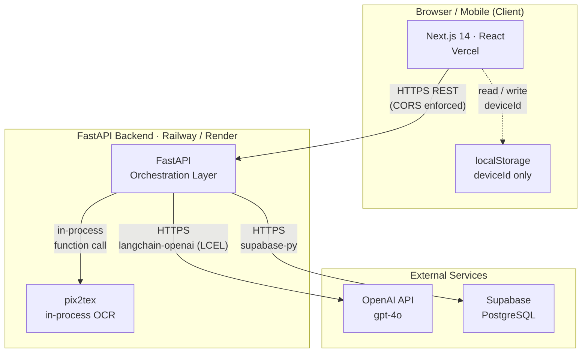
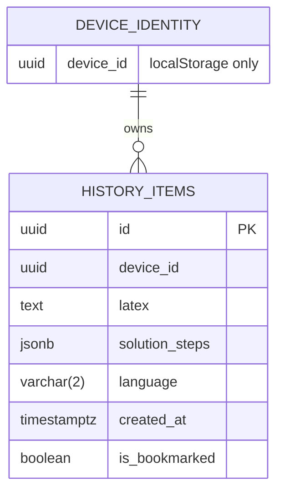
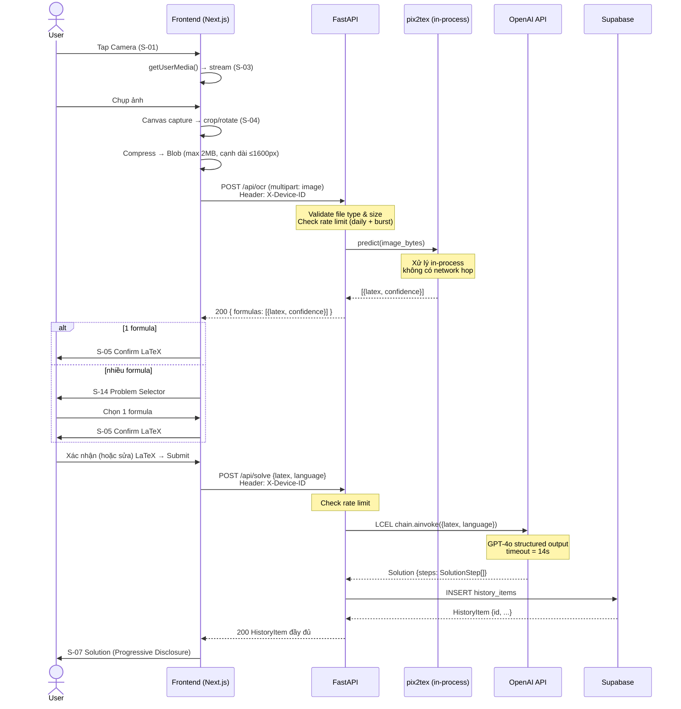
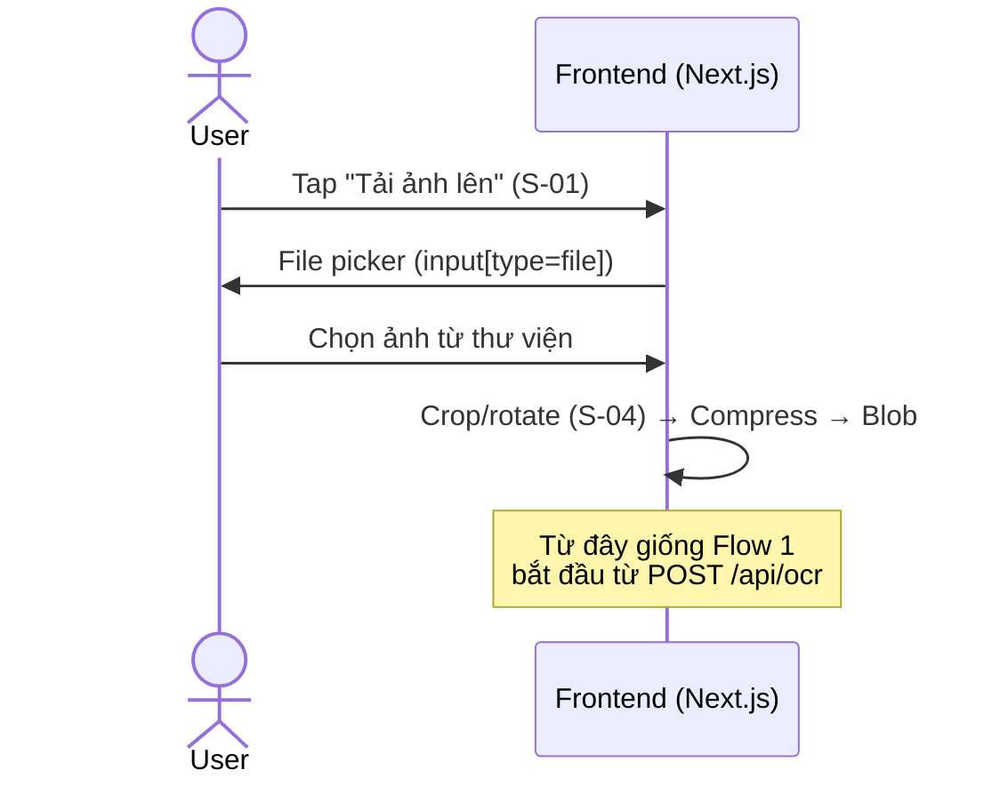
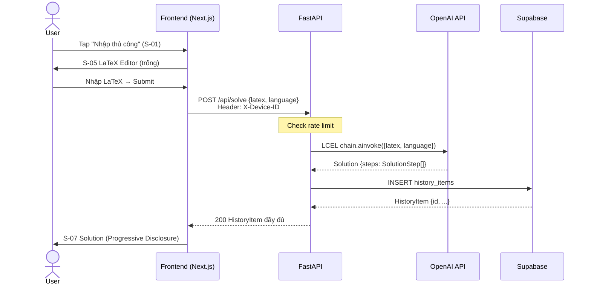
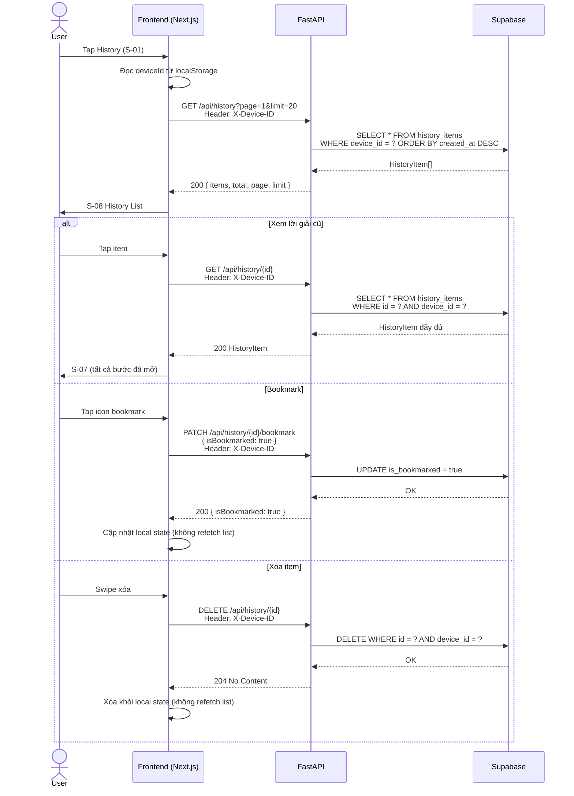
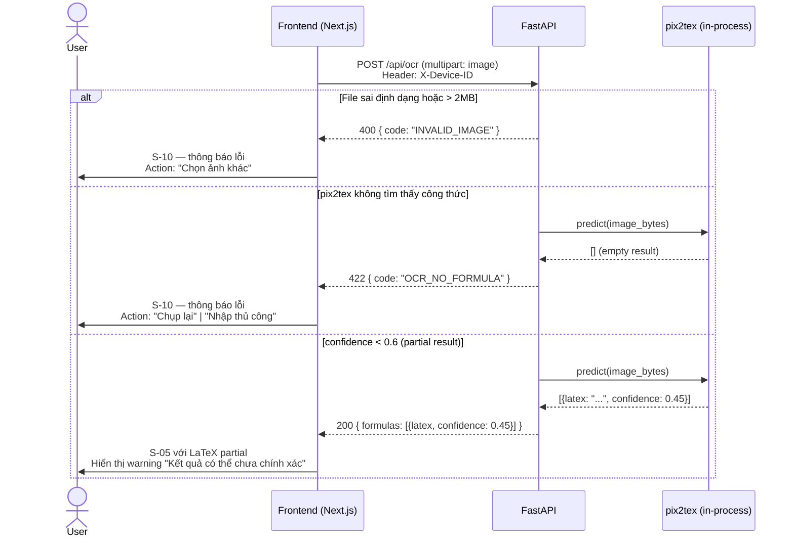
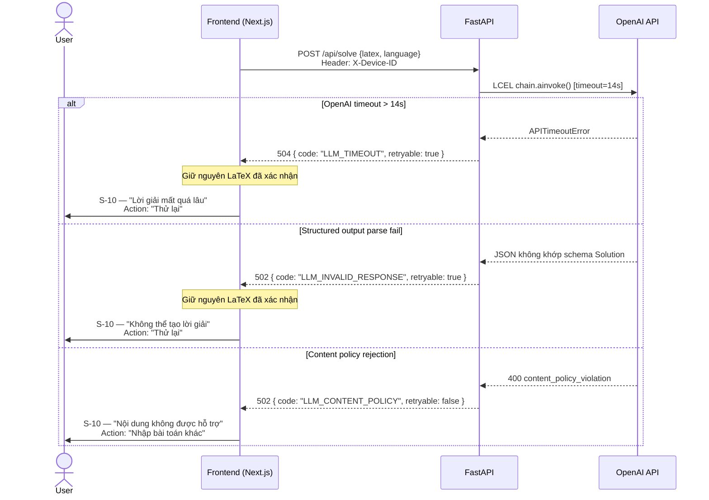

# System Design

## MathSnap — AI-Powered Math Tutor

| Thông tin               | Chi tiết                                                                      |
| ----------------------- | ----------------------------------------------------------------------------- |
| **Dự án**               | MathSnap                                                                      |
| **Phiên bản**           | 2.0.0                                                                         |
| **Ngày cập nhật**       | 10/05/2026                                                                    |
| **Tác giả**             | Thanh Thinh Nguyen                                                            |
| **Môn học**             | Thiết kế Giao diện Người dùng (UI Design)                                     |
| **Thời gian thực hiện** | 3 tuần (30/04/2026 – 21/05/2026)                                              |
| **Trạng thái**          | Approved                                                                      |
| **Tham chiếu**          | BRD v2.0.0 (Approved) · PRD v2.0.0 (Approved)                                 |
| **Đối tượng**           | Tác giả đồ án (designer/PM), lập trình viên (developers), giảng viên đánh giá |

> **Phạm vi tài liệu:** SYSTEM*DESIGN trả lời câu hỏi **"HOW (at system level)"** — mô tả kiến trúc hệ thống, các quyết định kỹ thuật, giao kèo giữa các thành phần, luồng dữ liệu và chiến lược xử lý. SYSTEM*DESIGN kế thừa mọi yêu cầu chức năng và phi chức năng từ PRD; khi có xung đột, PRD là nguồn tin cậy cho \_hành vi sản phẩm*, SYSTEM*DESIGN là nguồn tin cậy cho \_hành vi hệ thống\*. Khi có xung đột về mục tiêu, BRD là nguồn tin cậy tối cao.

---

## Mục lục

1. [System Overview](#1-system-overview)
2. [Tech Stack & Constraints](#2-tech-stack--constraints)
3. [Data Models](#3-data-models)
4. [API Contracts](#4-api-contracts)
5. [Data Flows](#5-data-flows)
6. [Image Processing & Privacy](#6-image-processing--privacy)
7. [LLM Prompt Design](#7-llm-prompt-design)
8. [Error Handling & Retry](#8-error-handling--retry)
9. [Rate Limiting & Cost Control](#9-rate-limiting--cost-control)
10. [Performance](#10-performance)
11. [Security](#11-security)
12. [Scale & Reliability](#12-scale--reliability)
13. [Trade-off Analysis](#13-trade-off-analysis)
14. [Edge Cases](#14-edge-cases)
15. [Appendix](#15-appendix)

---

## 1. System Overview

MathSnap gồm 5 thành phần phân tách thành hai deployment riêng biệt — **Next.js Frontend** và **FastAPI Backend** — cộng với hai dịch vụ bên ngoài được truy cập qua API. Điểm đặc biệt của kiến trúc này: OCR không phải một external API call mà là thư viện **pix2tex** chạy trong-process trực tiếp trong FastAPI.

### 1.1 High-level Architecture Diagram



### 1.2 Component Responsibilities

| Component               | Công nghệ                   | Vai trò                                                                                                     | Ranh giới kiểm soát           |
| ----------------------- | --------------------------- | ----------------------------------------------------------------------------------------------------------- | ----------------------------- |
| **Next.js Frontend**    | Next.js 14 / React          | Mobile-first SPA: giao diện người dùng, Camera API, LaTeX rendering (KaTeX), gọi FastAPI                    | Tác giả đồ án                 |
| **FastAPI Backend**     | Python 3.11 / FastAPI       | Orchestration layer: nhận request, điều phối pix2tex và OpenAI API (qua LangChain LCEL chain), ghi Supabase | Tác giả đồ án                 |
| **pix2tex**             | Python library (in-process) | Nhận diện công thức toán trong ảnh → LaTeX; chạy trong memory FastAPI, không có network hop                 | Tác giả đồ án                 |
| **OpenAI API**          | gpt-4o                      | Sinh lời giải từng bước cấu trúc JSON từ LaTeX input                                                        | Phụ thuộc bên ngoài           |
| **Supabase PostgreSQL** | Managed PostgreSQL          | Persist `HistoryItem` và `SolutionStep`; truy vấn theo `deviceId`                                           | Phụ thuộc bên ngoài (managed) |
| **localStorage**        | Browser API (client-side)   | Lưu `deviceId` (UUID v4) để scope dữ liệu History theo thiết bị                                             | Client-side                   |

### 1.3 System Boundaries

**Kiểm soát hoàn toàn:**

- Next.js frontend codebase và Vercel deployment config
- FastAPI backend codebase, bao gồm pix2tex integration và prompt logic
- Supabase database schema và migration scripts

**Phụ thuộc bên ngoài — rủi ro cần quản lý:**

- **OpenAI API**: uptime, cost per request, model behavior, content policy (→ Section 12)
- **Supabase hosting**: uptime, data residency, free tier limits (→ Section 12)

**Ngoài tầm kiểm soát:**

- Camera API support trên trình duyệt và thiết bị người dùng — fallback đã được thiết kế vào PRD (NFR-5, FR-1b, FR-1c)
- Chất lượng ảnh do người dùng chụp — hướng dẫn chụp được thiết kế vào UX (R-4 BRD)
- Network conditions của người dùng — timeout cứng đã được định nghĩa (NFR-1 PRD)

### 1.4 Communication Protocol

| Kết nối            | Protocol                        | Ghi chú                                                             |
| ------------------ | ------------------------------- | ------------------------------------------------------------------- |
| Frontend ↔ FastAPI | HTTPS REST                      | CORS chỉ cho phép origin của Next.js frontend (→ Section 11)        |
| FastAPI ↔ pix2tex  | In-process function call        | Không có network hop; ảnh xử lý trong memory, không rời server      |
| FastAPI ↔ OpenAI   | HTTPS / langchain-openai (LCEL) | API key chỉ tồn tại ở backend dưới dạng env variable (→ Section 11) |
| FastAPI ↔ Supabase | HTTPS / supabase-py             | Service role key chỉ tồn tại ở backend                              |

### 1.5 Deployment Topology

Hai service triển khai độc lập trên hai platform:

| Service          | Platform            | Trigger deploy     | Ghi chú                                |
| ---------------- | ------------------- | ------------------ | -------------------------------------- |
| Next.js Frontend | Vercel              | Push to `main`     | Automatic deployment, CDN global       |
| FastAPI Backend  | Railway hoặc Render | Push to `main`     | Docker container hoặc Python buildpack |
| PostgreSQL       | Supabase cloud      | Migration thủ công | Managed, không cần tự vận hành         |

> **Lưu ý về pix2tex:** thư viện yêu cầu tải model weights (~870MB) khi khởi động lần đầu. Railway/Render cần tối thiểu **1GB RAM** và thời gian cold start đủ dài. Cân nhắc keep-alive ping để tránh cold start trong demo.

---

## 2. Tech Stack & Constraints

### 2.1 Frontend

| Quyết định            | Lựa chọn                | Lý do                                                                                                           | Bị loại                                                     |
| --------------------- | ----------------------- | --------------------------------------------------------------------------------------------------------------- | ----------------------------------------------------------- |
| **Framework**         | Next.js 14 (App Router) | Mobile-first SPA, Vercel-native (zero-config deploy), React ecosystem, tích hợp Image Optimization              | Vite + React thuần: không có SSR, routing thủ công          |
| **LaTeX renderer**    | KaTeX 0.16              | Bundle ~300KB, render đồng bộ, không layout shift, đủ coverage cho THPT–ĐH năm 1–2 → đáp ứng NFR-1 (FCP ≤ 1.5s) | MathJax 3: ~800KB, render bất đồng bộ, làm tăng FCP         |
| **Image crop/rotate** | `react-easy-crop`       | Canvas API wrapper nhẹ (<10KB), không cần backend, output Blob trực tiếp                                        | Tắt crop hẳn: ảnh full-size làm giảm OCR accuracy (R-4 BRD) |
| **Đa ngôn ngữ**       | `next-intl`             | Tích hợp sẵn App Router, type-safe, locale detect                                                               | i18next: config phức tạp hơn không cần thiết với 2 ngôn ngữ |

**Constraint liên kết:** NFR-1 (FCP ≤ 1.5s, Lighthouse ≥ 90) → drive KaTeX và bundle optimization.

---

### 2.2 Backend

| Quyết định          | Lựa chọn                                               | Lý do                                                                                                                        | Bị loại                                                              |
| ------------------- | ------------------------------------------------------ | ---------------------------------------------------------------------------------------------------------------------------- | -------------------------------------------------------------------- |
| **Runtime**         | Python 3.11                                            | pix2tex là thư viện Python; không thể dùng runtime khác mà không thay OCR                                                    | Node.js: không có pix2tex                                            |
| **Web framework**   | FastAPI 0.111                                          | Async native, Pydantic v2 tích hợp sẵn, auto OpenAPI docs, tương thích `langchain-openai`                                    | Flask: không async; Django: quá nặng cho API-only service            |
| **LLM integration** | LangChain LCEL (`langchain-openai` + `langchain-core`) | Structured output qua `.with_structured_output(Solution)`, async `chain.ainvoke()`, LangSmith tracing opt-in, retry built-in | OpenAI SDK trực tiếp: đủ dùng nhưng không có tracing để debug prompt |
| **Database client** | `supabase-py`                                          | Official client, hỗ trợ async, kết nối trực tiếp đến Supabase PostgreSQL                                                     | SQLAlchemy: phức tạp hơn không cần thiết khi dùng Supabase managed   |

**Dependency bắt buộc trong `requirements.txt`:**

```
fastapi==0.111.0
uvicorn==0.30.0
pix2tex==0.1.2
langchain-openai==0.1.20
langchain-core==0.2.40
supabase==2.4.0
pydantic>=2.0
python-multipart==0.0.9
```

> **Lưu ý version pinning:** `langchain-openai` và `langchain-core` phải pin version cụ thể — LangChain có lịch sử đổi API thường xuyên. Không dùng `>=` hay bỏ trống version.

---

### 2.3 OCR

|                            | pix2tex _(đã chọn)_                  | Mathpix API                            |
| -------------------------- | ------------------------------------ | -------------------------------------- |
| **Chi phí**                | $0 — open source                     | ~$0.004/request                        |
| **Privacy**                | Ảnh không rời khỏi server            | Ảnh gửi đến Mathpix server             |
| **Dependency**             | Library Python, in-process           | External API, phụ thuộc uptime Mathpix |
| **RAM backend**            | ~870MB model weights                 | Không cần RAM đặc biệt                 |
| **Accuracy — THPT**        | Đủ (validated qua community reports) | Cao hơn                                |
| **Accuracy — ĐH phức tạp** | Có thể giảm trên ký hiệu đặc biệt    | Ổn định hơn                            |

**Kết luận chọn pix2tex:** C-5 (ngân sách giới hạn) và tinh thần BR-10 (không để ảnh rời infrastructure). Rủi ro accuracy trên bài phức tạp được ghi nhận tại R-1 BRD — giảm thiểu bằng hướng dẫn chụp rõ ràng trong UX.

---

### 2.4 LLM Provider

|                              | GPT-4o _(đã chọn)_ | GPT-4o-mini        | Claude 3.5 Sonnet     |
| ---------------------------- | ------------------ | ------------------ | --------------------- |
| **Structured output**        | ✅ Native          | ✅ Native          | ✅ Native             |
| **Cost (input / 1M tokens)** | ~$5                | ~$0.15             | ~$3                   |
| **Latency trung bình**       | ~3–8s              | ~1–3s              | ~3–6s                 |
| **Math reasoning**           | Tốt                | Đủ dùng cho THPT   | Tốt                   |
| **Tích hợp LangChain**       | `langchain-openai` | `langchain-openai` | `langchain-anthropic` |

**Kết luận chọn GPT-4o:** Chất lượng math reasoning tốt nhất trong budget cho prototype. Nếu C-5 trở thành bottleneck, có thể switch sang `gpt-4o-mini` chỉ bằng cách đổi một string trong config — LCEL không thay đổi code logic.

**LangChain LCEL** được chọn làm integration layer vì:

- Structured output contract tường minh qua Pydantic schema `Solution` — không tự viết JSON parser
- Async `chain.ainvoke()` tương thích FastAPI `async def` endpoint
- Timeout `ChatOpenAI(timeout=14)` — 1s buffer trước NFR-1 = 15s
- LangSmith tracing: opt-in qua env var, Free tier $0 (≤ 5,000 traces/tháng)
- Dễ switch model bằng cách đổi param `model=` duy nhất

---

### 2.5 Database

**Supabase PostgreSQL** — lý do chọn:

- Managed, zero DevOps: không cần tự vận hành PostgreSQL server (C-2: solo developer)
- Free tier đủ cho prototype: 500MB storage, unlimited requests trong giới hạn bandwidth
- `supabase-py` hỗ trợ async, tích hợp trực tiếp với FastAPI
- Dễ inspect data qua Supabase Dashboard trong quá trình debug
- Có Row Level Security sẵn nếu cần upgrade authentication sau này

Không dùng localStorage-only cho History vì mất data khi clear browser (→ Trade-off Section 13).

---

### 2.6 Deployment

| Service          | Platform                            | Lý do                                                        | Config đặc biệt                                              |
| ---------------- | ----------------------------------- | ------------------------------------------------------------ | ------------------------------------------------------------ |
| Next.js Frontend | **Vercel**                          | Vercel-native, CDN global, preview URLs tự động, zero-config | Không có                                                     |
| FastAPI Backend  | **Railway** _(ưu tiên)_ hoặc Render | Docker support, env vars, RAM ≥ 1GB cho pix2tex              | Chọn plan ≥ 1GB RAM; set keep-alive ping để tránh cold start |
| PostgreSQL       | **Supabase cloud**                  | Managed, không tự vận hành                                   | Migration thủ công qua Supabase CLI                          |

> **Railway vs Render:** Railway có cold start nhanh hơn (~3s vs ~8s) và UI thân thiện hơn — ưu tiên Railway. Render là backup nếu Railway không ổn định trong demo window.

---

### 2.7 Constraints

| Constraint (BRD)                        | Ảnh hưởng trực tiếp lên Tech Stack                                                                                          |
| --------------------------------------- | --------------------------------------------------------------------------------------------------------------------------- |
| **C-1** — 3 tuần                        | Chọn Supabase (không tự vận hành DB), Vercel (zero-config), LangChain LCEL (có sẵn structured output, không tự viết parser) |
| **C-2** — Solo developer                | Không có microservices, không có message queue; tất cả backend trong 1 FastAPI service                                      |
| **C-4** — Phụ thuộc third-party API     | OpenAI là SPOF duy nhất; pix2tex in-process loại bỏ dependency vào OCR third-party                                          |
| **C-5** — Ngân sách API giới hạn        | pix2tex = $0; LLM cost kiểm soát qua rate limiting (Section 9); LangSmith Free tier $0; Railway free tier đủ cho demo       |
| **NFR-1** — OCR ≤ 10s, LLM ≤ 15s        | Timeout cứng: `ChatOpenAI(timeout=14)`, `AbortController` ở frontend                                                        |
| **NFR-2** — FCP ≤ 1.5s, Lighthouse ≥ 90 | KaTeX thay vì MathJax, bundle splitting Next.js, lazy load KaTeX                                                            |

---

## 3. Data Models

Hệ thống MathSnap có **2 entity** với quan hệ 1-nhiều: mỗi `HistoryItem` chứa một danh sách `SolutionStep`. Do các step luôn được truy xuất cùng với HistoryItem (không bao giờ query step độc lập), `solution_steps` được lưu dưới dạng **JSONB** trong cột của `history_items` thay vì bảng riêng — đơn giản hơn, không cần JOIN, phù hợp C-1 (3 tuần).

---

### 3.1 Entity Overview



`DEVICE_IDENTITY` không có bảng trong database — chỉ tồn tại trong localStorage của browser. `device_id` là foreign key logic: backend dùng nó để filter `history_items`, không có FK constraint vật lý.

---

### 3.2 HistoryItem

Đơn vị lưu trữ chính, tương ứng với 1 bài toán mà người dùng đã giải.

| Field            | Kiểu (PostgreSQL) | Nullable | Default             | Ghi chú                                                |
| ---------------- | ----------------- | -------- | ------------------- | ------------------------------------------------------ |
| `id`             | `uuid`            | NOT NULL | `gen_random_uuid()` | PK, tự sinh                                            |
| `device_id`      | `uuid`            | NOT NULL | —                   | Index; dùng để scope History theo thiết bị             |
| `latex`          | `text`            | NOT NULL | —                   | LaTeX input từ OCR hoặc nhập tay; max 2000 ký tự       |
| `solution_steps` | `jsonb`           | NOT NULL | `'[]'`              | Mảng `SolutionStep[]`; được ghi một lần khi LLM trả về |
| `language`       | `varchar(2)`      | NOT NULL | `'vi'`              | `'vi'` hoặc `'en'` — FR-8                              |
| `created_at`     | `timestamptz`     | NOT NULL | `now()`             | Thời điểm ghi vào DB; không cho phép client set        |
| `is_bookmarked`  | `boolean`         | NOT NULL | `false`             | Toggle qua `PATCH /api/history/:id/bookmark`           |

---

### 3.3 SolutionStep

Sub-entity nhúng bên trong `solution_steps` (JSONB). Mỗi phần tử trong mảng tuân theo schema sau:

| Field         | Kiểu (JSON)        | Nullable | Ghi chú                                                              |
| ------------- | ------------------ | -------- | -------------------------------------------------------------------- |
| `index`       | `number` (integer) | NOT NULL | Thứ tự bước, bắt đầu từ `1`                                          |
| `title`       | `string`           | NOT NULL | Tiêu đề ngắn hiển thị trong Progressive Disclosure; max 100 ký tự    |
| `explanation` | `string`           | NOT NULL | Giải thích chi tiết bằng ngôn ngữ đã chọn; max 1000 ký tự            |
| `formula`     | `string \| null`   | nullable | LaTeX thuần (không có `$...$`) nếu bước có công thức; max 500 ký tự  |
| `is_answer`   | `boolean`          | NOT NULL | `true` cho bước cuối cùng — bước kết quả. Chỉ đúng 1 step trong mảng |

**Ví dụ JSON hợp lệ:**

```json
[
  {
    "index": 1,
    "title": "Chuyển vế",
    "explanation": "Chuyển -3 sang vế phải, đổi dấu thành +3",
    "formula": "2x = 7 + 3",
    "is_answer": false
  },
  {
    "index": 2,
    "title": "Chia hai vế",
    "explanation": "Chia cả hai vế cho 2 để tìm x",
    "formula": "x = \\frac{10}{2}",
    "is_answer": false
  },
  {
    "index": 3,
    "title": "Kết quả",
    "explanation": "Vậy x = 5",
    "formula": "x = 5",
    "is_answer": true
  }
]
```

---

### 3.4 DeviceIdentity

`device_id` không phải là PII và không có bảng trong database. Quy tắc tạo và quản lý:

- **Tạo:** UUID v4, sinh client-side lần đầu tiên khi user mở app (`crypto.randomUUID()`)
- **Lưu:** `localStorage['mathsnap_device_id']`
- **Gửi lên backend:** Header `X-Device-ID` — thống nhất dùng header thay vì query param để không lộ trong URL log (→ Section 4)
- **Không phải authentication:** Backend không validate danh tính, chỉ dùng để scope data
- **Khi bị xóa:** User clear localStorage → tạo `device_id` mới → mất access History cũ (expected behavior, R-5 BRD)

---

### 3.5 Database Schema (SQL DDL)

```sql
CREATE TABLE history_items (
    id             UUID        PRIMARY KEY DEFAULT gen_random_uuid(),
    device_id      UUID        NOT NULL,
    latex          TEXT        NOT NULL CHECK (char_length(latex) <= 2000),
    solution_steps JSONB       NOT NULL DEFAULT '[]'::jsonb,
    language       VARCHAR(2)  NOT NULL DEFAULT 'vi' CHECK (language IN ('vi', 'en')),
    created_at     TIMESTAMPTZ NOT NULL DEFAULT now(),
    is_bookmarked  BOOLEAN     NOT NULL DEFAULT false
);

-- Index để query History theo device nhanh
CREATE INDEX idx_history_items_device_id ON history_items (device_id, created_at DESC);
```

Không có bảng `solution_steps` riêng, không có bảng `users` — đúng với phạm vi MVP không có authentication.

---

### 3.6 Pydantic Models (FastAPI)

Schema Python dùng trực tiếp trong LCEL chain (Section 7) và API response:

```python
# app/schemas/solution.py
from pydantic import BaseModel, Field

class SolutionStep(BaseModel):
    index:       int
    title:       str = Field(max_length=100)
    explanation: str = Field(max_length=1000)
    formula:     str | None = Field(default=None, max_length=500)
    is_answer:   bool

class Solution(BaseModel):
    steps: list[SolutionStep] = Field(min_length=1, max_length=10)

# app/schemas/history.py
from uuid import UUID
from datetime import datetime

class HistoryItem(BaseModel):
    id:             UUID
    device_id:      UUID
    latex:          str
    solution_steps: list[SolutionStep]
    language:       str
    created_at:     datetime
    is_bookmarked:  bool
```

---

### 3.7 TypeScript Types (Next.js Frontend)

```typescript
// types/history.ts
export interface SolutionStep {
  index: number;
  title: string;
  explanation: string;
  formula?: string;
  isAnswer: boolean; // camelCase ở frontend, snake_case ở backend/DB
}

export interface HistoryItem {
  id: string; // UUID
  deviceId: string;
  latex: string;
  solutionSteps: SolutionStep[];
  language: 'vi' | 'en';
  createdAt: string; // ISO 8601
  isBookmarked: boolean;
}
```

> **Naming convention:** Backend/DB dùng `snake_case` (Python/PostgreSQL), Frontend dùng `camelCase` (JavaScript). FastAPI response dùng `model_config = ConfigDict(alias_generator=to_camel, populate_by_name=True)` để tự động transform — chi tiết tại Section 4.

---

### 3.8 Quy tắc lưu trữ

| Loại dữ liệu                  | Lưu?             | Nơi lưu                                         | Ghi chú                                 |
| ----------------------------- | ---------------- | ----------------------------------------------- | --------------------------------------- |
| LaTeX string                  | ✅               | Supabase `history_items.latex`                  | Nguồn sự thật của bài toán              |
| SolutionStep[]                | ✅               | Supabase `history_items.solution_steps` (JSONB) | Ghi 1 lần sau khi LLM trả về            |
| Language, timestamp, bookmark | ✅               | Supabase `history_items`                        | Metadata của session                    |
| device_id                     | ✅ (client only) | localStorage                                    | Không có bảng riêng trong Supabase      |
| Ảnh gốc / ảnh đã crop         | ❌               | Không lưu                                       | BR-10: xóa ngay sau OCR, không ghi disk |
| Prompt gửi LLM                | ❌               | Không lưu                                       | Có thể trace qua LangSmith nếu bật      |
| LLM raw response              | ❌               | Không lưu                                       | Chỉ lưu parsed `SolutionStep[]`         |

---

### 3.9 Giới hạn dữ liệu

| Đối tượng              | Giới hạn       | Lý do                                                                         |
| ---------------------- | -------------- | ----------------------------------------------------------------------------- |
| `latex`                | max 2000 ký tự | Công thức dài hơn thường là copy nhầm; LLM prompt bị phình nếu không giới hạn |
| `SolutionStep[]`       | max 10 bước    | Bài THPT hiếm khi cần >8 bước; tránh LLM hallucinate thêm bước thừa           |
| `title` mỗi step       | max 100 ký tự  | Giới hạn hiển thị trong Progressive Disclosure UI                             |
| `explanation` mỗi step | max 1000 ký tự | Đủ cho giải thích chi tiết, không tràn màn hình mobile                        |
| `formula` mỗi step     | max 500 ký tự  | Công thức LaTeX thuần; render bởi KaTeX                                       |
| HistoryItem per device | max 100 items  | Tránh Supabase free tier bị tràn; xóa item cũ nhất khi vượt ngưỡng            |

---

## 4. API Contracts

### 4.1 Conventions

**Base URL**

| Môi trường  | URL                                    |
| ----------- | -------------------------------------- |
| Development | `http://localhost:8000`                |
| Production  | `https://<railway-app>.up.railway.app` |

**Versioning:** Không dùng prefix `/v1/` cho MVP — đường dẫn phẳng `/api/*`. Khi cần breaking change ở phiên bản sau mới thêm `/api/v2/`.

**Device Identity:** Mọi request cần scope theo thiết bị phải kèm header `X-Device-ID: <uuid-v4>`. Header thiếu hoặc không hợp lệ → `400 INVALID_DEVICE_ID`.

**Naming convention:** Response JSON dùng `camelCase` (frontend convention). FastAPI config `alias_generator=to_camel` để tự động transform từ `snake_case` (→ Section 3.7).

**Content-Type:**

- Request có body JSON: `Content-Type: application/json`
- Request upload ảnh: `Content-Type: multipart/form-data`
- Response luôn: `Content-Type: application/json`

---

### 4.2 `POST /api/ocr`

Nhận ảnh, trả về danh sách công thức LaTeX đã nhận dạng.

**Request**

```
POST /api/ocr
Content-Type: multipart/form-data
X-Device-ID: <uuid-v4>

Field: image  (file)
  - Định dạng chấp nhận: image/jpeg, image/png, image/webp
  - Max size: 2MB
```

**Response 200 — OK**

```json
{
  "formulas": [
    { "latex": "2x + 3 = 7", "confidence": 0.92 },
    { "latex": "x^2 - 4 = 0", "confidence": 0.85 }
  ]
}
```

- `formulas` luôn là array. Nếu chỉ có 1 công thức → array 1 phần tử.
- Frontend: `formulas.length === 1` → đi thẳng S-05 Confirm; `formulas.length > 1` → hiển thị S-14 Problem Selector.
- `confidence`: float `0.0–1.0` từ pix2tex. Nếu `confidence < 0.6`: vẫn trả 200, frontend hiển thị S-05 với LaTeX partial cho user sửa (→ Section 14, OQ-6).

**Response 422 — Unprocessable**

```json
{
  "code": "OCR_NO_FORMULA",
  "message": "Không tìm thấy công thức toán trong ảnh.",
  "retryable": false
}
```

**Response 400 — Bad Request**

```json
{
  "code": "INVALID_IMAGE",
  "message": "Định dạng file không được hỗ trợ hoặc vượt quá 2MB.",
  "retryable": false
}
```

> `X-Device-ID` **bắt buộc** ở endpoint này từ v2.0.0 — không phải để scope dữ liệu (OCR vẫn không persist theo BR-10), mà để áp dụng rate limit (FR-10 PRD: 20 OCR/device/day, burst 5/phút). Header thiếu hoặc không hợp lệ → `400 INVALID_DEVICE_ID`. Vượt limit → `429 RATE_LIMITED`.

---

### 4.3 `POST /api/solve`

Nhận LaTeX, gọi LLM sinh lời giải, tự động lưu vào History, trả về `HistoryItem` đầy đủ.

**Request**

```
POST /api/solve
Content-Type: application/json
X-Device-ID: <uuid-v4>     (bắt buộc)

{
  "latex":    "2x + 3 = 7",
  "language": "vi"
}
```

| Field      | Kiểu             | Bắt buộc | Ghi chú                        |
| ---------- | ---------------- | -------- | ------------------------------ |
| `latex`    | string           | ✅       | Max 2000 ký tự (→ Section 3.9) |
| `language` | `"vi"` \| `"en"` | ❌       | Default `"vi"` — FR-8          |

**Response 200 — OK**

```json
{
  "id": "e4a1f2b3-...",
  "deviceId": "a1b2c3d4-...",
  "latex": "2x + 3 = 7",
  "language": "vi",
  "createdAt": "2026-04-29T10:00:00Z",
  "isBookmarked": false,
  "solutionSteps": [
    {
      "index": 1,
      "title": "Chuyển vế",
      "explanation": "Chuyển +3 sang vế phải, đổi dấu thành -3",
      "formula": "2x = 7 - 3",
      "isAnswer": false
    },
    {
      "index": 2,
      "title": "Chia hai vế",
      "explanation": "Chia cả hai vế cho 2",
      "formula": "x = \\frac{4}{2}",
      "isAnswer": false
    },
    {
      "index": 3,
      "title": "Kết quả",
      "explanation": "Vậy x = 2",
      "formula": "x = 2",
      "isAnswer": true
    }
  ]
}
```

> Trả về `HistoryItem` đầy đủ để frontend thêm ngay vào local state History mà không cần gọi thêm `GET /api/history`. Auto-save diễn ra trong cùng request — nếu DB write fail, vẫn trả 200 (lỗi DB không chặn lời giải hiển thị với user).

**Response 504 — Gateway Timeout**

```json
{
  "code": "LLM_TIMEOUT",
  "message": "Lời giải mất quá nhiều thời gian. Vui lòng thử lại.",
  "retryable": true
}
```

**Response 429 — Too Many Requests**

```json
{
  "code": "RATE_LIMITED",
  "message": "Bạn đã dùng hết lượt giải hôm nay. Thử lại sau 24 giờ.",
  "retryable": false
}
```

**Response 502 — Bad Gateway**

```json
{
  "code": "LLM_INVALID_RESPONSE",
  "message": "Không thể tạo lời giải. Vui lòng thử lại.",
  "retryable": true
}
```

---

### 4.4 `GET /api/history`

Trả về danh sách `HistoryItem` của thiết bị, sắp xếp mới nhất trước.

**Request**

```
GET /api/history?page=1&limit=20&bookmarked=false
X-Device-ID: <uuid-v4>     (bắt buộc)
```

| Query param  | Kiểu    | Default | Mô tả                                |
| ------------ | ------- | ------- | ------------------------------------ |
| `page`       | integer | `1`     | Trang hiện tại                       |
| `limit`      | integer | `20`    | Số item mỗi trang, max 50            |
| `bookmarked` | boolean | —       | Nếu `true`: chỉ trả item đã bookmark |

**Response 200 — OK**

```json
{
  "items": [],
  "total": 47,
  "page": 1,
  "limit": 20
}
```

> `solutionSteps` được trả đầy đủ trong mỗi item — Progressive Disclosure là UI concern, backend không filter bước.

---

### 4.5 `GET /api/history/{id}`

Trả về một `HistoryItem` cụ thể theo id. Dùng khi user tap vào item trong S-08 History List để xem lại lời giải đầy đủ.

**Request**

```
GET /api/history/e4a1f2b3-...
X-Device-ID: <uuid-v4>     (bắt buộc)
```

**Response 200 — OK** (trả về `HistoryItem` đầy đủ với `solutionSteps`)

```json
{
  "id": "e4a1f2b3-...",
  "deviceId": "a1b2c3d4-...",
  "latex": "2x + 3 = 7",
  "language": "vi",
  "createdAt": "2026-04-29T10:00:00Z",
  "isBookmarked": true,
  "solutionSteps": []
}
```

**Response 404 — Not Found**

```json
{ "code": "HISTORY_NOT_FOUND", "message": "Không tìm thấy bài toán này.", "retryable": false }
```

> 404 áp dụng cho cả trường hợp item không tồn tại lẫn item thuộc `device_id` khác — không phân biệt để tránh information leak (giống `DELETE`).

---

### 4.6 `DELETE /api/history/{id}`

Xóa một `HistoryItem`. Backend verify `device_id` trong header khớp với item trước khi xóa.

**Request**

```
DELETE /api/history/e4a1f2b3-...
X-Device-ID: <uuid-v4>     (bắt buộc)
```

**Response 204 — No Content** (xóa thành công, body rỗng)

**Response 404 — Not Found**

```json
{ "code": "HISTORY_NOT_FOUND", "message": "Không tìm thấy bài toán này.", "retryable": false }
```

> 404 trả về cho cả 2 trường hợp: item không tồn tại và item tồn tại nhưng thuộc `device_id` khác — không phân biệt để tránh information leak.

---

### 4.7 `PATCH /api/history/{id}/bookmark`

Cập nhật trạng thái bookmark của một `HistoryItem`. Body chứa giá trị explicit (không toggle ngầm) để đảm bảo idempotency.

**Request**

```
PATCH /api/history/e4a1f2b3-.../bookmark
Content-Type: application/json
X-Device-ID: <uuid-v4>     (bắt buộc)

{ "isBookmarked": true }
```

**Response 200 — OK**

```json
{ "isBookmarked": true }
```

**Response 404 — Not Found**

```json
{ "code": "HISTORY_NOT_FOUND", "message": "Không tìm thấy bài toán này.", "retryable": false }
```

---

### 4.8 Error Response Schema

Mọi lỗi từ API đều theo cùng một schema:

```json
{
  "code": "LLM_TIMEOUT",
  "message": "Lời giải mất quá nhiều thời gian. Vui lòng thử lại.",
  "retryable": true
}
```

| Field       | Kiểu    | Mô tả                                                                       |
| ----------- | ------- | --------------------------------------------------------------------------- |
| `code`      | string  | Mã lỗi định danh — Frontend dùng để map sang UI action                      |
| `message`   | string  | Mô tả ngắn gọn — dùng cho log, không nhất thiết hiển thị trực tiếp cho user |
| `retryable` | boolean | `true` nếu user có thể bấm "Thử lại" và có khả năng thành công              |

**Danh sách error code:**

| Code                   | HTTP Status | retryable | Nguồn gốc                                                                         |
| ---------------------- | ----------- | --------- | --------------------------------------------------------------------------------- |
| `INVALID_IMAGE`        | 400         | false     | File sai định dạng hoặc quá 2MB                                                   |
| `INVALID_DEVICE_ID`    | 400         | false     | Header `X-Device-ID` thiếu hoặc không phải UUID                                   |
| `INVALID_REQUEST`      | 400         | false     | Body JSON sai schema (Pydantic validation)                                        |
| `OCR_NO_FORMULA`       | 422         | false     | pix2tex không tìm thấy công thức                                                  |
| `HISTORY_NOT_FOUND`    | 404         | false     | Item không tồn tại hoặc không thuộc device                                        |
| `RATE_LIMITED`         | 429         | varies    | Vượt rate limit OCR/LLM — daily (`retryable=false`) hoặc burst (`retryable=true`) |
| `LLM_TIMEOUT`          | 504         | true      | OpenAI không phản hồi trong 14s                                                   |
| `LLM_INVALID_RESPONSE` | 502         | true      | Structured output parse fail                                                      |
| `LLM_CONTENT_POLICY`   | 502         | false     | OpenAI reject vì content policy (R-8 BRD)                                         |
| `INTERNAL_ERROR`       | 500         | true      | Lỗi không xác định — fallback chung                                               |

---

### 4.9 HTTP Status Code Summary

| Status | Ý nghĩa trong MathSnap                                       |
| ------ | ------------------------------------------------------------ |
| `200`  | Thành công, body chứa data                                   |
| `204`  | Thành công, không có body (DELETE)                           |
| `400`  | Request sai — client lỗi, không nên retry                    |
| `404`  | Resource không tồn tại hoặc không thuộc device               |
| `422`  | Request hợp lệ nhưng không xử lý được (OCR không ra kết quả) |
| `429`  | Rate limit — chờ rồi retry                                   |
| `500`  | Lỗi server không xác định                                    |
| `502`  | External service (OpenAI) trả về kết quả không dùng được     |
| `504`  | External service (OpenAI) timeout                            |

---

## 5. Data Flows

Section này chuyển các User Flow từ PRD thành Sequence Diagram ở cấp hệ thống — thể hiện rõ thứ tự gọi API, xử lý và lưu trữ giữa các component. Mỗi flow tương ứng với một nhánh trong Experience Map của PRD.

---

### 5.1 Flow 1 — Happy Path: Camera → OCR → Confirm → Solve

Đây là flow chính, bao gồm toàn bộ chuỗi từ chụp ảnh đến hiển thị lời giải.



---

### 5.2 Flow 2 — Upload ảnh từ thư viện

Flow 2 giống hệt Flow 1 từ bước OCR trở đi. Điểm khác biệt duy nhất là nguồn ảnh đến từ file picker thay vì camera.



---

### 5.3 Flow 3 — Nhập LaTeX thủ công

Bỏ qua hoàn toàn bước OCR. User nhập trực tiếp vào S-05.



---

### 5.4 Flow 4 — Xem History & Bookmark



---

### 5.5 Flow 5 — OCR Fail

Hai nhánh lỗi từ bước OCR: không có công thức, hoặc file không hợp lệ.



> OCR chạy in-process — không có external timeout. Nếu pix2tex treo bất thường, FastAPI worker timeout sẽ xử lý ở tầng ASGI.

---

### 5.6 Flow 6 — LLM Fail

Ba nhánh lỗi từ bước LLM: timeout, response sai schema, content policy rejection.



> **State preservation:** Frontend giữ `latex` state qua tất cả nhánh LLM Fail. User không mất LaTeX đã xác nhận và không phải chụp lại ảnh (từ US-E3 PRD).

---

### 5.7 Flow 7 — Rate Limited

```mermaid
sequenceDiagram
    actor User
    participant FE as Frontend (Next.js)
    participant BE as FastAPI

    FE->>BE: POST /api/solve {latex, language}<br/>Header: X-Device-ID
    Note over BE: Counter vượt ngưỡng<br/>daily hoặc burst (→ Section 9)
    BE-->>FE: 429 { code: "RATE_LIMITED" }
    FE->>User: S-10 — thông báo phù hợp<br/>(daily: hiển thị reset time;<br/>burst: cho retry sau 60s)
```

> **Áp dụng cho cả `/api/ocr` từ v2.0.0** — pattern giống hệt: device_id vượt ngưỡng → backend trả 429 trước khi gọi pix2tex hoặc OpenAI. Frontend phân biệt thông báo daily-limit vs burst-limit theo `message` từ response.

---

### 5.8 Tổng hợp — Entry Points & Branches

| Flow             | Entry Point (Screen) | Bỏ qua OCR? | Bỏ qua LLM? | Lưu History?   |
| ---------------- | -------------------- | ----------- | ----------- | -------------- |
| 1 — Camera       | S-01 → S-03          | ❌          | ❌          | ✅ tự động     |
| 2 — Upload       | S-01 → file picker   | ❌          | ❌          | ✅ tự động     |
| 3 — Nhập tay     | S-01 → S-05          | ✅          | ❌          | ✅ tự động     |
| 4 — History      | S-01 → S-08          | ✅          | ✅          | Không ghi thêm |
| 5 — OCR Fail     | —                    | —           | ✅          | ❌             |
| 6 — LLM Fail     | —                    | ✅          | —           | ❌             |
| 7 — Rate Limited | —                    | ✅          | ✅          | ❌             |

---

## 6. Image Processing & Privacy

Hiện thực hóa BR-10 (không lưu ảnh gốc) và R-4 (ảnh mờ làm OCR sai) ở cấp kỹ thuật.

### 6.1 Image Lifecycle

```
[User chụp / chọn ảnh]
       │
       ▼ Client-side (browser memory)
[Canvas API: crop + rotate]
       │
       ▼ Client-side
[Canvas toBlob(): resize ≤1600px, compress JPEG q=0.85]
       │  multipart/form-data (≤2MB)
       ▼ HTTPS
[FastAPI: nhận bytes vào RAM — không ghi disk]
       │  in-process function call
       ▼
[pix2tex.predict(image_bytes) → [{latex, confidence}]]
       │
       ▼
[bytes buffer → garbage collected ngay]
       │
       ▼
[LaTeX string → trả về Frontend]
```

Ảnh không bao giờ: ghi xuống disk, lưu trong DB, gửi đến external service. Đây là bảo đảm mạnh hơn yêu cầu tối thiểu của BR-10.

### 6.2 Client-side Preprocessing

Toàn bộ xử lý ảnh xảy ra trong browser trước khi upload:

| Bước          | Công nghệ                           | Mục đích                                                       |
| ------------- | ----------------------------------- | -------------------------------------------------------------- |
| Capture frame | `getUserMedia` + `<canvas>`         | Lấy frame từ camera stream; release stream ngay sau khi chụp   |
| Crop & Rotate | `react-easy-crop` → Canvas API      | Chỉ gửi vùng chứa công thức, loại bỏ phần thừa                 |
| Resize        | Canvas `drawImage` scale            | Resize về cạnh dài ≤ 1600px — đủ cho pix2tex, giảm upload time |
| Compress      | `canvas.toBlob('image/jpeg', 0.85)` | Giảm file size, tốc độ truyền nhanh hơn                        |

**Camera stream:** `getUserMedia()` xin permission → capture vào `<canvas>` → `stream.getTracks().forEach(t => t.stop())` ngay sau khi lấy frame — stream không lưu vào bộ nhớ thiết bị.

### 6.3 Format Validation

| Thuộc tính                   | Giá trị                                                              |
| ---------------------------- | -------------------------------------------------------------------- |
| Định dạng chấp nhận          | `image/jpeg`, `image/png`, `image/webp` (FR-1b)                      |
| Max file size (sau compress) | 2MB                                                                  |
| Max cạnh dài (sau resize)    | 1600px                                                               |
| Validate client-side         | Trước khi upload (fast fail, không tốn băng thông)                   |
| Validate server-side         | MIME type check bằng `python-magic` — không tin hoàn toàn vào client |

### 6.4 Multi-formula Detection

pix2tex trả về list nếu detect nhiều block công thức trong một ảnh. FastAPI trả nguyên list về Frontend:

- `formulas.length === 1` → Frontend đi thẳng S-05 Confirm
- `formulas.length > 1` → Frontend hiển thị S-14 Problem Selector → user chọn 1 → S-05

Ngưỡng detect tối thiểu do pix2tex tự quyết định theo model — không có tham số can thiệp từ phía ứng dụng.

### 6.5 Privacy Guarantee

|                     | pix2tex (MathSnap) | Mathpix API        | Google Cloud Vision |
| ------------------- | ------------------ | ------------------ | ------------------- |
| Ảnh rời khỏi server | ❌ Không           | ✅ Gửi đến Mathpix | ✅ Gửi đến Google   |
| Ảnh ghi xuống disk  | ❌ Không           | Tùy policy Mathpix | Tùy policy Google   |
| Kiểm soát hoàn toàn | ✅                 | ❌ Không           | ❌ Không            |

---

## 7. LLM Prompt Design

LLM là thành phần kém dự đoán nhất trong hệ thống. Section này tường minh hóa toàn bộ prompt contract.

### 7.1 System Prompt

```python
SYSTEM_PROMPT = """\
Bạn là gia sư toán. Nhiệm vụ: giải bài toán theo từng bước rõ ràng, dễ hiểu.
Ngôn ngữ phản hồi: {language}.

Quy tắc bắt buộc:
1. Mỗi bước phải có title ngắn gọn (≤10 từ) và explanation đầy đủ.
2. Công thức viết bằng LaTeX thuần — không dùng $...$ hay \\(...\\).
3. Bước cuối cùng (kết quả) phải có is_answer = true. Chỉ đúng 1 bước.
4. Số bước tối đa: 10. Không thêm bước giải thích thừa.
5. Không đặt câu hỏi ngược lại. Không từ chối nếu là bài toán hợp lệ.\
"""
```

**Language injection vào system prompt** (không phải user prompt) — đảm bảo toàn bộ response từ đầu đến cuối đều dùng ngôn ngữ đã chọn, không chỉ riêng explanation.

### 7.2 User Prompt Template

```python
HUMAN_TEMPLATE = "Bài toán (LaTeX): {latex}"
```

Template đơn giản — LaTeX input là toàn bộ context cần thiết. Không thêm instruction vào user message để tránh conflict với system prompt.

### 7.3 LCEL Chain & Structured Output

```python
from langchain_openai import ChatOpenAI
from langchain_core.prompts import ChatPromptTemplate
from app.schemas.solution import Solution

_prompt = ChatPromptTemplate.from_messages([
    ("system", SYSTEM_PROMPT),
    ("human",  HUMAN_TEMPLATE),
])

_llm = ChatOpenAI(
    model="gpt-4o",
    timeout=14,
    max_retries=1,
    temperature=0,
).with_structured_output(Solution)

solver_chain = _prompt | _llm
```

`.with_structured_output(Solution)` yêu cầu OpenAI trả về JSON khớp Pydantic schema `Solution` — không cần tự viết parser, không cần `json.loads()`. Nếu output không khớp schema, LCEL raise `OutputParserException` → FastAPI bắt và trả 502 `LLM_INVALID_RESPONSE`.

### 7.4 Output Parsing — Flow

```
OpenAI trả JSON
      │
      ▼ LCEL .with_structured_output()
Pydantic validate → Solution(steps=[SolutionStep(...)])
      │
      ├─ Thành công → FastAPI nhận Solution object
      │
      └─ OutputParserException → 502 LLM_INVALID_RESPONSE (không retry)
```

**Không retry tự động** khi output sai format — retry với cùng input thường cho cùng kết quả. User bấm "Thử lại" thủ công (từ `retryable: true` trong error response).

### 7.5 Prompt Versioning

- Prompt được version cùng codebase (trong `app/services/solver.py`) → git history là version log
- Khi bật LangSmith: mỗi invoke tự động gắn prompt hash → dễ so sánh kết quả trước/sau khi sửa prompt
- Không dùng prompt management platform riêng cho MVP (C-1: 3 tuần)

---

## 8. Error Handling & Retry

### 8.1 Error Taxonomy

| Nguồn          | Loại lỗi                         | HTTP | Code                   | retryable |
| -------------- | -------------------------------- | ---- | ---------------------- | --------- |
| **Client**     | File sai định dạng / > 2MB       | 400  | `INVALID_IMAGE`        | false     |
| **Client**     | Header `X-Device-ID` thiếu / sai | 400  | `INVALID_DEVICE_ID`    | false     |
| **Client**     | Body JSON sai schema             | 400  | `INVALID_REQUEST`      | false     |
| **OCR**        | Không tìm thấy công thức         | 422  | `OCR_NO_FORMULA`       | false     |
| **LLM**        | OpenAI timeout > 14s             | 504  | `LLM_TIMEOUT`          | true      |
| **LLM**        | Output không khớp schema         | 502  | `LLM_INVALID_RESPONSE` | true      |
| **LLM**        | Content policy violation         | 502  | `LLM_CONTENT_POLICY`   | false     |
| **Rate limit** | Vượt daily limit                 | 429  | `RATE_LIMITED`         | false     |
| **Rate limit** | Vượt burst limit (5/phút)        | 429  | `RATE_LIMITED`         | true      |
| **History**    | Item không tồn tại / sai device  | 404  | `HISTORY_NOT_FOUND`    | false     |
| **Server**     | Lỗi không xác định               | 500  | `INTERNAL_ERROR`       | true      |

### 8.2 Timeout Handling

| Request            | Backend timeout            | Frontend AbortController                                      |
| ------------------ | -------------------------- | ------------------------------------------------------------- |
| `POST /api/ocr`    | ASGI worker timeout (~30s) | 15s — pix2tex thường < 5s; 15s là safety net cho network chậm |
| `POST /api/solve`  | `ChatOpenAI(timeout=14)`   | 16s — 2s buffer sau backend timeout + network round-trip      |
| `GET /api/history` | Không cần timeout cứng     | 10s — Supabase query nhanh                                    |

```typescript
// Frontend — AbortController cho /api/solve
const controller = new AbortController();
const timer = setTimeout(() => controller.abort(), 16_000);

try {
  const res = await fetch('/api/solve', {
    method: 'POST',
    signal: controller.signal,
    body: JSON.stringify({ latex, language }),
  });
} catch (e) {
  if (e instanceof Error && e.name === 'AbortError') showError('LLM_TIMEOUT');
} finally {
  clearTimeout(timer);
}
```

### 8.3 Retry Strategy

Không có auto-retry — mọi retry đều do user khởi động thủ công:

| Lỗi                    | User action                     | Lý do không auto-retry                          |
| ---------------------- | ------------------------------- | ----------------------------------------------- |
| `LLM_TIMEOUT`          | Bấm "Thử lại"                   | Auto-retry tốn thêm LLM request vào ngân sách   |
| `LLM_INVALID_RESPONSE` | Bấm "Thử lại"                   | Cùng input thường cho cùng kết quả              |
| `OCR_NO_FORMULA`       | "Chụp lại" hoặc "Nhập thủ công" | Cần input mới, không phải retry cùng ảnh        |
| `INTERNAL_ERROR`       | Bấm "Thử lại"                   | Lỗi server thoáng qua — retry có thể thành công |

`max_retries=1` trong `ChatOpenAI` chỉ áp dụng cho network glitch / OpenAI 5xx — không áp dụng cho timeout hay parse fail.

### 8.4 State Preservation on Error

```
[User xác nhận LaTeX tại S-05]
        │
        ▼  Frontend lưu latex vào React state
[POST /api/solve → đang chờ]
        │
        ├─ Thành công → S-07 (render solution)
        │
        └─ Thất bại → S-10 (error screen)
                  │  latex state vẫn còn trong memory
                  └─ User bấm "Thử lại"
                     → POST /api/solve lại với latex cũ
                     → KHÔNG cần chụp ảnh lại (US-E3 PRD)
```

### 8.5 User-facing Error Message Mapping

| Code                   | Thông báo hiển thị (VI)                 | Action button                                |
| ---------------------- | --------------------------------------- | -------------------------------------------- |
| `INVALID_IMAGE`        | Ảnh không đúng định dạng hoặc quá lớn   | "Chọn ảnh khác"                              |
| `OCR_NO_FORMULA`       | Không tìm thấy công thức toán trong ảnh | "Chụp lại" / "Nhập thủ công"                 |
| `LLM_TIMEOUT`          | Lời giải mất quá nhiều thời gian        | "Thử lại"                                    |
| `LLM_INVALID_RESPONSE` | Không thể tạo lời giải lúc này          | "Thử lại"                                    |
| `LLM_CONTENT_POLICY`   | Nội dung này không được hỗ trợ          | "Nhập bài toán khác"                         |
| `RATE_LIMITED` (daily) | Đã dùng hết lượt hôm nay                | _(hiển thị thời gian reset, không có retry)_ |
| `RATE_LIMITED` (burst) | Bạn đang gửi quá nhanh                  | "Thử lại sau 60 giây"                        |
| `INTERNAL_ERROR`       | Có lỗi xảy ra, vui lòng thử lại         | "Thử lại"                                    |

---

## 9. Rate Limiting & Cost Control

### 9.1 Phạm vi Rate Limiting

Cả `POST /api/ocr` lẫn `POST /api/solve` đều bị rate limit theo **BR-14** (BRD v2.0.0) và **FR-10** (PRD v2.0.0), với hai motivation khác nhau:

- **`/api/solve`**: motivation chính là **cost** — mỗi request tốn phí OpenAI. Daily limit 20/device.
- **`/api/ocr`**: motivation chính là **abuse prevention** — pix2tex free nhưng tốn CPU/RAM, có thể bị DOS hoặc bị abuse upload ảnh không phải toán (R-8 BRD). Daily limit 20/device.

Cả hai endpoint đều có chung **burst limit 5 req/phút** để chống pattern automation.

### 9.2 Cơ chế đếm — Daily Limit

**Cho `/api/solve`:** đếm trực tiếp từ `history_items` (mỗi solve thành công tạo 1 row):

```sql
SELECT COUNT(*)
FROM   history_items
WHERE  device_id   = $1
AND    created_at >= CURRENT_DATE
AND    created_at <  CURRENT_DATE + INTERVAL '1 day';
```

Pre-check chạy trước mỗi lần gọi LCEL chain. Nếu `count >= DAILY_SOLVE_LIMIT` → trả 429 ngay, không gọi OpenAI.

**Cho `/api/ocr`:** OCR request không tạo row trong `history_items` (chỉ trả về formula, chưa save). Daily count cho OCR dùng phương pháp xấp xỉ qua `history_items` — vì user thường gọi OCR rồi solve liên tiếp, daily count của solve ≈ daily count của OCR. Nếu cần chính xác hơn, xem 9.2.2.

**Ưu điểm:** Tái dụng bảng đã có, không thêm schema. **Nhược điểm:** Query thêm mỗi request và xấp xỉ với OCR — chấp nhận được với prototype scale nhỏ (3–10 users).

### 9.2.1 Burst Limit (theo phút)

Bên cạnh daily limit, áp dụng burst limit **5 req/phút** mỗi `device_id` cho **cả** `/api/ocr` và `/api/solve` để chống pattern automation.

**Implementation MVP — in-memory sliding window:**

```python
from collections import defaultdict
from time import monotonic

_burst: dict[str, list[float]] = defaultdict(list)
BURST_LIMIT = 5
BURST_WINDOW = 60  # seconds

def check_burst(device_id: str) -> bool:
    """Return True if request is within burst limit, False if exceeded."""
    now = monotonic()
    window = _burst[device_id]
    # Loại bỏ timestamp cũ ngoài window
    window[:] = [t for t in window if now - t < BURST_WINDOW]
    if len(window) >= BURST_LIMIT:
        return False
    window.append(now)
    return True
```

**Trade-off:** state in-memory mất khi container restart. Với prototype scale nhỏ chấp nhận được; nâng cấp Redis (Upstash free tier) hoặc Supabase realtime counter cho v2 nếu cần persist qua restart.

### 9.2.2 Tracking OCR calls (optional)

Nếu daily limit cho OCR cần chính xác (không chấp nhận xấp xỉ qua `history_items`), thêm bảng nhẹ:

```sql
CREATE TABLE api_call_log (
    id          UUID        PRIMARY KEY DEFAULT gen_random_uuid(),
    device_id   UUID        NOT NULL,
    endpoint    VARCHAR(20) NOT NULL,  -- 'ocr' | 'solve'
    created_at  TIMESTAMPTZ NOT NULL DEFAULT now()
);
CREATE INDEX idx_api_call_log_device_created ON api_call_log (device_id, created_at DESC);

-- Cleanup hằng ngày: xoá log > 7 ngày để tránh bảng phình
DELETE FROM api_call_log WHERE created_at < CURRENT_DATE - INTERVAL '7 days';
```

**Quyết định MVP:** dùng xấp xỉ qua `history_items` cho `/api/ocr`, **không** tạo bảng `api_call_log`. Nếu metric thực tế cho thấy lỗi xấp xỉ > 10% (vd. user gọi OCR nhiều lần mà không solve), mới tạo bảng riêng ở revision sau.

### 9.3 Cấu hình

```bash
# .env
DAILY_SOLVE_LIMIT=20         # /api/solve — chống cost OpenAI
DAILY_OCR_LIMIT=20           # /api/ocr — chống abuse / DOS
BURST_LIMIT_PER_MINUTE=5     # áp dụng cho cả 2 endpoint
                             # thay đổi không cần deploy lại (Railway env vars)
```

Ngưỡng mặc định 20 solves + 20 OCR/device/day — đủ cho demo và testing, không vượt budget khi có ~5 người dùng thử. Burst limit 5/phút phù hợp với pattern thao tác thật của user (chụp ảnh, sửa, submit) và đủ chặn automation.

### 9.4 Response khi vượt limit

**Daily limit vượt (404 sau cùng → 429):**

```json
{
  "code": "RATE_LIMITED",
  "message": "Bạn đã dùng hết 20 lượt hôm nay. Thử lại vào ngày mai.",
  "retryable": false
}
```

**Burst limit vượt:**

```json
{
  "code": "RATE_LIMITED",
  "message": "Bạn đang gửi quá nhanh. Vui lòng đợi 1 phút rồi thử lại.",
  "retryable": true
}
```

Frontend hiển thị thông báo phù hợp theo loại limit (daily vs burst). Daily limit kèm thời gian reset (midnight UTC), không hiển thị nút "Thử lại". Burst limit có nút "Thử lại" sau 60 giây.

**Resolves OQ-8 (PRD v2.0.0)** — chiến lược hiển thị quota: **reactive** (chỉ hiển thị khi đạt 429), không proactive. Lý do: tránh thêm endpoint `GET /api/quota` riêng, tránh gây lo âu cho user khi xem badge trên UI. Nếu usability test phản hồi user bị bất ngờ khi đạt limit, cân nhắc thêm proactive badge ở v2.

### 9.5 Cost Monitoring

| Kênh                    | Cách dùng                                                                                 |
| ----------------------- | ----------------------------------------------------------------------------------------- |
| OpenAI Dashboard        | Theo dõi tổng chi phí theo ngày/tuần; set usage alert tại $5                              |
| LangSmith (nếu bật)     | Xem cost per trace, phát hiện prompt gây token spike                                      |
| Supabase query thủ công | `SELECT COUNT(*), DATE(created_at) FROM history_items GROUP BY 2` — số lần giải theo ngày |

---

## 10. Performance

### 10.1 Chiến lược đạt FCP ≤ 1.5s

| Kỹ thuật                   | Áp dụng                                                                    | NFR liên quan    |
| -------------------------- | -------------------------------------------------------------------------- | ---------------- |
| Code splitting tự động     | Next.js App Router mặc định — mỗi route là bundle riêng                    | NFR-2 FCP        |
| KaTeX lazy load            | `dynamic(() => import('katex'), { ssr: false })` — chỉ load khi có formula | NFR-2 FCP        |
| Font: `font-display: swap` | Tránh FOIT (Flash of Invisible Text)                                       | NFR-2 FCP        |
| Critical CSS inline        | Next.js tự inline CSS của layout root                                      | NFR-2 FCP        |
| Image: Next.js `<Image>`   | Tự động WebP, lazy load, size hints — tránh LCP penalty                    | NFR-2 Lighthouse |

### 10.2 Loading States (Perceived Performance)

| Màn hình chờ       | Trigger                 | Component                           |
| ------------------ | ----------------------- | ----------------------------------- |
| S-04 (sau chụp)    | Upload + OCR đang xử lý | Skeleton placeholder công thức      |
| S-06 (sau confirm) | LLM đang sinh lời giải  | Skeleton 3 bước với animation pulse |

Skeleton screen làm giảm cảm giác chờ đợi, phù hợp nguyên lý P-3 (Instant Feedback) của PRD.

### 10.3 Caching Strategy

| Đối tượng              | Cache ở đâu             | TTL            | Ghi chú                                                |
| ---------------------- | ----------------------- | -------------- | ------------------------------------------------------ |
| Static assets (JS/CSS) | Vercel CDN              | Vĩnh viễn      | Content hash trong filename → cache busting tự động    |
| Fonts                  | Vercel CDN              | 1 năm          | Self-hosted qua `next/font`                            |
| History list           | Không cache             | —              | Data thay đổi thường xuyên                             |
| HistoryItem chi tiết   | React state (in-memory) | Phiên làm việc | Nếu đã fetch trong session thì dùng lại, không refetch |
| LaTeX render output    | React `useMemo`         | Phiên làm việc | Tránh re-render KaTeX cùng formula                     |

### 10.4 Lighthouse Audit Checklist

Đo trên public URL production (mobile simulation, Moto G4):

- [ ] FCP ≤ 1.5s (NFR-1 PRD)
- [ ] Lighthouse **Mobile Usability** ≥ 90 (G-3)
- [ ] Lighthouse **Performance** ≥ 80 (G-5)
- [ ] Lighthouse **Best Practices** ≥ 80 (G-5)
- [ ] Lighthouse **Accessibility** ≥ 80 (G-5)
- [ ] Không có render-blocking resources
- [ ] Tất cả ảnh có `alt` attribute (Accessibility)
- [ ] KaTeX không load trong initial bundle
- [ ] `<meta name="viewport">` đúng cho mobile
- [ ] Touch targets ≥ 44×44px (NFR-2 Accessibility)

---

## 11. Security

### 11.1 API Key Protection

| Key                             | Lưu ở đâu       | Expose ra client? |
| ------------------------------- | --------------- | ----------------- |
| `OPENAI_API_KEY`                | Railway env var | ❌                |
| `SUPABASE_SERVICE_ROLE_KEY`     | Railway env var | ❌                |
| `SUPABASE_ANON_KEY`             | Vercel env var  | ✅ Intentional    |
| `LANGCHAIN_API_KEY` (LangSmith) | Railway env var | ❌                |

`.env` file trong `.gitignore`. Không dùng `NEXT_PUBLIC_` prefix cho key nhạy cảm.

### 11.2 Input Validation

**Client-side:**

- File type: check `file.type` và extension trước khi upload
- File size: check `file.size <= 2_000_000` trước khi upload
- LaTeX length: check `latex.length <= 2000` trước khi submit

**Server-side:**

- MIME type: check magic bytes bằng `python-magic` (không chỉ dựa vào `Content-Type` header)
- File size: FastAPI `UploadFile` size limit
- LaTeX: Pydantic `max_length=2000`
- `device_id`: validate UUID v4 format

**LaTeX Sanitization:**

```python
import re

def sanitize_latex(latex: str) -> str:
    # Loại bỏ control characters
    latex = re.sub(r'[\x00-\x08\x0b\x0c\x0e-\x1f\x7f]', '', latex)
    return latex[:2000]
```

LaTeX không thể thực thi code, nhưng cần phòng ngừa prompt injection (user nhập chuỗi cố gắng override system prompt).

### 11.3 CORS Policy

```python
# FastAPI main.py
app.add_middleware(
    CORSMiddleware,
    allow_origins=[os.getenv("ALLOWED_ORIGINS")],  # chỉ Vercel URL
    allow_methods=["GET", "POST", "PATCH", "DELETE"],
    allow_headers=["Content-Type", "X-Device-ID"],
)
```

`ALLOWED_ORIGINS` là env var — dễ thay đổi giữa dev (`http://localhost:3000`) và production.

### 11.4 DeviceId — Không phải Authentication

`device_id` chỉ là data scoping mechanism, không phải security boundary. Backend không "authenticate" device_id — bất kỳ UUID hợp lệ nào đều được chấp nhận. Hàm ý: dữ liệu History không được coi là "private" ở cấp security; đây là expected behavior cho MVP không có auth (OQ-2 PRD).

---

## 12. Scale & Reliability

### 12.1 Load Estimation

| Ngữ cảnh                | Concurrent users                 | Requests/phút |
| ----------------------- | -------------------------------- | ------------- |
| Demo nộp đồ án          | 1–3                              | ~5            |
| Usability test          | 3–5                              | ~15           |
| Sau khi public (nếu có) | Không thiết kế cho giai đoạn này | —             |

Backend chỉ cần xử lý tốt 5–10 concurrent requests. Railway free tier (512MB–1GB RAM) đủ cho ngữ cảnh này.

### 12.2 Stateless Backend Design

FastAPI không giữ state giữa các request — mọi state đều ở Supabase hoặc client. Nếu cần scale horizontal sau này, chỉ cần tăng số instance mà không cần session affinity.

**Ngoại lệ duy nhất:** pix2tex model weights (~870MB) load vào RAM khi khởi động. Nếu scale thành nhiều instance, mỗi instance tốn 870MB RAM riêng — cần tính vào chi phí infrastructure khi scale.

### 12.3 Single Point of Failure

| Thành phần     | SPOF?               | Khi down                                                              |
| -------------- | ------------------- | --------------------------------------------------------------------- |
| **OpenAI API** | ✅ External SPOF    | `LLM_TIMEOUT` / `LLM_INVALID_RESPONSE` → S-10 → user thử lại sau      |
| **Supabase**   | ✅ Managed SPOF     | History không load / không save — lời giải vẫn hiển thị trong session |
| **pix2tex**    | ❌ In-process       | Nếu crash → FastAPI worker restart tự động (Railway)                  |
| **Vercel**     | ❌ CDN với failover | 99.99% uptime SLA                                                     |

Không có fallback provider cho OpenAI ở v1 — phù hợp C-1 (3 tuần). Ghi nhận là R-2 BRD.

### 12.4 Cold Start Mitigation

pix2tex cần ~870MB RAM + thời gian load model khi container khởi động lần đầu (~15–30s trên Railway).

**Giải pháp cho demo:** Dùng UptimeRobot (free tier) ping `GET /health` mỗi 5 phút để giữ container warm.

```python
@app.get("/health")
async def health():
    return {"status": "ok"}
```

**Resolves OQ-7 (PRD v2.0.0):** UX behaviour khi cold start được giải quyết bằng combo (1) UptimeRobot keep-alive (giảm xác suất cold start xuống ~0% trong demo window), (2) skeleton screen có sẵn ở S-04/S-06 cho 3s đầu, (3) nếu vượt 8s — hiển thị message "Đang khởi động máy chủ, vui lòng đợi..." để user biết hệ thống không bị treo. NFR-6 (PRD) yêu cầu cold start ≤ 3s là target.

### 12.5 Monitoring (Minimal Viable)

| Mục tiêu          | Công cụ            | Thiết lập                |
| ----------------- | ------------------ | ------------------------ |
| Container uptime  | Railway dashboard  | Built-in                 |
| API cost          | OpenAI dashboard   | Set alert tại $5         |
| Error logs        | Railway log stream | Xem khi debug            |
| Performance audit | Lighthouse CLI     | Chạy thủ công trước demo |

---

## 13. Trade-off Analysis

### 13.1 OCR: pix2tex vs Mathpix API

| Tiêu chí               | pix2tex              | Mathpix API         |
| ---------------------- | -------------------- | ------------------- |
| Chi phí                | $0                   | ~$0.004/request     |
| Privacy                | Ảnh không rời server | Ảnh gửi đến Mathpix |
| Phụ thuộc uptime       | In-process           | External service    |
| RAM backend            | ~870MB               | ~50MB               |
| Accuracy — THPT        | Đủ dùng              | Cao hơn             |
| Accuracy — ĐH phức tạp | Có thể kém hơn       | Ổn định             |

**Chọn pix2tex** vì C-5 (ngân sách) và BR-10 (privacy). Rủi ro accuracy ghi nhận tại R-1 BRD.

### 13.2 Crop/Rotate: Client-side vs Server-side

|                  | Client-side            | Server-side             |
| ---------------- | ---------------------- | ----------------------- |
| Upload payload   | Nhỏ (chỉ vùng đã crop) | Lớn (full image)        |
| Latency          | Thấp hơn               | Cao hơn                 |
| Privacy          | Tốt hơn                | Kém hơn                 |
| Compatibility    | Phụ thuộc Canvas API   | Nhất quán mọi browser   |
| Phức tạp backend | Thấp                   | Cao (cần Pillow/OpenCV) |

**Chọn client-side** — Canvas API được hỗ trợ rộng rãi trên mobile (NFR-5 PRD).

### 13.3 History Storage: localStorage-only vs Supabase

|                         | Supabase  | localStorage-only |
| ----------------------- | --------- | ----------------- |
| Persist khi clear cache | ✅        | ❌                |
| Multi-device            | ✅        | ❌                |
| Query & filter          | ✅ SQL    | ❌                |
| Phức tạp                | Cao hơn   | Thấp              |
| Chi phí                 | Free tier | $0                |

**Chọn Supabase** vì **BR-15** (persist trên backend là Must-have trong BRD v2.0.0) và khả năng mở rộng sau v1. Trade-off này không còn là lựa chọn kiến trúc tuỳ chọn — đã được formalize thành Must requirement.

### 13.4 LLM Response: Wait-for-complete vs Streaming

|                       | Wait-for-complete | Streaming (SSE)        |
| --------------------- | ----------------- | ---------------------- |
| Parse structured JSON | Dễ — parse 1 lần  | Khó — parse từng chunk |
| UX khi chờ            | Skeleton screen   | Thấy response dần dần  |
| Complexity            | Thấp              | Cao                    |

**Chọn wait-for-complete** cho MVP. Streaming là cải tiến hợp lý cho v2.

### 13.5 LaTeX Renderer: KaTeX vs MathJax

|              | KaTeX                  | MathJax 3     |
| ------------ | ---------------------- | ------------- |
| Bundle size  | ~300KB                 | ~800KB        |
| Render speed | Đồng bộ, nhanh         | Bất đồng bộ   |
| Layout shift | Không                  | Có thể xảy ra |
| Coverage     | Đủ cho THPT–ĐH năm 1–2 | Rộng hơn      |
| FCP impact   | Thấp                   | Cao           |

**Chọn KaTeX** vì NFR-2 (FCP ≤ 1.5s) và target user là học sinh THPT (PRD).

### 13.6 LLM Integration: LangChain LCEL vs OpenAI SDK

|                   | LangChain LCEL                       | OpenAI SDK                             |
| ----------------- | ------------------------------------ | -------------------------------------- |
| Structured output | `.with_structured_output()` built-in | `client.beta.chat.completions.parse()` |
| Async support     | `chain.ainvoke()` native             | `await client.chat...` native          |
| Tracing / debug   | LangSmith opt-in                     | Không có                               |
| Dependencies thêm | 2 package                            | 0 package                              |
| Version stability | Cần pin cẩn thận                     | Ổn định hơn                            |

**Chọn LCEL** vì LangSmith tracing hữu ích khi debug prompt trong quá trình phát triển.

---

## 14. Edge Cases

### 14.1 Nhiều formula trong một ảnh

**Quyết định:** Backend trả `formulas[]` (array), Frontend hiển thị S-14 Problem Selector nếu `length > 1`. User chọn 1 formula → chuyển sang S-05.

**Ngưỡng:** pix2tex tự quyết định block detection — không có tham số can thiệp. Nếu pix2tex trả về 1 formula nhưng confidence thấp (<0.6), xử lý như partial result (14.2).

### 14.2 Partial OCR Result (confidence < 0.6)

**Quyết định:** Vẫn trả 200 với `confidence < 0.6`. Frontend hiển thị S-05 kèm warning "Kết quả nhận dạng có thể chưa chính xác — vui lòng kiểm tra lại". User sửa LaTeX trực tiếp tại S-05 trước khi submit.

**Ngưỡng:** Có thể điều chỉnh qua env var `OCR_CONFIDENCE_THRESHOLD=0.6` sau khi có dữ liệu usability test thực tế.

### 14.3 LaTeX Validation

**Quyết định:** Validate cả hai tầng:

- **Client-side (real-time):** KaTeX render preview tại S-05 — nếu KaTeX throw error, hiển thị warning nhưng không block submit (user có thể biết LaTeX mà KaTeX không cover)
- **Server-side (trước khi gọi LLM):** Chỉ check độ dài (max 2000 ký tự) và không rỗng — không validate syntax LaTeX ở server vì pix2tex có thể trả ra LaTeX không chuẩn 100%

### 14.4 Concurrent Requests từ cùng DeviceId (Double-tap)

**Quyết định:** Frontend disable submit button ngay sau lần tap đầu tiên và re-enable sau khi nhận response hoặc error. Backend không có idempotency key — hai request giống nhau sẽ tạo ra 2 HistoryItem riêng biệt.

Double-tap đã được chặn ở UI layer — không xử lý idempotency ở backend cho MVP.

### 14.5 Ảnh không phải toán (R-8 BRD)

**Quyết định:** Hai tầng xử lý tự nhiên:

1. **pix2tex:** Trả về `[]` hoặc confidence rất thấp → `OCR_NO_FORMULA` hoặc partial result → user tự nhận ra
2. **OpenAI:** Nếu LaTeX trông hợp lệ nhưng không phải toán → LLM trả output vô nghĩa → user tự nhận ra kết quả sai

Không có active detection "đây có phải bài toán không" ở v1 — phù hợp scope MVP.

### 14.6 LaTeX quá ngắn / quá đơn giản

**Quyết định:** Không có min length validation — `1 + 1` là bài toán hợp lệ. LLM sẽ trả về lời giải 1–2 bước. Không cần can thiệp.

### 14.7 deviceId bị xóa (Clear localStorage)

**Quyết định:** User mất access History cũ — **expected behavior**. History cũ vẫn tồn tại trong Supabase nhưng không thể truy cập vì device_id mới khác device_id cũ.

Mitigate bằng UX: onboarding (S-02) cần thông báo rõ "Lịch sử được lưu theo thiết bị — xóa dữ liệu trình duyệt sẽ mất lịch sử" (từ R-5 BRD). Không build recovery mechanism cho v1.

### 14.8 History vượt 100 items

**Quyết định:** Khi `POST /api/solve` thành công và device đã có ≥ 100 items: xóa item cũ nhất trước khi INSERT item mới, thực hiện trong cùng transaction.

```sql
-- Pseudo-logic trong FastAPI
IF count_items(device_id) >= 100 THEN
    DELETE FROM history_items
    WHERE id = (
        SELECT id FROM history_items
        WHERE device_id = $1
        ORDER BY created_at ASC
        LIMIT 1
    );
END IF;
INSERT INTO history_items (...) VALUES (...);
```

---

## 15. Appendix

### 15.1 Thuật ngữ kỹ thuật

| Thuật ngữ                  | Định nghĩa                                                                                                                        |
| -------------------------- | --------------------------------------------------------------------------------------------------------------------------------- |
| **SPA**                    | Single Page Application — ứng dụng web chạy toàn bộ trên client, điều hướng không reload trang                                    |
| **REST**                   | Representational State Transfer — kiến trúc API dùng HTTP verb (GET/POST/PATCH/DELETE) và stateless request                       |
| **UUID v4**                | Universally Unique Identifier version 4 — chuỗi 128-bit sinh ngẫu nhiên, dùng làm `id` và `device_id`                             |
| **MIME type**              | Media type định danh định dạng file (vd: `image/jpeg`, `application/json`); dùng để validate file upload                          |
| **CORS**                   | Cross-Origin Resource Sharing — cơ chế trình duyệt kiểm soát request từ domain khác; FastAPI config `allow_origins`               |
| **AbortController**        | Web API cho phép cancel một `fetch()` request đang chờ — dùng để enforce timeout ở frontend                                       |
| **LCEL**                   | LangChain Expression Language — cú pháp `prompt \| llm` để compose LangChain components thành chain                               |
| **Structured Output**      | Tính năng của OpenAI API yêu cầu LLM trả về JSON khớp một JSON Schema cụ thể — không cần tự parse                                 |
| **pix2tex**                | Thư viện Python open-source dùng Vision Transformer để nhận dạng công thức toán trong ảnh và xuất LaTeX                           |
| **LangSmith**              | Platform tracing của LangChain — ghi lại toàn bộ input/output/latency/cost của mỗi chain invocation                               |
| **JSONB**                  | Kiểu dữ liệu PostgreSQL lưu JSON ở dạng binary — hỗ trợ index và query bên trong JSON object                                      |
| **Progressive Disclosure** | UX pattern ẩn thông tin phức tạp ban đầu, người dùng chủ động reveal từng phần — áp dụng cho SolutionStep                         |
| **SSE**                    | Server-Sent Events — giao thức HTTP cho phép server đẩy data liên tục về client (dùng cho streaming LLM, out of scope v1)         |
| **FCP**                    | First Contentful Paint — thời điểm trình duyệt render nội dung đầu tiên lên màn hình; NFR-2 yêu cầu ≤ 1.5s                        |
| **Cold Start**             | Thời gian khởi động container từ trạng thái ngủ — đặc biệt chậm với pix2tex do cần load ~870MB model weights                      |
| **SPOF**                   | Single Point of Failure — thành phần mà nếu down sẽ làm hỏng toàn bộ tính năng liên quan                                          |
| **Prompt Injection**       | Kỹ thuật tấn công nhúng instruction vào input người dùng để override system prompt của LLM                                        |
| **deviceId**               | UUID v4 sinh client-side, lưu trong localStorage, dùng để scope History theo thiết bị — không phải PII, không phải authentication |
| **KaTeX**                  | Thư viện JavaScript render công thức LaTeX thành HTML/CSS — nhanh, nhẹ (~300KB), dùng cho frontend MathSnap                       |
| **DDL**                    | Data Definition Language — tập lệnh SQL dùng để tạo và định nghĩa schema (`CREATE TABLE`, `CREATE INDEX`)                         |

---

### 15.2 Tài liệu tham chiếu

| Tài liệu                      | Mô tả                                                           | Link                                                       |
| ----------------------------- | --------------------------------------------------------------- | ---------------------------------------------------------- |
| **BRD v2.0.0**                | Business Requirements Document — WHY của MathSnap               | `docs/BRD.md`                                              |
| **PRD v2.0.0**                | Product Requirements Document — WHAT + HOW ở cấp sản phẩm       | `docs/PRD.md`                                              |
| **Next.js 16 Docs**           | App Router, Image Optimization, `next/font`                     | https://nextjs.org/docs                                    |
| **FastAPI Docs**              | Async endpoints, Pydantic v2, middleware                        | https://fastapi.tiangolo.com                               |
| **pix2tex GitHub**            | LaTeX OCR — cài đặt, model weights, API                         | https://github.com/lukas-blecher/LaTeX-OCR                 |
| **LangChain LCEL**            | `.with_structured_output()`, `ChatOpenAI`, `ChatPromptTemplate` | https://python.langchain.com/docs/expression_language      |
| **OpenAI Structured Outputs** | JSON Schema enforcement trong API                               | https://platform.openai.com/docs/guides/structured-outputs |
| **Supabase Docs**             | PostgreSQL, `supabase-py`, Row Level Security                   | https://supabase.com/docs                                  |
| **KaTeX Docs**                | Supported functions, rendering API                              | https://katex.org/docs/supported.html                      |
| **react-easy-crop**           | Client-side crop/rotate library                                 | https://github.com/ValentinH/react-easy-crop               |
| **Railway Docs**              | Deploy, env vars, keep-alive, RAM config                        | https://docs.railway.app                                   |
| **Vercel Docs**               | Next.js deployment, CDN, preview URLs                           | https://vercel.com/docs                                    |
| **LangSmith Docs**            | Tracing setup, pricing tiers                                    | https://docs.smith.langchain.com                           |

---

### 15.3 Lịch sử sửa đổi

| Phiên bản | Ngày       | Tác giả            | Nội dung                                                                                                                                                                                                                                                                                                                                                                                                                                                                                                                                                                                                                                                                                                                                                                                                                                                                                                                                                                                                                                                                                                                                                                                                                                                                                                                                                                                                                                                                                                                                                                                        |
| --------- | ---------- | ------------------ | ----------------------------------------------------------------------------------------------------------------------------------------------------------------------------------------------------------------------------------------------------------------------------------------------------------------------------------------------------------------------------------------------------------------------------------------------------------------------------------------------------------------------------------------------------------------------------------------------------------------------------------------------------------------------------------------------------------------------------------------------------------------------------------------------------------------------------------------------------------------------------------------------------------------------------------------------------------------------------------------------------------------------------------------------------------------------------------------------------------------------------------------------------------------------------------------------------------------------------------------------------------------------------------------------------------------------------------------------------------------------------------------------------------------------------------------------------------------------------------------------------------------------------------------------------------------------------------------------- |
| **0.1.0** | 30/04/2026 | Thanh Thinh Nguyen | Khởi tạo outline 15 sections; chờ phê duyệt                                                                                                                                                                                                                                                                                                                                                                                                                                                                                                                                                                                                                                                                                                                                                                                                                                                                                                                                                                                                                                                                                                                                                                                                                                                                                                                                                                                                                                                                                                                                                     |
| **0.2.0** | 30/04/2026 | Thanh Thinh Nguyen | Viết nội dung Section 1 (System Overview); cập nhật Section 5, 6, 9, 12, 13 theo tech stack đã xác định                                                                                                                                                                                                                                                                                                                                                                                                                                                                                                                                                                                                                                                                                                                                                                                                                                                                                                                                                                                                                                                                                                                                                                                                                                                                                                                                                                                                                                                                                         |
| **0.3.0** | 30/04/2026 | Thanh Thinh Nguyen | Viết nội dung Section 2 (Tech Stack & Constraints); cập nhật Section 1 phản ánh LangChain LCEL                                                                                                                                                                                                                                                                                                                                                                                                                                                                                                                                                                                                                                                                                                                                                                                                                                                                                                                                                                                                                                                                                                                                                                                                                                                                                                                                                                                                                                                                                                  |
| **0.4.0** | 30/04/2026 | Thanh Thinh Nguyen | Viết nội dung Section 3 (Data Models): ER diagram, DDL, Pydantic models, TypeScript types, giới hạn dữ liệu                                                                                                                                                                                                                                                                                                                                                                                                                                                                                                                                                                                                                                                                                                                                                                                                                                                                                                                                                                                                                                                                                                                                                                                                                                                                                                                                                                                                                                                                                     |
| **0.5.0** | 30/04/2026 | Thanh Thinh Nguyen | Viết nội dung Section 4 (API Contracts): 6 endpoints, conventions, error schema, HTTP status summary                                                                                                                                                                                                                                                                                                                                                                                                                                                                                                                                                                                                                                                                                                                                                                                                                                                                                                                                                                                                                                                                                                                                                                                                                                                                                                                                                                                                                                                                                            |
| **0.6.0** | 30/04/2026 | Thanh Thinh Nguyen | Viết nội dung Section 5 (Data Flows): 7 flows với Mermaid sequence diagram, bảng tổng hợp entry points                                                                                                                                                                                                                                                                                                                                                                                                                                                                                                                                                                                                                                                                                                                                                                                                                                                                                                                                                                                                                                                                                                                                                                                                                                                                                                                                                                                                                                                                                          |
| **0.7.0** | 30/04/2026 | Thanh Thinh Nguyen | Viết nội dung Section 6–14: Image Processing, LLM Prompt Design, Error Handling, Rate Limiting, Performance, Security, Scale, Trade-off, Edge Cases                                                                                                                                                                                                                                                                                                                                                                                                                                                                                                                                                                                                                                                                                                                                                                                                                                                                                                                                                                                                                                                                                                                                                                                                                                                                                                                                                                                                                                             |
| **1.0.0** | 01/05/2026 | Thanh Thinh Nguyen | Hoàn thiện Section 15 (Appendix): glossary, tài liệu tham chiếu — tài liệu đầy đủ, sẵn sàng review                                                                                                                                                                                                                                                                                                                                                                                                                                                                                                                                                                                                                                                                                                                                                                                                                                                                                                                                                                                                                                                                                                                                                                                                                                                                                                                                                                                                                                                                                              |
| **2.0.0** | 10/05/2026 | Thanh Thinh Nguyen | Đồng bộ với BRD v2.0.0 và PRD v2.0.0. **Cụm A (alignment):** cập nhật version/date/timeline (3 tuần, deadline 21/05); sửa C-1 references trong Section 2.7, 7.5 và intro Section 3 + 12.3 (2 tuần → 3 tuần); sửa mis-reference BO-3 → BR-15 trong Section 13.3; cập nhật BRD/PRD references v1.0.0 → v2.0.0. **Cụm B1 (rate limit phạm vi):** mở rộng rate limit từ chỉ `/api/solve` sang **cả** `/api/ocr` (daily 20/device) khớp FR-10 PRD; thêm Section 9.2.1 Burst Limit (5 req/phút, in-memory sliding window); thêm Section 9.2.2 (api_call_log table optional); thêm `DAILY_OCR_LIMIT` và `BURST_LIMIT_PER_MINUTE` env vars; tách response 9.4 thành daily-limit và burst-limit; cập nhật Section 4.2 yêu cầu `X-Device-ID` cho `/api/ocr`; cập nhật Mermaid Flow 1, 5, 7; mở rộng error taxonomy 8.1, 8.5 và code list 4.8 cho dual-mode RATE_LIMITED. **Cụm B3 (Lighthouse threshold):** cập nhật Section 10.4 Audit Checklist khớp PRD G-3 (Mobile Usability ≥ 90) và G-5 (Performance + Best Practices + Accessibility ≥ 80); sửa reference NFR-3 → NFR-2 (Accessibility đã chuyển sang NFR-2 trong PRD v2.0.0). **Cụm C (refinements traceability):** thêm note R-11 + NFR-7 vào Section 11.1; thêm note backend proxy vào Section 1.4 link NFR-7/R-11; thêm intro BR-15 + BR-10 vào Section 3.8; bổ sung bullet FR-11/BR-15 vào Section 3.4 DeviceIdentity; thêm "Resolves OQ-7" vào Section 12.4 Cold Start Mitigation; thêm "Resolves OQ-8" vào Section 9.4 Rate Limit Response (chọn strategy reactive). C7 đã được merge vào A4 trong cùng vòng (note Trade-off Section 13.3). |
