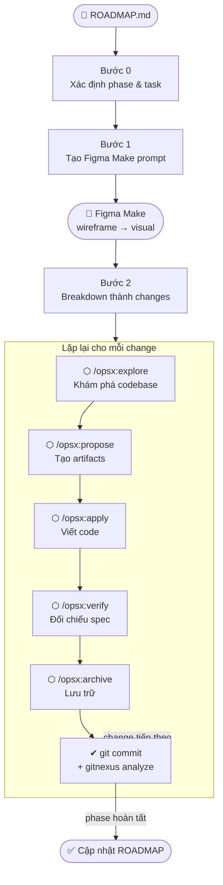
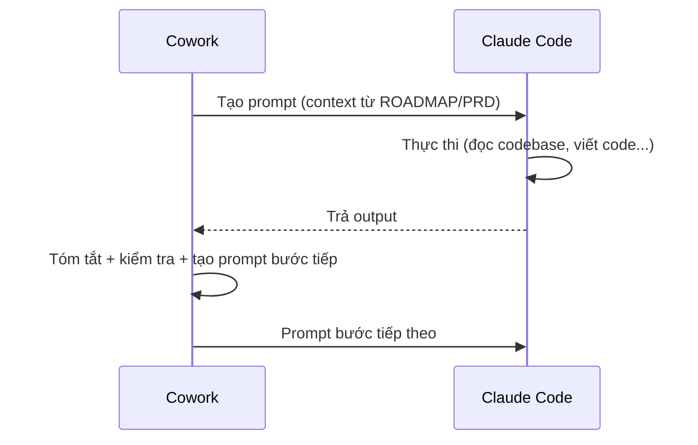

# Cowork × Claude Code — Spec-driven Development OPSX Workflow

> Hướng dẫn thực hành: Dùng Cowork làm **project manager** và Claude Code làm **implementer** trong chu trình phát triển phần mềm theo bộ khung OpenSpec.

---

## Mục lục

1. [Tổng quan — Mô hình phối hợp Cowork & Claude Code](#1-tổng-quan--mô-hình-phối-hợp-cowork--claude-code)
2. [Bước 0 — Đọc ROADMAP và xác định task](#2-bước-0--đọc-roadmap-và-xác-định-task)
3. [Bước 1 — Tạo thiết kế với Figma Make](#3-bước-1--tạo-thiết-kế-với-figma-make)
4. [Bước 2 — Breakdown thành danh sách changes](#4-bước-2--breakdown-thành-danh-sách-changes)
5. [Bước 3 — Phát triển từng change với OpenSpec](#5-bước-3--phát-triển-từng-change-với-openspec)
   - [5.1 /opsx:explore — Khám phá & phân tích](#51-opsxexplore--khám-phá--phân-tích)
   - [5.2 /opsx:propose — Lập kế hoạch](#52-opsxpropose--lập-kế-hoạch)
   - [5.3 /opsx:apply — Thực thi](#53-opsxapply--thực-thi)
   - [5.4 /opsx:verify — Kiểm tra](#54-opsxverify--kiểm-tra)
   - [5.5 /opsx:archive — Kết thúc & lưu trữ](#55-opsxarchive--kết-thúc--lưu-trữ)
6. [Bước 4 — Commit và Re-index](#6-bước-4--commit-và-re-index)
7. [Quick Reference](#7-quick-reference)
8. [Các tình huống thường gặp](#8-các-tình-huống-thường-gặp)

---

## 1. Tổng quan — Mô hình phối hợp Cowork & Claude Code

Workflow này chia công việc thành hai vai trò rõ ràng:

- **Cowork** — Project manager: đọc tài liệu, tạo prompt, xử lý và tóm tắt output
- **Claude Code** — Implementer: thực thi toàn bộ việc khám phá codebase, đề xuất, viết code, verify

Cowork không viết code. Claude Code không tự quyết định scope hay ưu tiên.

### Sơ đồ luồng tổng thể



Với mỗi bước trong vòng lặp, Cowork và Claude Code phối hợp theo mô hình relay:



### Nguyên tắc cốt lõi

1. **Cowork không đoán** — luôn đọc file thực tế trước khi tạo prompt cho Claude Code
2. **Prompt phải có context** — mỗi prompt cần include: tên change, task cụ thể, constraints từ ROADMAP/PRD
3. **Một bước một lần** — không skip từ explore thẳng sang apply; đợi output hoàn tất trước khi sang bước tiếp
4. **ROADMAP là source of truth** — mọi change đều phải trace về một task trong ROADMAP

---

## 2. Bước 0 — Đọc ROADMAP và xác định task

Trước khi làm bất cứ điều gì, Cowork đọc `docs/ROADMAP.md` để xác định phase hiện tại và task cần làm tiếp theo. Đây là bước định hướng — không có bước này, mọi prompt tiếp theo thiếu context.

### Phân tích với Cowork

```
Đọc docs/ROADMAP.md. Tôi đang ở Phase [N].
Tóm tắt cho tôi:
1. Phase [N] bao gồm những gì — mục tiêu tổng thể là gì?
2. Những deliverable nào cần hoàn thành, và deliverable nào còn dang dở?
3. Thứ tự ưu tiên giữa các task (P0/P1/P2) và dependencies giữa chúng là gì?
4. Timeline còn lại của phase này — có task nào đang trễ không?
5. Tôi nên bắt đầu từ đâu và tại sao?
```

### Cowork thực hiện

- Đọc `docs/ROADMAP.md` trực tiếp (không đoán)
- Xác định phase/sprint hiện tại và mức độ hoàn thành
- Liệt kê deliverables theo thứ tự P0 → P1 → P2, đánh dấu done/pending
- Phân tích dependency giữa các task để xác định task nào unblocked
- Gợi ý task tiếp theo kèm lý do rõ ràng

### Kết quả mong đợi

Cowork trả về danh sách deliverables theo phase, trạng thái từng item, thứ tự ưu tiên, dependencies, và task cụ thể nên bắt đầu — đủ context để tạo prompt cho Claude Code ở các bước sau.

---

## 3. Bước 1 — Tạo thiết kế với Figma Make

### Tạo Figma Make prompt với Cowork

Bước này áp dụng khi Phase cần thiết kế màn hình mới (thường là Phase hi-fi design). Trước khi code bất kỳ màn hình nào, cần có thiết kế đã được validate — layout, navigation flow, component states, copy tiếng Việt.

Nếu thiết kế đã có sẵn trong Figma, bỏ qua bước này và chuyển thẳng sang Bước 2.

```
Đọc file etc/notes/figma-make-design-tools-cowork-skills-guide.md
và tạo Figma Make prompt cho màn hình [tên màn hình, ví dụ: S-02 Camera Capture].

Dựa trên Design System đã có trong file đó (màu sắc, typography, spacing).
Thêm suffix Round 1: "Wireframe only — no colors, focus on layout and hierarchy"
```

Cowork đọc design guide thực tế trước khi tạo prompt — không tự bịa màu sắc hay typography.

### Quy trình 3 vòng trong Figma

Mỗi màn hình đi qua 3 vòng, mỗi vòng thêm suffix khác nhau vào cuối prompt:

| Vòng | Suffix thêm vào cuối prompt                                   | Mục tiêu                        |
| ---- | ------------------------------------------------------------- | ------------------------------- |
| 1    | `"Wireframe only — no colors, focus on layout and hierarchy"` | Validate cấu trúc & hierarchy   |
| 2    | `"Add navigation interactions and clickable states"`          | Validate luồng & transitions    |
| 3    | _(không thêm gì)_                                             | Visual đầy đủ với Design System |

Xác nhận từng vòng trước khi chuyển vòng tiếp theo.

### Đọc thiết kế Figma vào Claude Code

Sau khi thiết kế hoàn chỉnh, dùng Figma MCP để Claude Code đọc và hiểu toàn bộ design trước khi code:

```
Read the Figma Make design for this project.
Figma file key: [FILE_KEY]

Using the Figma MCP, fetch:
1. All screens — list them with their screen IDs and names
2. Navigation flow — how users move between screens
3. For each screen: layout structure, key components, all UI states
   (empty, loading, success, error), and exact Vietnamese copy
4. Design tokens: colors (hex), typography, spacing
5. Components shared across screens

Then summarize:
- How many screens total?
- What are the main user flows?
- Which screens are the most complex (most states)?
- Any design gaps or missing states that need clarification?
```

Nếu Figma MCP không có sẵn, thay bằng:

```
Read docs/PRD.md and docs/SYSTEM_DESIGN.md.
Extract all screens, their states, and navigation flows.
Present as a screen inventory table.
```

### Xử lý lỗi trong Figma Make

Khi Figma Make fix sai 2 lần liên tiếp, dùng prompt sau để buộc nó đọc code trước khi sửa:

```
Before making any changes, find and paste the EXACT code
(file path + full component JSX) for [component cần fix].
Do NOT fix anything yet. Wait for my confirmation before proceeding.
```

---

## 4. Bước 2 — Breakdown thành danh sách changes

Chia toàn bộ Phase thành các "changes" nhỏ, độc lập — mỗi change có thể implement và verify riêng lẻ trong một session. Cowork tự thực hiện bước này bằng cách đọc tài liệu và suy luận ra danh sách.

### Nguyên tắc breakdown tốt

- **Một concern duy nhất** — mỗi change chỉ cover 1 màn hình, 1 API module, hoặc 1 tính năng
- **Thứ tự dependencies** — backend trước frontend nếu frontend phụ thuộc vào API
- **Đủ nhỏ** — mỗi change implement được trong ~30–60 phút
- **Đặt tên kebab-case** — ví dụ: `project-foundation`, `home-screen`, `backend-ocr-api`

### Breakdown với Cowork

```
Đọc docs/PRD.md, docs/ROADMAP.md và screen inventory từ Figma.
Breakdown Phase [N] thành danh sách OpenSpec changes.

Với mỗi change, cung cấp:
- Tên change (kebab-case)
- Nội dung cover (1-2 câu)
- Dependencies (change nào phải làm trước)
- Độ phức tạp ước tính: S / M / L

Sắp xếp theo thứ tự: dependencies trước, frontend sau backend nếu có phụ thuộc API.
Trình bày dạng bảng.
```

---

## 5. Bước 3 — Phát triển từng change với OpenSpec

Với mỗi change trong danh sách, chạy tuần tự 5 bước sau. Đây là vòng lặp cốt lõi của workflow.

```
/opsx:explore → /opsx:propose → /opsx:apply → /opsx:verify → /opsx:archive
```

**Quy tắc quan trọng:** Đợi output hoàn tất của từng bước trước khi chạy bước tiếp theo. Không chạy song song, không skip bước.

---

### 5.0 Khởi động — Nạp context trước khi bắt đầu change

Trước khi tạo bất kỳ prompt nào cho Claude Code, Cowork phải đọc tài liệu opsx thực tế. Bỏ qua bước này dẫn đến prompt thiếu context và Claude Code phải tự tìm hướng từ đầu.

**Cowork thu thập context:**

```
Tôi sẽ thực hiện change `[tên-change]` theo bộ khung OpenSpec.

**Bước 1 — ĐỌC, không được bỏ qua:**

[OpenSpec Workflow Documentation](https://github.com/Fission-AI/OpenSpec/blob/main/docs/workflows.md)

Dùng Read tool đọc lần lượt theo đúng thứ tự này:
1. docs/SYSTEM_DESIGN.md
2. docs/ROADMAP.md
3. docs/plans/**.md

KHÔNG tạo bất kỳ prompt nào cho đến khi hoàn tất bước này.

**Bước 2 — XÁC NHẬN hiểu biết (bắt buộc trước khi tiếp tục):**

Sau khi đọc xong, trả lời 3 câu hỏi sau:
1. Change `[tên-change]` thuộc task nào trong ROADMAP, priority gì, và dependency là gì?
2. Mỗi lệnh opsx (explore/propose/apply/verify/archive) làm gì — tóm tắt mỗi lệnh trong 1 câu?
3. Những file nào trong codebase Claude Code cần đọc khi thực hiện explore cho change này?

**Bước 3 — Sau khi đã trả lời đủ 3 câu trên:**
Tạo prompt cho Claude Code bắt đầu từ `/opsx:explore`.
Dừng lại và đợi tôi dán output của Explore trước khi sang bước tiếp theo.
```

**Tóm tắt trước khi tạo prompt:**

> Nếu Cowork chỉ đọc opsx rồi tạo prompt ngay, có hai rủi ro thường gặp:
>
> - **Thiếu context ROADMAP** — prompt explore không có task, priority, acceptance criteria → Claude Code explore không biết focus vào đâu
> - **Thiếu gợi ý file liên quan** — prompt explore bỏ trống phần `Please read these files` → Claude Code phải tự tìm, dễ bỏ sót file quan trọng
>
> Yêu cầu Cowork tóm tắt hiểu biết trước khi hành động giúp bạn phát hiện sai sót ngay tại bước khởi động, trước khi prompt được gửi đến Claude Code.

---

### 5.1 /opsx:explore — Khám phá & phân tích

**Mục đích:** Hiểu codebase liên quan, xác định scope, và đưa ra các câu hỏi kiến trúc cần quyết định trước khi commit vào implementation.

**Cowork tạo prompt Claude Code:**

```
/opsx:explore [tên-change]

Context từ ROADMAP:
- Task: [mô tả task]
- Acceptance criteria: [AC từ PRD nếu có]
- Priority: [P0/P1/P2]

Entry points: [màn hình/routes nào dẫn vào]
Exit points: [màn hình/routes nào dẫn ra]

Please read these files before exploring:
- [file liên quan 1]
- [file liên quan 2]

Key questions:
1. [Câu hỏi về architecture/scope]
2. [Câu hỏi về conflict với code hiện tại]
3. [Câu hỏi về design decision]
```

**Cowork xử lý output:**

```
Đây là output từ /opsx:explore trong Claude Code:

[paste output]

Hãy:
1. Tóm tắt các phát hiện chính (3-5 điểm)
2. Highlight risk hoặc dependency quan trọng
3. Tạo sẵn prompt cho bước /opsx:propose tiếp theo
```

**Framework quyết định khi explore hỏi câu hỏi kiến trúc:**

Explore thường hỏi 2–3 câu hỏi trước khi propose. Trả lời theo 3 tiêu chí:

| Tiêu chí         | YES — làm ngay                   | NO — để change riêng         |
| ---------------- | -------------------------------- | ---------------------------- |
| **Scope**        | Nhỏ, liên quan trực tiếp         | Lớn hoặc có thể tách độc lập |
| **Architecture** | Nhất quán với patterns đã có     | Cần refactor lớn             |
| **Bug fix**      | One-line fix liên quan trực tiếp | Refactor nhiều file          |

Example:

```
/opsx:explore

Change: backend-production-hardening

Đây là G2 trong Phase 2.5 của project MathSnap. G1 (backend-core-api) là dependency — assume G1 đã done hoặc đang done song song.

Mục tiêu của change này: đưa backend từ "chạy được" lên "production-grade" bằng 3 nhóm:
1. Rate limiting 2 lớp — daily quota (SQL COUNT từ history_items) + burst limit (in-memory sliding window 5 req/phút)
2. Error response chuẩn hóa — 10 error codes theo SYSTEM_DESIGN §4.8 (INVALID_DEVICE_ID, RATE_LIMITED_DAILY, RATE_LIMITED_BURST, OCR_FAILED, LLM_FAILED, v.v.)
3. Input validation — deviceId UUID v4 check, file MIME type check bằng python-magic, LaTeX sanitize + max_length

Hãy explore codebase và trả lời:
1. `src/server/app/main.py` hiện có gì? Thiếu gì so với scope trên?
2. Cần tạo thêm file/module gì? (gợi ý: rate_limit.py, validators.py, errors.py)
3. Có dependency nào trong pyproject.toml chưa có cần thêm không? (python-magic)
4. Có conflict hoặc gap nào giữa G1 (Pydantic models) và việc implement error codes không?

Sau explore, đề xuất file structure cho change này.
```

---

### 5.2 /opsx:propose — Lập kế hoạch

**Mục đích:** Từ kết quả explore và các quyết định đã chốt, tạo đầy đủ artifacts: proposal, design, specs, tasks, plan.

**Cowork tạo prompt Claude Code (sau khi chốt decisions):**

```
Decisions before proposing:

1. [Câu hỏi 1 từ explore]: [Quyết định và lý do]
2. [Câu hỏi 2 từ explore]: [Quyết định và lý do]

Scope confirmed:
- [Item 1 cần làm]
- [Item 2 cần làm]
- [Item N KHÔNG làm — để follow-up]

/opsx:propose [tên-change]
```

**Cowork xử lý output:**

```
Đây là output từ /opsx:propose trong Claude Code:

[paste output]

Hãy:
1. Tóm tắt change được propose (tên, scope, số tasks)
2. Kiểm tra xem tasks có align với ROADMAP không
3. Flag bất kỳ scope creep hoặc thiếu sót nào
4. Tạo sẵn prompt cho bước /opsx:apply tiếp theo
```

Example:

```
/opsx:propose backend-production-hardening

Explore đã complete. Dưới đây là scope đã lock — dùng làm input cho proposal.

## Scope (sau Explore + decisions)

### In scope — 4 nhóm việc thực sự còn lại:

**1. Rate Limiting (core of this change)**
- Daily quota: SQL COUNT từ history_items WHERE device_id = ? AND created_at >= today
  - Limit: DAILY_SOLVE_LIMIT (env, default 20) cho /api/solve
  - Nếu vượt → 429, code RATE_LIMITED, retryable=false
- Burst limit: in-memory sliding window per device_id
  - Limit: BURST_LIMIT_PER_MINUTE (env, default 5)
  - Nếu vượt → 429, code RATE_LIMITED, retryable=true
- Apply cả hai cho /api/ocr VÀ /api/solve

**2. LaTeX sanitize**
- Strip null bytes + control chars (\x00–\x1f) từ SolveRequest.latex trước khi pass vào LCEL chain
- max_length=2000 đã có từ G1 — không thay đổi

**3. Structured logging khi rate limit hit**
- Log: device_id (first 8 chars), limit type (daily/burst), endpoint, timestamp
- Dùng logger đã có trong solve.py pattern — không thêm library mới

**4. Config/env**
- Thêm DAILY_SOLVE_LIMIT, BURST_LIMIT_PER_MINUTE vào .env.example
- Thêm defaults vào rate_limit.py

### Out of scope (already done in G1):
- 10 error codes — done (errors.py)
- ErrorResponse schema — done
- deviceId UUID v4 validation — done
- MIME type check — giữ Content-Type header check, bỏ python-magic
- max_length validation — done

### File structure:
- NEW: src/server/app/rate_limit.py
- MODIFY: src/server/app/routers/ocr.py (add rate limit calls)
- MODIFY: src/server/app/routers/solve.py (add rate limit calls + LaTeX sanitize)
- MODIFY: src/server/app/services/supabase.py (add count_daily function)
- MODIFY: src/server/pyproject.toml (no new deps needed — python-magic bỏ qua)
- MODIFY: src/server/.env.example (add 3 rate limit env vars)

### Error behavior:
- Daily exceeded: 429, RATE_LIMITED, retryable=false, message "Bạn đã dùng hết lượt hôm nay. Vui lòng thử lại vào ngày mai."
- Burst exceeded: 429, RATE_LIMITED, retryable=true, message "Bạn đang gửi quá nhanh. Vui lòng đợi 1 phút."
- FE phân biệt qua retryable field (không phải error code riêng)

### TDD instruction:
Khi viết plan hoặc tasks cho change này, với bất kỳ task nào có coding (implement, modify, add), hãy follow TDD: viết test trước → chạy test thất bại → implement → test pass. Ghi rõ "following TDD" trong task description tương ứng.

### DoD:
- Rate limit chặn được ở 21st request/day (daily)
- Rate limit chặn được ở 6th request/phút (burst)
- LaTeX với control chars bị strip trước khi vào LLM
- Log xuất hiện trên Railway khi limit hit
- Tất cả test bằng curl/Postman với input invalid

Spec tham chiếu: SYSTEM_DESIGN.md §9 (Rate Limiting), §4.8 (Error Schema), §8.5 (Error messages).
```

---

### 5.3 /opsx:apply — Thực thi

**Mục đích:** Thực thi tasks trong plan.md, tạo code thực tế.

**Cowork tạo prompt Claude Code:**

```
/opsx:apply [tên-change]

Implement theo tasks.md đã tạo.
Ưu tiên: P0 tasks trước.
Nếu gặp blocker, dừng và report — đừng tự ý thay đổi scope.
```

**Cowork xử lý output:**

```
Đây là output từ /opsx:apply trong Claude Code:

[paste output]

Hãy:
1. Bao nhiêu task đã hoàn thành? Còn lại bao nhiêu?
2. Có blocker hoặc vấn đề nào không?
3. Nếu hoàn thành: tạo sẵn prompt cho /opsx:verify
4. Nếu còn dang dở: tạo prompt để continue apply
```

**Xử lý khi apply gặp blocker:**

```
Claude Code bị blocked ở task [X] với lỗi:
[paste error]

Phân tích: đây là vấn đề gì? Cần update artifact (design.md/tasks.md)
hay fix code trực tiếp? Sau đó tiếp tục apply.
```

---

### 5.4 /opsx:verify — Kiểm tra

**Mục đích:** Đối chiếu implementation với specs và design decisions theo 3 chiều: completeness, correctness, coherence.

**Cowork tạo prompt Claude Code:**

```
/opsx:verify [tên-change]

Verify implementation theo 3 chiều:
- Completeness: tất cả tasks đã done chưa?
- Correctness: implementation có match spec không?
- Coherence: code có follow project patterns không?
```

**Cowork xử lý output:**

```
Đây là output từ /opsx:verify trong Claude Code:

[paste output]

Hãy:
1. Tổng kết: CRITICAL / WARNING / SUGGESTION issues
2. Có cần fix gì trước khi archive không?
3. Nếu clear: tạo sẵn prompt cho /opsx:archive
4. Nếu có CRITICAL: tạo prompt để fix và re-apply
```

**Bảng hành động theo từng loại kết quả:**

| Kết quả    | Hành động                                 |
| ---------- | ----------------------------------------- |
| All passed | Tiến hành archive                         |
| CRITICAL   | Fix trước khi archive                     |
| WARNING    | Quyết định fix ngay hay ghi chú follow-up |
| SUGGESTION | Ghi chú, để follow-up                     |

---

### 5.5 /opsx:archive — Kết thúc & lưu trữ

**Mục đích:** Đánh dấu change hoàn thành, lưu artifacts vào archive.

**Cowork tạo prompt Claude Code:**

```
/opsx:archive [tên-change]

Kiểm tra:
- Tất cả tasks đã [x] chưa?
- Có delta specs cần sync không?
Archive khi mọi thứ ready.
```

**Cowork xử lý output và cập nhật ROADMAP:**

```
Đây là output từ /opsx:archive trong Claude Code:

[paste output]

Hãy:
1. Xác nhận archive thành công
2. Liệt kê những thay đổi đã được implement
3. Cập nhật docs/ROADMAP.md: đánh dấu [x] cho task [tên task]
4. Có milestone nào cần cập nhật status không?
5. Gợi ý change tiếp theo từ danh sách pending
```

---

## 6. Bước 4 — Commit và Re-index

### Merge về develop

Khi dùng git worktrees (OpenSpec tạo worktree riêng cho mỗi change), sau khi apply hoàn tất Claude Code sẽ hỏi về merge strategy:

```
1. Merge back to develop locally   ← Chọn cái này
2. Push and create a Pull Request
3. Keep the branch as-is
4. Discard this work
```

### Commit

Dùng [Conventional Commits](https://www.conventionalcommits.org/) cho commit message.

### Re-index với GitNexus

```
npx gitnexus analyze
```

Chạy sau mỗi commit để giữ knowledge graph cập nhật. Nếu bỏ qua, GitNexus sẽ cảnh báo index stale ở các bước explore/impact analysis tiếp theo.

---

## 7. Quick Reference

### Bảng: Tình huống → Xử lý với Cowork

| Tình huống               | Xử lý với Cowork                                                                               |
| ------------------------ | ---------------------------------------------------------------------------------------------- |
| Bắt đầu ngày làm việc    | `"Đọc ROADMAP, tôi nên làm gì hôm nay?"`                                                       |
| Cần design màn hình mới  | `"Tạo Figma Make prompt cho [màn hình]"`                                                       |
| Bắt đầu change mới       | `"Tạo /opsx:explore prompt cho [change]"`                                                      |
| Paste Claude Code output | `"Đây là output từ /opsx:[bước]. Tóm tắt và tạo prompt bước tiếp theo."`                       |
| Sau khi archive xong     | `"Cập nhật ROADMAP, task [X] đã xong. Change tiếp theo là gì?"`                                |
| Bị blocker               | `"Claude Code báo lỗi [X]. Phân tích và đề xuất hướng xử lý."`                                 |
| Output quá dài để paste  | Chỉ paste phần summary cuối (block `## Implementation Complete` hoặc `## Verification Report`) |

### Checklist nhanh cho mỗi change

```
□ Explore: đọc output, trả lời câu hỏi kiến trúc
□ Propose: xác nhận artifacts được tạo đúng, scope không creep
□ Apply: build passes, không có TypeScript errors
□ Merge về develop (option 1)
□ Verify: không có CRITICAL issues
□ Archive: change được archive thành công
□ Commit: đúng convention, stage đúng files
□ npx gitnexus analyze: re-index codebase
□ Cập nhật ROADMAP.md: đánh dấu task done
```

---

## 8. Các tình huống thường gặp

### Apply gặp import error sau thay đổi dependency

```
Apply gặp ImportError:
[error]

Nguyên nhân thường gặp: thư viện đã update, import path thay đổi.
Fix bằng cách dùng standard library trực tiếp thay vì wrapper cũ.
```

Ví dụ thực tế: `langchain_core.pydantic_v1` bị xóa trong langchain-core 0.3+ → dùng Pydantic v2 trực tiếp.

### Verify trả về WARNING về test coverage

Nếu warning là "no unit tests for UI component":

```
WARNING về test coverage là acceptable — đây là UI-only change,
không có business logic cần unit test. Mark as acknowledged.
Proceed với archive.
```

### Explore phát hiện routing conflict

Ví dụ: Next.js reserves `loading.tsx` → không thể dùng `/solution/loading` route.

```
Fix: merge các screen liên quan vào 1 route với internal state machine.
Ví dụ: /solution/loading + /solution → merged vào /solution với useState.
```

### Apply trả về N/M tasks với M > N

Thường là verification tasks cần làm thủ công. Paste output vào Cowork:

```
Apply hoàn thành [N]/[M] tasks. Remaining tasks là manual verification.
Tiến hành verify bằng code inspection cho các tasks này,
sau đó mark all done và proceed với archive.
```

### Transitive Skills — Cách hoạt động

```
/btw what the skills was used in this subagent

  Based on the conversation so far, here are the skills that were invoked:

  1. `superpowers:using-superpowers` — Loaded at session start (via the SessionStart hook system reminder). Establishes how to find and use skills.
  2. `/opsx:apply` — The user's explicit command (/opsx:apply). Orchestrates the full apply workflow: select change → check status → get instructions → read context files → implement tasks.
  3. `superpowers:using-git-worktrees` — Invoked by the apply instruction (step 1 of the schema's instruction). Used to detect isolation state, find the native EnterWorktree tool, nd create the isolated git worktree for
  backend-production-hardening.
  4. `superpowers:subagent-driven-development` — Invoked by the apply instruction (step 2). Drives the per-task execution loop: implementer subagent → spec compliance review → ode quality review → mark done → next task.

  The skills used transitively (by the subagent-driven-development skill's design, not by explicit Skill tool calls):

  - `superpowers:test-driven-development` — Each implementer subagent was instructed to follow TDD (RED → GREEN → commit). The skill itself says this is enforced transitively by ubagent-driven-development.
  - `superpowers:requesting-code-review` — The code-quality-reviewer-prompt.md template references this skill's code-reviewer.md template, which was read and used for every code uality review dispatch.

  So in total: 4 explicitly invoked skills, 2 transitively enforced by the subagent-driven-development framework.
```

Điểm mấu chốt: hai skills này **không được gọi bằng `Skill` tool** trong session chính. Thay vào đó, chúng được _nhúng vào instruction_ của skills cấp trên — và chỉ được đọc/thực thi bên trong subagent.

---

#### Cơ chế "transitive"

```
Session chính (apply)
│
├── opsx:apply
│     └── đọc schema instruction → bước 2: "invoke subagent-driven-development"
│
└── superpowers:subagent-driven-development  ← explicitly invoked
      │
      │  Skill này SPAWN subagent cho mỗi task:
      │
      ├── [Implementer Subagent]
      │     └── instruction bao gồm: "read superpowers:test-driven-development"
      │           → subagent đọc skill TDD, follow RED→GREEN→commit
      │           → session chính không biết, không gọi TDD trực tiếp
      │
      └── [Code Quality Reviewer Subagent]
            └── instruction bao gồm: "read code-reviewer.md từ requesting-code-review"
                  → subagent đọc template review, apply tiêu chí
                  → session chính không gọi skill này trực tiếp
```

---

#### `superpowers:test-driven-development` — Transitive qua subagent-driven-development

`subagent-driven-development` khi spawn **implementer subagent**, nó pass vào system prompt/instruction của subagent đó một đoạn đại loại:

> _"Before writing any implementation code, read `superpowers:test-driven-development`. Follow RED → GREEN → commit cycle for each task."_

Subagent đó đọc skill TDD, hiểu quy trình, rồi tự thực thi — viết failing test trước, implement sau. Session chính (apply) không cần biết TDD tồn tại. `subagent-driven-development` là người "enforce" nó bằng cách nhúng vào context của mỗi implementer.

Đây là lý do prompt bạn vừa thêm `"following TDD"` có hiệu lực: nó báo cho `subagent-driven-development` biết rằng tasks này yêu cầu TDD, từ đó nó mới include TDD skill vào subagent instruction.

---

#### `superpowers:requesting-code-review` — Transitive qua template reference

`subagent-driven-development` sau mỗi implementer subagent sẽ spawn một **code-quality-reviewer subagent**. Reviewer subagent này được trỏ đến `code-quality-reviewer-prompt.md` — một template nằm trong skill `subagent-driven-development`.

Bên trong template đó có dòng:

> _"Use the review criteria from `superpowers:requesting-code-review/code-reviewer.md`"_

Reviewer subagent đọc file đó, lấy tiêu chí (security, performance, correctness, naming…), rồi apply vào code vừa implement. Skill `requesting-code-review` không bao giờ xuất hiện trong session chính — nó chỉ sống bên trong reviewer subagent context.

---

#### Tóm lại — Tại sao thiết kế vậy?

Đây là pattern **composition qua subagent context injection** thay vì explicit skill chaining. Lợi ích:

- Session chính giữ được sự đơn giản — chỉ biết "apply một change"
- Skills phức tạp (TDD, code review) được delegate xuống subagent, chạy isolated
- Dễ swap: muốn bỏ TDD cho một change cụ thể, chỉ cần không mention "following TDD" trong tasks — `subagent-driven-development` sẽ không inject TDD skill vào subagent đó

---

_Tài liệu được tổng hợp từ workflow thực tế của dự án MathSnap._
_Áp dụng được cho bất kỳ dự án nào dùng OpenSpec + GitNexus trong Cowork × Claude Code._
